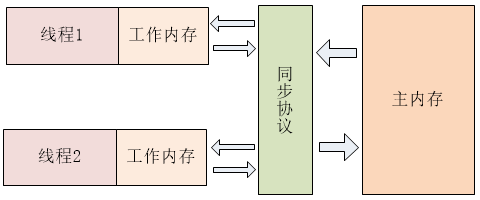
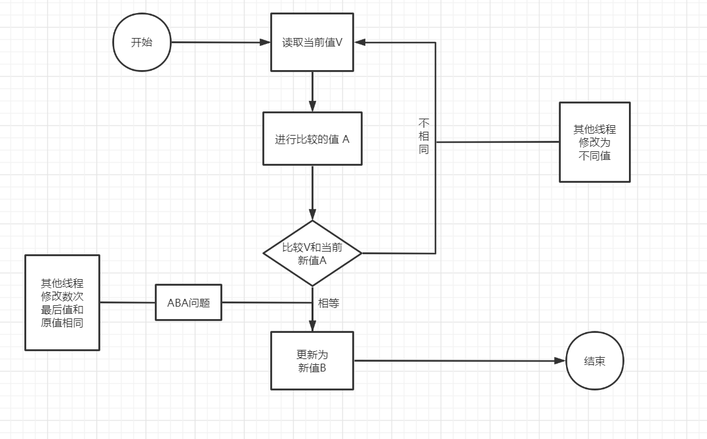

### JUC

在 Java 5.0 提供了 **java.util.concurrent** （简称 JUC ）包，在此包中增加了在并发编程中很常用 的实用工具类，用于定义类似于线程的自定义子 系统，包括线程池、异步 IO 和轻量级任务框架。 提供可调的、灵活的线程池。还提供了设计用于多线程上下文中的 Collection 实现等

#### 内存模型

​		计算机在执行程序时，每条指令都是在CPU中执行的，而执行指令过程中，势必涉及到数据的读取和写入。由于程序运行过程中的临时数据是存放在主存（物理内存）当中的，这时就存在一个问题，由于CPU执行速度很快，而从内存读取数据和向内存写入数据的过程跟CPU执行指令的速度比起来要慢的多，因此如果任何时候对数据的操作都要通过和内存的交互来进行，会大大降低指令执行的速度。因此在CPU里面就有了高速缓存。

​		当程序在运行过程中，会将运算需要的数据从主存复制一份到CPU的高速缓存当中，那么CPU进行计算时就可以直接从它的高速缓存读取数据和向其中写入数据，当运算结束之后，再将高速缓存中的数据刷新到主存当中。

> i = i + 1

​		当线程执行这个语句时，会先从主存当中读取i的值，然后复制一份到高速缓存当中，然后CPU执行指令对i进行加1操作，然后将数据写入高速缓存，最后将高速缓存中i最新的值刷新到主存当中。这个代码在单线程中运行是没有任何问题的，但是在多线程中运行就会有问题了。在多核CPU中，每条线程可能运行于不同的CPU中，因此每个线程运行时有自己的高速缓存（对单核CPU来说，其实也会出现这种问题，只不过是以线程调度的形式来分别执行的）

​		如果一个变量在多个CPU中都存在缓存（一般在多线程编程时才会出现），那么就可能存在缓存不一致的问题，为了解决缓存不一致性问题，通常来说有以下2种解决方法（这2种方式都是硬件层面上提供的方式）：

1）通过在总线加LOCK#锁的方式

2）通过缓存一致性协议

​		在早期的CPU当中，是通过在总线上加LOCK#锁的形式来解决缓存不一致的问题。因为CPU和其他部件进行通信都是通过总线来进行的，如果对总线加LOCK#锁的话，也就是说阻塞了其他CPU对其他部件访问（如内存），从而使得只能有一个CPU能使用这个变量的内存。比如上面例子中 如果一个线程在执行 i = i +1，如果在执行这段代码的过程中，在总线上发出了LCOK#锁的信号，那么只有等待这段代码完全执行完毕之后，其他CPU才能从变量i所在的内存读取变量，然后进行相应的操作。这样就解决了缓存不一致的问题。但是上面的方式会有一个问题，由于在锁住总线期间，其他CPU无法访问内存，导致效率低下。

​		所以就出现了缓存一致性协议。最出名的就是Intel 的MESI协议，MESI协议保证了每个缓存中使用的共享变量的副本是一致的。它核心的思想是：当CPU写数据时，如果发现操作的变量是共享变量，即在其他CPU中也存在该变量的副本，会发出信号通知其他CPU将该变量的缓存行置为无效状态，因此当其他CPU需要读取这个变量时，发现自己缓存中缓存该变量的缓存行是无效的，那么它就会从内存重新读取。

#### 并发编程

+ 原子性：即一个操作或者多个操作 要么全部执行并且执行的过程不会被任何因素打断，要么就都不执行。
+ 可见性：指当多个线程访问同一个变量时，一个线程修改了这个变量的值，其他线程能够立即看得到修改的值。
+ 有序性：即程序执行的顺序按照代码的先后顺序执行。指令重排序（Instruction Reorder），一般来说，处理器为了提高程序运行效率，可能会对输入代码进行优化，它不保证程序中各个语句的执行先后顺序同代码中的顺序一致，但是它会保证程序最终执行结果和代码顺序执行的结果是一致的

要想并发程序正确地执行，必须要保证原子性、可见性以及有序性。只要有一个没有被保证，就有可能会导致程序运行不正确

#### Java内存模型

Java 内存模型（Java Memory Model，JMM）规定：**对于多个线程共享的变量，存储在主内存当中**。**每个线程都有自己独立的工作内存，每个线程只能访问自己的工作内存，工作内存中保存了主内存中共享变量的副本，线程对共享变量的所有操作只能通过操作工作内存中的副本来实现，而不能直接对主存进行操作，操作完毕之后再同步回到主内存当中，并且每个线程不可以访问其它线程的工作内存**。其 JVM 模型大致如下图。



JMM这样的规定可能导致得到后果线程对共享变量的修改没有即时更新到主内存，或者线程没能够即时将共享变量的最新值同步到工作内存中，从而使得线程在使用共享变量的值时，该值并不是最新的。这就引出了内存可见性

+ 内存可见性（Memory Visibility）：是指当某个线程正在使用对象状态，而另一个线程在同时修改该状态，需要确保当一个线程修改了对象状态后，其他线程能够看到发生的状态变化。可见性错误是指当读操作与写操作在不同的线程中执行时，我们无法确保执行读操作的线程能实时地看到其他线程写入的值，有时甚至是根本不可能的事情。

**原子性保证**

Java内存模型只保证了基本读取和赋值是原子性操作，如果要实现更大范围操作的原子性，可以通过synchronized和Lock来实现。由于synchronized和Lock能够保证任一时刻只有一个线程执行该代码块，那么自然就不存在原子性问题了，从而保证了原子性。

> x = 10;    
> //语句1（直接将数值10赋值给x，也就是说线程执行这个语句的会直接将数值10写入到工作内存中）

>  y = x; 
>  //语句2（实际上包含2个操作，它先要去读取x的值，再将x的值写入工作内存，虽然读取x的值以及 将x的值写入工作内存 这2个操作都是原子性操作，但是合起来就不是原子性操作了）      

> x++;           
> //语句3（包括3个操作：读取x的值，进行加1操作，写入新的值）

> x = x + 1;     
> //语句4（包括3个操作：读取x的值，进行加1操作，写入新的值）

只有语句1是原子性操作，其他三个语句都不是原子性操作；也就是说，只有简单的读取、赋值（而且必须是将数字赋值给某个变量，变量之间的相互赋值不是原子操作）才是原子操作

**可见性保证**

Java提供了**volatile**关键字来保证可见性，当一个共享变量被volatile修饰时，它会保证修改的值会立即被更新到主存，当有其他线程需要读取时，它会去内存中读取新值。另外，通过synchronized和Lock也能够保证可见性，synchronized和Lock能保证同一时刻只有一个线程获取锁然后执行同步代码，并且在释放锁之前会将对变量的修改刷新到主存当中。因此可以保证可见性。

**有序性保证**

​		在Java内存模型中，允许编译器和处理器对指令进行重排序，但是重排序过程不会影响到单线程程序的执行，却会影响到多线程并发执行的正确性。在Java里面，可以通过volatile关键字来保证一定的“有序性”。另外可以通过synchronized和Lock来保证有序性，很显然，synchronized和Lock保证每个时刻是有一个线程执行同步代码，相当于是让线程顺序执行同步代码，自然就保证了有序性。

​		Java内存模型具备一些先天的“有序性”，即不需要通过任何手段就能够得到保证的有序性，这个通常也称为 happens-before 原则。如果两个操作的执行次序无法从happens-before原则推导出来，那么它们就不能保证它们的有序性，虚拟机可以随意地对它们进行重排序。

+ happens-before原则（先行发生原则）
  + 程序次序规则：一个线程内，按照代码顺序，书写在前面的操作先行发生于书写在后面的操作
  + 锁定规则：一个unLock操作先行发生于后面对同一个锁额lock操作（即无论在单线程中还是多线程中，同一个锁如果出于被锁定的状态，那么必须先对锁进行了释放操作，后面才能继续进行lock操作）
  + volatile变量规则：对一个变量的写操作先行发生于后面对这个变量的读操作（如果一个线程先去写一个变量，然后一个线程去进行读取，那么写入操作肯定会先行发生于读操作）
  + 传递规则：如果操作A先行发生于操作B，而操作B又先行发生于操作C，则可以得出操作A先行发生于操作C
  + 线程启动规则：Thread对象的start()方法先行发生于此线程的每个一个动作
  + 线程中断规则：对线程interrupt()方法的调用先行发生于被中断线程的代码检测到中断事件的发生
  + 线程终结规则：线程中所有的操作都先行发生于线程的终止检测，我们可以通过Thread.join()方法结束、Thread.isAlive()的返回值手段检测到线程已经终止执行
  + 对象终结规则：一个对象的初始化完成先行发生于他的finalize()方法的开始

#### Volatile

一旦一个共享变量（类的成员变量、类的静态成员变量）被volatile修饰之后，那么就具备了两层语义：

1）保证了不同线程对这个变量进行操作时的可见性，即一个线程修改了某个变量的值，这新值对其他线程来说是立即可见的。

2）禁止进行指令重排序。

  ```java
 //线程1  
public class TestVolatile {
  	public static void main(String[] args) {
  		ThreadDemo td = new ThreadDemo();
  		new Thread(td).start();	
       
  		while(true){
  			if(td.isFlag()){
  				System.out.println("------------------");
  				break;
  			}
  		}
  	}
  }
  
//线程2
  class ThreadDemo implements Runnable {
  
  	private boolean flag = false;
  
  	@Override
  	public void run() {
  		try {
  			Thread.sleep(200);
  		} catch (InterruptedException e) {
  		}
  		flag = true;
  		System.out.println("flag=" + isFlag());
  	}
      
  	public boolean isFlag() {
  		return flag;
  	}
      
  	public void setFlag(boolean flag) {
  		this.flag = flag;
  	}
  }
  ```

  **第一次程序运行结果（没有volatile）**

  > flag=true

​		每个线程在运行过程中都有自己的工作内存，那么线程1在运行的时候，会将stop变量的值拷贝一份放在自己的工作内存当中。那么当线程2更改了stop变量的值之后，但是还没来得及写入主存当中，线程2转去做其他事情了，那么线程1由于不知道线程2对stop变量的更改，因此还会一直循环下去

----


  ```java
  //如果设置为	
  private volatile boolean flag = false;
  ```

   **第二次程序运行结果（使用volatile）**

  > flag=true
  >
  > —————————————

用volatile修饰之后，在线程2修改stop值时（当然这里包括2个操作，修改线程2工作内存中的值，然后将修改后的值写入内存），会使得线程1的工作内存中缓存变量stop的缓存行无效，然后线程1读取时，发现自己的缓存行无效，它会等待缓存行对应的主存地址被更新之后，然后去对应的主存读取最新的值

+ 使用volatile关键字会强制将修改的值立即写入主存

+ 使用volatile关键字的话，当线程2进行修改时，会导致线程1的工作内存中缓存变量stop的缓存行无效（反映到硬件层的话，就是CPU的L1或者L2缓存中对应的缓存行无效）

#### ? ? ？

+ 由于线程1的工作内存中缓存变量stop的缓存行无效，所以线程1再次读取变量stop的值时会去主存读取


**volatile** 是Java 提供了一种稍弱的同步机制，用来确保将变量的更新操作通知到其它线程。当把共享变量声明为 volatile 类型后，**线程对该变量修改时会将该变量的值立即刷新回主内存**，同时会使其它线程中缓存的该变量无效，从而其它线程在读取该值时会从主内中重新读取该值（参考缓存一致性）。因此在读取 volatile 类型的变量时总是会返回最新写入的值。

volatile**屏蔽掉了JVM中必要的代码优化(指令重排序)**，所以在**效率上比较低

volatile关键字最主要的作用是：

1. **保证变量的内存可见性**
2. **局部阻止重排序的发生**

可以将 volatile 看做一个轻量级的锁，但是又与锁有些不同： 

1. 对于多线程，**不是一种互斥关系** 
2. **不能保证变量状态的“原子性操作“**

#### CAS

* Compare And Swap (Compare And Exchange) / 自旋 / 自旋锁 / 无锁 

* CAS 是一种**硬件对并发的支持**，针对多处理器操作而设计的处理器中的一种特殊指令，用于管理对共享数据的并发访问。 

* CAS 是一种**无锁的非阻塞算法**的实现。 

* CAS 包含了 3 个操作数： 

  * 需要读写的内存值 V
  * 进行比较的值 A
  * 拟写入的新值 B

  当且仅当 **V 的值等于 A** 时，CAS 通过原子方式用新值 B 来更新 V的值，否则不会执行任何操作。




+  ABA问题

CAS会导致ABA问题，线程1准备用CAS将变量的值由A替换为B，在此之前，线程2将变量的值由A替换为C，又由C替换为A，然后线程1执行CAS时发现变量的值仍然为A，所以CAS成功。但实际上这时的现场已经和最初不同了，尽管CAS成功，但可能存在潜藏的问题。

解决办法（版本号 AtomicStampedReference），基础类型简单值不需要版本号