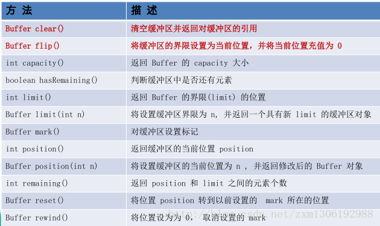

## NIO

+ 概念：Java NIO（New IO）是从Java 1.4版本开始引入的 一个新的IO API，可以替代标准的Java IO API。 NIO与原来的IO有同样的作用和目的，但是使用 的方式完全不同，NIO支持面向缓冲区的、基于 通道的IO操作。NIO将以更加高效的方式进行文 件的读写操作

+ Java NIO与IO的区别

  | IO                      | NIO                         |
  | ----------------------- | --------------------------- |
  | 面向流(Stream Oriented) | 面向缓冲区(Buffer Oriented) |
  | 阻塞IO(Blocking IO)     | 非阻塞IO(Non Blocking IO)   |
  | (无)                    | 选择器(Selectors)           |

  Java NIO系统的核心在于：通道(Channel)和缓冲区 (Buffer)。通道表示打开到 IO 设备(例如：文件、 套接字)的连接。若需要使用 NIO 系统，需要获取 用于连接 IO 设备的通道以及用于容纳数据的缓冲 区。然后操作缓冲区，对数据进行处理。**Channel 负责传输， Buffer 负责存储**

#### Buffer

+ 缓冲区（Buffer）：一个用于特定基本数据类 型的容器。由 java.nio 包定义的，所有缓冲区 都是 Buffer 抽象类的子类。
+  Java NIO 中的 Buffer 主要用于与 NIO 通道进行 交互，数据是从通道读入缓冲区，从缓冲区写入通道中的。

+ Buffer 就像一个数组，可以保存多个相同类型的数据。根 据数据类型不同(boolean 除外) ，有以下 Buffer 常用子类：ByteBuffer、 CharBuffer、 ShortBuffer、IntBuffer、LongBuffer、FloatBuffer 、DoubleBuffer 

  上述 Buffer 类 他们都采用相似的方法进行管理数据，只是各自 管理的数据类型不同而已。都是通过如下方法获取一个 Buffer 对象：
  static XxxBuffer allocate(int capacity) : 创建一个容量为capacity 的 XxxBuffer 对象

+ Buffer 中的重要概念
  + 容量 (capacity) ：表示 Buffer 最大数据容量，缓冲区容量不能为负，并且创 建后不能更改。 
  + 限制 (limit)：第一个不应该读取或写入的数据的索引，即位于 limit 后的数据 不可读写。缓冲区的限制不能为负，并且不能大于其容量。
  +  位置 (position)：下一个要读取或写入的数据的索引。缓冲区的位置不能为 负，并且不能大于其限制 
  + 标记 (mark)与重置 (reset)：标记是一个索引，通过 Buffer 中的 mark() 方法 指定 Buffer 中一个特定的 position，之后可以通过调用 reset() 方法恢复到这 个 position.
    **标记、位置、限制、容量遵守以下不变式： 0 <= mark <= position <= limit <= capacity**
  + **

