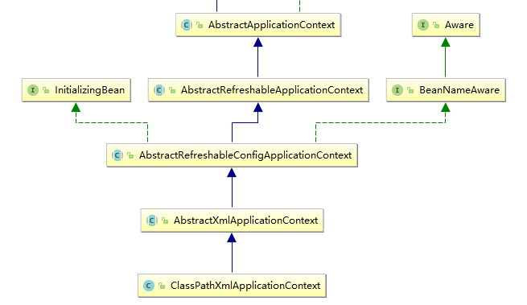

## Spring Source Analysis

#### Spring Bean加载过程

https://blog.csdn.net/chaitoudaren/article/details/104833634

https://blog.csdn.net/Bronze5/article/details/100063175

https://www.cnblogs.com/liyus/p/10983108.html



##### ClassPathXmlApplicationContext初始化步骤

1. **ClassPathXmlApplicationContext()构造方法**

   ```
   <!-- ClassPathXmlApplicationContext -->
   public ClassPathXmlApplicationContext(String configLocation) throws BeansException {
   		this(new String[] {configLocation}, true, null);
   }
   
   <!-- 调用构造方法 -->
   public ClassPathXmlApplicationContext(
   			String[] configLocations, boolean refresh, @Nullable ApplicationContext parent)
   			throws BeansException {
   
   		super(parent);
   		// 1.1设置配置文件路径
   		setConfigLocations(configLocations);
   		if (refresh) {
   			// 1.2刷新上下文，调用父类AbstractApplicationContext
   			refresh();
   		}
   }
   ```

   **1.1** setConfigLocations(configLocations)：设置配置文件路径（调用间接父类AbstractRefreshableConfigApplicationContext）

   把传入的配置文件路径，保存在configLocations属性中

   ```
   <!-- AbstractRefreshableConfigApplicationContext -->
   public void setConfigLocations(@Nullable String... locations) {
   		if (locations != null) {
   			Assert.noNullElements(locations, "Config locations must not be null");
   			this.configLocations = new String[locations.length];
   			for (int i = 0; i < locations.length; i++) {
   				this.configLocations[i] = resolvePath(locations[i]).trim();
   			}
   		}
   		else {
   			this.configLocations = null;
   		}
   	}
   ```

   **1.2** refresh()：刷新上下文（调用间接父类AbstractXmlApplicationContext的方法）

   ```
   <!-- AbstractXmlApplicationContext -->
   public void refresh() throws BeansException, IllegalStateException {
   		synchronized (this.startupShutdownMonitor) {
   			// 1.2.1准备刷新上下文
   			prepareRefresh();
   
   			// 1.2.2初始化BeanFactory，并进行XML文件读取
   			ConfigurableListableBeanFactory beanFactory = obtainFreshBeanFactory();
   
   			// 对BeanFactory进行各种功能填充
   			prepareBeanFactory(beanFactory);
   
   			try {
   				// 子类覆盖方法做额外的处理
   				postProcessBeanFactory(beanFactory);
   
   				// 激活各种BeanFactory处理器
   				invokeBeanFactoryPostProcessors(beanFactory);
   
   				// 注册拦截Bean创建的Bean后处理器
   				registerBeanPostProcessors(beanFactory);
   
   				// 为上下文初始化消息源
   				initMessageSource();
   
   				// 为上下文初始化消息广播器
   				initApplicationEventMulticaster();
   
   				// 初始化特定上下文子类中的其他特殊bean。
   				onRefresh();
   
   				// 在注册的bean中查找监听器bean并注册它们。
   				registerListeners();
   
   				// 初始化剩下的单例bean(非惰性的)
   				finishBeanFactoryInitialization(beanFactory);
   
   				// 最后一步：发布相应事件
   				finishRefresh();
   			}
   
   			catch (BeansException ex) {
   				if (logger.isWarnEnabled()) {
   					logger.warn("Exception encountered during context initialization - " +
   							"cancelling refresh attempt: " + ex);
   				}
   
   				// 销毁已经创建的单例，以避免挂起资源。
   				destroyBeans();
   
   				// Reset 'active' flag.
   				cancelRefresh(ex);
   
   				// Propagate exception to caller.
   				throw ex;
   			}
   
   			finally {
   				// Reset common introspection caches in Spring's core, since we
   				// might not ever need metadata for singleton beans anymore...
   				resetCommonCaches();
   			}
   		}
   	}
   ```

   **1.2.1**prepareRefresh()：准备刷新上下文

   设置一下刷新Spring上下文的开始时间

   将closed标识位设置为false

   将active标识位设置为true

   ```
   <!-- AbstractApplicationContext -->
   protected void prepareRefresh() {
   	// Switch to active.
   	this.startupDate = System.currentTimeMillis();
   	this.closed.set(false);
   	this.active.set(true);
   
   	if (logger.isDebugEnabled()) {
   		if (logger.isTraceEnabled()) {
   			logger.trace("Refreshing " + this);
   		}
   		else {
   			logger.debug("Refreshing " + getDisplayName());
   		}
   }
   ```

   **1.2.2**obtainFreshBeanFactory()初始化BeanFactory，并进行XML文件读取（）

   ```
   <!-- AbstractApplicationContext -->
   protected ConfigurableListableBeanFactory obtainFreshBeanFactory() {
   		// 1.2.2.1刷新BeanFactory
   		refreshBeanFactory();
   		// ConfigurableListableBeanFactory是一个接口
   		ConfigurableListableBeanFactory beanFactory = getBeanFactory();
   		if (logger.isDebugEnabled()) {
   			logger.debug("Bean factory for " + getDisplayName() + ": " + beanFactory);
   		}
   		return beanFactory;
   	}
   
   ```

   **1.2.2.1**refreshBeanFactory()：创建一个DefaultListableBeanFactory和加载BeanDefinition。

   ```
   <!-- AbstractRefreshableApplicationContext -->
   protected final void refreshBeanFactory() throws BeansException {
   		if (hasBeanFactory()) {
   			destroyBeans();
   			closeBeanFactory();
   		}
   		try {
   			//构造Bean的核心类
   			DefaultListableBeanFactory beanFactory = createBeanFactory();
   			beanFactory.setSerializationId(getId());
   			customizeBeanFactory(beanFactory);
   			//1.2.2.1.1将XML文件进行解析
   			loadBeanDefinitions(beanFactory);
   			synchronized (this.beanFactoryMonitor) {
   				this.beanFactory = beanFactory;
   			}
   		}
   		catch (IOException ex) {
   			throw new ApplicationContextException("I/O error parsing bean definition source for " + getDisplayName(), ex);
   		}
   }
   ```

   **1.2.2.1.1**loadBeanDefinitions(beanFactory)：将XML文件进行解析,以Key-Value的形式，Key表示BeanName，Value为BeanDefinition，最终存入DefaultListableBeanFactory中

   ```
   <!-- AbstractXmlApplicationContext -->
   protected void loadBeanDefinitions(XmlBeanDefinitionReader reader) throws BeansException, IOException {
   		Resource[] configResources = getConfigResources();
   		if (configResources != null) {
   			reader.loadBeanDefinitions(configResources);
   		}
   		String[] configLocations = getConfigLocations();
   		if (configLocations != null) {
   			reader.loadBeanDefinitions(configLocations);
   		}
   }
   
   protected void loadBeanDefinitions(DefaultListableBeanFactory beanFactory) throws BeansException, IOException {
   		// Create a new XmlBeanDefinitionReader for the given BeanFactory.
   		XmlBeanDefinitionReader beanDefinitionReader = new XmlBeanDefinitionReader(beanFactory);
   
   		// Configure the bean definition reader with this context's
   		// resource loading environment.
   		beanDefinitionReader.setEnvironment(this.getEnvironment());
   		beanDefinitionReader.setResourceLoader(this);
   		beanDefinitionReader.setEntityResolver(new ResourceEntityResolver(this));
   		initBeanDefinitionReader(beanDefinitionReader);
   		//1.2.2.1.1.1
   		loadBeanDefinitions(beanDefinitionReader);
   }
   ```

   首先将DefaultListableBeanFactory转换为XmlBeanDefinitionReader交由，XmlBeanDefinitionReader去实现loadBeanDefinition的操作

   **1.2.2.1.1.1**loadBeanDefinitions(beanDefinitionReader)

   + 先调用自身AbstractXmlApplicationContext的loadBeanDefinitions(XmlBeanDefinitionReader reader)

   ```
   <!-- XmlBeanDefinitionReader -->
   protected void loadBeanDefinitions(XmlBeanDefinitionReader reader) throws BeansException, IOException {
      Resource[] configResources = getConfigResources();
      if (configResources != null) {
         reader.loadBeanDefinitions(configResources);
      }
      String[] configLocations = getConfigLocations();
      if (configLocations != null) {
         reader.loadBeanDefinitions(configLocations);
      }
   }
   ```

   + 然后调用XmlBeanDefinitionReader的loadBeanDefinitions，然后一系列构造方法之后调用doLoadBeanDefinitions，去获取这个Document的、注册Bean

   ```
   <!-- XmlBeanDefinitionReader -->
   @Override
   public int loadBeanDefinitions(Resource resource) throws BeanDefinitionStoreException {
   		// 把Resource包装成编码资源EncodedResource
   		return loadBeanDefinitions(new EncodedResource(resource));
   	}
   
   public int loadBeanDefinitions(EncodedResource encodedResource) throws BeanDefinitionStoreException {
   		// 判断参数
   		Assert.notNull(encodedResource, "EncodedResource must not be null");
   		if (logger.isInfoEnabled()) {
   			logger.info("Loading XML bean definitions from " + encodedResource.getResource());
   		}
   
   		Set<EncodedResource> currentResources = this.resourcesCurrentlyBeingLoaded.get();
   		if (currentResources == null) {
   			currentResources = new HashSet<>(4);
   			this.resourcesCurrentlyBeingLoaded.set(currentResources);
   		}
   		// 一个资源只加载一次
   		if (!currentResources.add(encodedResource)) {
   			throw new BeanDefinitionStoreException(
   					"Detected cyclic loading of " + encodedResource + " - check your import definitions!");
   		}
   		try {
   			// 从encodedResource获取输入流
   			InputStream inputStream = encodedResource.getResource().getInputStream();
   			try {
   				// 把inputStream包装成org.xml.sax.InputSource
   				InputSource inputSource = new InputSource(inputStream);
   				if (encodedResource.getEncoding() != null) {
   					inputSource.setEncoding(encodedResource.getEncoding());
   				}
   				// 一般spring中xx()方法是校验参数、准备数据的,真正干活儿的就是doXx()方法;继续分析这个方法
   				return doLoadBeanDefinitions(inputSource, encodedResource.getResource());
   			}
   			finally {
   				inputStream.close();
   			}
   		}
   		catch (IOException ex) {
   			throw new BeanDefinitionStoreException(
   					"IOException parsing XML document from " + encodedResource.getResource(), ex);
   		}
   		finally {
   			currentResources.remove(encodedResource);
   			if (currentResources.isEmpty()) {
   				this.resourcesCurrentlyBeingLoaded.remove();
   			}
   		}
   	}
   
   
   public int loadBeanDefinitions(InputSource inputSource, @Nullable String resourceDescription) throws BeanDefinitionStoreException {
           return this.doLoadBeanDefinitions(inputSource, new DescriptiveResource(resourceDescription));
       }
   ```

   ```
   protected int doLoadBeanDefinitions(InputSource inputSource, Resource resource)
   			throws BeanDefinitionStoreException {
   		try {
   			//继续看怎么获取这个Document的
   			Document doc = doLoadDocument(inputSource, resource);
   			//1.2.2.1.1.1.1 注册bean
   			return registerBeanDefinitions(doc, resource);
   		}
   		// 省略catch的异常
   		...
   	}
   
   protected Document doLoadDocument(InputSource inputSource, Resource resource) throws Exception {
   		// 1.2.2.1.1.1.2这里调用了DefaultDocumentLoader的loadDocument的方法
   		return this.documentLoader.loadDocument(inputSource, getEntityResolver(), this.errorHandler,
   				getValidationModeForResource(resource), isNamespaceAware());
   }
   ```

   **1.2.2.1.1.1.2**XmlBeanDefinitionReader把加载xml文件的操作，先做一系列的XML文件的验证，保证了XML文件的正确性，然后交由DefaultDocumentLoader处理

   在doLoadDocument()方法调用getValidationModeForResource()获取验证模式的时候，委托XmlValidationModeDetector的detectValidationMode()方法来获取的。判断xml的验证模式的规则是：某行是否包含“DOCTYPE”若包含则为DTD验证模式，若xml正式内容开始时还未检测到“DOCTYPE”则为XSD模式

   + XML检验

     ```
     // 这个入参是xml资源的抽象表示
       	protected int getValidationModeForResource(Resource resource) {
       		int validationModeToUse = getValidationMode();
       		if (validationModeToUse != VALIDATION_AUTO) {
       			return validationModeToUse;
       		}
       		// 检测验证模式
       		int detectedMode = detectValidationMode(resource);
       		if (detectedMode != VALIDATION_AUTO) {
       			return detectedMode;
       		}
       		// Hmm, we didn't get a clear indication... Let's assume XSD,
       		// since apparently no DTD declaration has been found up until
       		// detection stopped (before finding the document's root tag).
       		return VALIDATION_XSD;
       	}
       	
       	protected int detectValidationMode(Resource resource) {
       		if (resource.isOpen()) {
       			throw new BeanDefinitionStoreException(
       					"Passed-in Resource [" + resource + "] contains an open stream: " +
       					"cannot determine validation mode automatically. Either pass in a Resource " +
       					"that is able to create fresh streams, or explicitly specify the validationMode " +
       					"on your XmlBeanDefinitionReader instance.");
       		}
       	
       		InputStream inputStream;
       		try {
       			// 获取输入流
       			inputStream = resource.getInputStream();
       		}
       		catch (IOException ex) {
       			throw new BeanDefinitionStoreException(
       					"Unable to determine validation mode for [" + resource + "]: cannot open InputStream. " +
       					"Did you attempt to load directly from a SAX InputSource without specifying the " +
       					"validationMode on your XmlBeanDefinitionReader instance?", ex);
       		}
       	
       		try {
       			// 委托给XmlValidationModeDetector去检测验证模式,并传入输入流   继续分析这个
       			return this.validationModeDetector.detectValidationMode(inputStream);
       		}
       		catch (IOException ex) {
       			throw new BeanDefinitionStoreException("Unable to determine validation mode for [" +
       					resource + "]: an error occurred whilst reading from the InputStream.", ex);
       		}
       	}
     ```

     + XmlBeanDefinitionReader把创建好的ResourceEntityResolver对象，传给DefaultDocumentLoader来自定义获取验证模式声明文件的方式。
     + DocumentBuilder的parse方法在解析xml文档的时候，会调用自定义ResourceEntityResolver的resolveEntity()方法。
     + ResourceEntityResolver的resolveEntity()方法会先调用父类DelegatingEntityResolver的resolveEntity()方法。
     + DelegatingEntityResolver的resolveEntity()方法中根据不同的验证模式分发给真正干活儿的：BeansDtdResolver和PluggableSchemaResolver
     + DTD验证模式，直接在BeansDtdResolver使用ClassPathResource读取org/springframework/beans/factory/xml/spring-beans.dtd文件即可。
     + XSD验证模式，先把META-INF/spring.schemas文件的内容映射为一个Properties对象。然后根据传入的systemId值，获取到对应的xsd文件名，进而使用ClassPathResource读取。

   + DefaultDocumentLoader处理xml

     ```
     <!-- DefaultDocumentLoader -->
     public Document loadDocument(InputSource inputSource, EntityResolver entityResolver,
     			ErrorHandler errorHandler, int validationMode, boolean namespaceAware) throws Exception {
     		// 1.创建解析器工厂
     		DocumentBuilderFactory factory = createDocumentBuilderFactory(validationMode, namespaceAware);
     		if (logger.isDebugEnabled()) {
     			logger.debug("Using JAXP provider [" + factory.getClass().getName() + "]");
     		}
     		// 2.创建解析器对象
     		DocumentBuilder builder = createDocumentBuilder(factory, entityResolver, errorHandler);
     		// 3.获取Document
     		return builder.parse(inputSource);
     	}
     	
     protected DocumentBuilderFactory createDocumentBuilderFactory(int validationMode, boolean namespaceAware)
     			throws ParserConfigurationException {
     		DocumentBuilderFactory factory = DocumentBuilderFactory.newInstance();
     		factory.setNamespaceAware(namespaceAware);
     		// 设置验证方式
     		if (validationMode != XmlValidationModeDetector.VALIDATION_NONE) {
     			factory.setValidating(true);
     			if (validationMode == XmlValidationModeDetector.VALIDATION_XSD) {
     				// Enforce namespace aware for XSD...
     				factory.setNamespaceAware(true);
     				try {
     					factory.setAttribute(SCHEMA_LANGUAGE_ATTRIBUTE, XSD_SCHEMA_LANGUAGE);
     				}
     				catch (IllegalArgumentException ex) {
     					ParserConfigurationException pcex = new ParserConfigurationException(
     							"Unable to validate using XSD: Your JAXP provider [" + factory +
     							"] does not support XML Schema. Are you running on Java 1.4 with Apache Crimson? " +
     							"Upgrade to Apache Xerces (or Java 1.5) for full XSD support.");
     					pcex.initCause(ex);
     					throw pcex;
     				}
     			}
     		}
     		return factory;
     	}
     	
     	
     protected DocumentBuilder createDocumentBuilder(DocumentBuilderFactory factory,
     			@Nullable EntityResolver entityResolver, @Nullable ErrorHandler errorHandler)
     			throws ParserConfigurationException {
     		// 从解析器工厂中创建解析器
     		DocumentBuilder docBuilder = factory.newDocumentBuilder();
     		if (entityResolver != null) {
     			docBuilder.setEntityResolver(entityResolver);
     		}
     		if (errorHandler != null) {
     			docBuilder.setErrorHandler(errorHandler);
     		}
     		return docBuilder;
     	}
     ```

   **1.2.2.1.1.1.1**注册bean：DefaultDocumentLoader处理完后返回Document，然后将Document转换为spring认识的BeanDefinition

   ```
   <!-- XmlBeanDefinitionReader -->
   public int registerBeanDefinitions(Document doc, Resource resource) throws BeanDefinitionStoreException {
   		// 1.实例化一个DefaultBeanDefinitionDocumentReader对象并强转为BeanDefinitionDocumentReader 
   		BeanDefinitionDocumentReader documentReader = createBeanDefinitionDocumentReader();
   		// 2.记录已注册BeanDefinition的个数
   		int countBefore = getRegistry().getBeanDefinitionCount();
   
   ```

   ​					// 3.注册bean

   ```
      		documentReader.registerBeanDefinitions(doc, createReaderContext(resource));
      		// 4.返回本次注册的个数
      		return getRegistry().getBeanDefinitionCount() - countBefore;
      	}
   ```

   **注册bean**：DefaultBeanDefinitionDocumentReader真正执行注册bean的逻辑

   ```
   <!-- DefaultBeanDefinitionDocumentReader -->
   @Override
   public void registerBeanDefinitions(Document doc, XmlReaderContext readerContext) {
      		this.readerContext = readerContext;
      		logger.debug("Loading bean definitions");
      		// document转element，即beans标签的抽象
      		Element root = doc.getDocumentElement();
      		// doXxx()来执行真正的注册逻辑
      		doRegisterBeanDefinitions(root);
   }
   ```

   ```
   protected void doRegisterBeanDefinitions(Element root) {
         		BeanDefinitionParserDelegate parent = this.delegate;
         		this.delegate = createDelegate(getReaderContext(), root, parent);
         		if (this.delegate.isDefaultNamespace(root)) {
         			// 获取beans标签中profile的属性值
         			String profileSpec = root.getAttribute(PROFILE_ATTRIBUTE);
         			// 若profile的属性值存在，则需要判断当前环境中是否有与之匹配的profile值
         			if (StringUtils.hasText(profileSpec)) {
         				String[] specifiedProfiles = StringUtils.tokenizeToStringArray(
         						profileSpec, BeanDefinitionParserDelegate.MULTI_VALUE_ATTRIBUTE_DELIMITERS);
         				// 当前环境中spring.profiles.active/spring.profiles.default作为key对应的值需要与之匹配，才能加载该beans标签
         				// 可以通过启动参数指定，如：-Dspring.profiles.active=test
         				if (!getReaderContext().getEnvironment().acceptsProfiles(specifiedProfiles)) {
         					if (logger.isInfoEnabled()) {
         						logger.info("Skipped XML bean definition file due to specified profiles [" + profileSpec +
         								"] not matching: " + getReaderContext().getResource());
         					}
         					return;
         				}
         			}
         		}
         		// 空方法，由子类做具体实现 
         		preProcessXml(root);
   ```

   ​							// 解析beanDefinition

   ```
           	parseBeanDefinitions(root, this.delegate);
            	// 空方法，由子类做具体实现 
            	postProcessXml(root);
            		
            	this.delegate = parent;
            	}
   ```

   + 解析beanDefinition

     ```
     <!-- DefaultBeanDefinitionDocumentReader -->
     protected void parseBeanDefinitions(Element root, BeanDefinitionParserDelegate delegate) {
        		if (delegate.isDefaultNamespace(root)) {
        			// 获取beans标签的字标签，即bean标签
        			NodeList nl = root.getChildNodes();
        			// 循环处理bean标签
        			for (int i = 0; i < nl.getLength(); i++) {
        				Node node = nl.item(i);
        				if (node instanceof Element) {
        					Element ele = (Element) node;
        					// 使用node.getNamespaceURI()获取命名空间与“http://www.springframework.org/schema/beans”
        					// 相比较，判断是否为spring的默认标签
        					if (delegate.isDefaultNamespace(ele)) {
        						// 默认标签解析
        						parseDefaultElement(ele, delegate);
        					}
        					else {
        						// 自定义标签解析
        						delegate.parseCustomElement(ele);
        					}
        				}
        			}
        		}
        		else {
        			delegate.parseCustomElement(root);
        		}
        	}
     ```

     + 默认标签解析

     ```
     // 默认标签解析
     private void parseDefaultElement(Element ele, BeanDefinitionParserDelegate delegate) {
     	if (delegate.nodeNameEquals(ele, IMPORT_ELEMENT)) {
     			// 对import标签的处理
     			importBeanDefinitionResource(ele);
     	}
     	else if (delegate.nodeNameEquals(ele, ALIAS_ELEMENT)) {
     			// 处理alias标签
     			processAliasRegistration(ele);
     	}
     	else if (delegate.nodeNameEquals(ele, BEAN_ELEMENT)) {
     			// 处理bean标签(本章主要分析这个)
     			processBeanDefinition(ele, delegate);
     	}
     	else if (delegate.nodeNameEquals(ele, NESTED_BEANS_ELEMENT)) {
     			// 递归(recurse)处理beans标签
     			doRegisterBeanDefinitions(ele);
     	}
     }
     ```

     + 处理bean标签

     ```
     protected void processBeanDefinition(Element ele, BeanDefinitionParserDelegate delegate) {
     		// 1.解析bean标签,获取bdHolder实例（本章主要分析这个）
     		BeanDefinitionHolder bdHolder = delegate.parseBeanDefinitionElement(ele);
     		if (bdHolder != null) {
     			// 2.装饰bdHolder
     			bdHolder = delegate.decorateBeanDefinitionIfRequired(ele, bdHolder);
     			try {
     				// 3.注册装饰后的实例
     		BeanDefinitionReaderUtils.registerBeanDefinition(bdHolder, getReaderContext().getRegistry());
     			}
     			catch (BeanDefinitionStoreException ex) {
     				getReaderContext().error("Failed to register bean definition with name '" +
     						bdHolder.getBeanName() + "'", ele, ex);
     			}
     			// 4.发布注册事件,通知相关监听器
     			getReaderContext().fireComponentRegistered(new BeanComponentDefinition(bdHolder));
     		}
     	}
     ```

     1.获取处理bean标签，交由BeanDefinitionParserDelegate这个类处理最终获取一个BeanDefinitionHolder实例

     ```
     public BeanDefinitionHolder parseBeanDefinitionElement(Element ele) {
     		return parseBeanDefinitionElement(ele, null);
     	}
     
     public BeanDefinitionHolder parseBeanDefinitionElement(Element ele, @Nullable BeanDefinition containingBean) {
     		// 解析id属性
     		String id = ele.getAttribute(ID_ATTRIBUTE);
     		// 解析name属性
     		String nameAttr = ele.getAttribute(NAME_ATTRIBUTE);
     
     		List<String> aliases = new ArrayList<>();
     		if (StringUtils.hasLength(nameAttr)) {
     			String[] nameArr = StringUtils.tokenizeToStringArray(nameAttr, MULTI_VALUE_ATTRIBUTE_DELIMITERS);
     			aliases.addAll(Arrays.asList(nameArr));
     		}
     
     		String beanName = id;
     		if (!StringUtils.hasText(beanName) && !aliases.isEmpty()) {
     			beanName = aliases.remove(0);
     			if (logger.isDebugEnabled()) {
     				logger.debug("No XML 'id' specified - using '" + beanName +
     						"' as bean name and " + aliases + " as aliases");
     			}
     		}
     
     		if (containingBean == null) {
     			checkNameUniqueness(beanName, aliases, ele);
     		}
     		
     ```

     ​		// 解析bean标签的其他属性，并封装至beanDefinition

     ```
          		AbstractBeanDefinition beanDefinition = parseBeanDefinitionElement(ele, beanName, containingBean);
          		if (beanDefinition != null) {
          			if (!StringUtils.hasText(beanName)) {
          				try {
          					if (containingBean != null) {
          						beanName = BeanDefinitionReaderUtils.generateBeanName(
          								beanDefinition, this.readerContext.getRegistry(), true);
          					}
          					else {
          						beanName = this.readerContext.generateBeanName(beanDefinition);
          						// Register an alias for the plain bean class name, if still possible,
          						// if the generator returned the class name plus a suffix.
          						// This is expected for Spring 1.2/2.0 backwards compatibility.
          						String beanClassName = beanDefinition.getBeanClassName();
          						if (beanClassName != null &&
          								beanName.startsWith(beanClassName) && beanName.length() > beanClassName.length() &&
          								!this.readerContext.getRegistry().isBeanNameInUse(beanClassName)) {
          							aliases.add(beanClassName);
          						}
          					}
          					if (logger.isDebugEnabled()) {
          						logger.debug("Neither XML 'id' nor 'name' specified - " +
          								"using generated bean name [" + beanName + "]");
          					}
          				}
          				catch (Exception ex) {
          					error(ex.getMessage(), ele);
          					return null;
          				}
          			}
          			String[] aliasesArray = StringUtils.toStringArray(aliases);
          			// 将获取到的信息封装到BeanDefinitionHolder实例中
          			return new BeanDefinitionHolder(beanDefinition, beanName, aliasesArray);
          		}
          
          		return null;
          	}
          	
     ```

     //解析bean标签的其他属性 

     ```
     public AbstractBeanDefinition parseBeanDefinitionElement(
          			Element ele, String beanName, @Nullable BeanDefinition containingBean) {
          
          		this.parseState.push(new BeanEntry(beanName));
          
          		// 解析class属性
          		String className = null;
          		if (ele.hasAttribute(CLASS_ATTRIBUTE)) {
          			className = ele.getAttribute(CLASS_ATTRIBUTE).trim();
          		}
          		// 解析parent属性
          		String parent = null;
          		if (ele.hasAttribute(PARENT_ATTRIBUTE)) {
          			parent = ele.getAttribute(PARENT_ATTRIBUTE);
          		}
          
          		try {
          			// 创建用于承载属性的 AbstractBeanDefinition 类型的 GenericBeanDefinition，点进去
          			AbstractBeanDefinition bd = createBeanDefinition(className, parent);
          
          			// 硬编码解析默认bean的各种属性
          			parseBeanDefinitionAttributes(ele, beanName, containingBean, bd);
          			// 提取 descripτion
          			bd.setDescription(DomUtils.getChildElementValueByTagName(ele, DESCRIPTION_ELEMENT));
     ```

           			// 解析元数据
           			parseMetaElements(ele, bd);
           			// 解析lookup-method 属性
           			parseLookupOverrideSubElements(ele, bd.getMethodOverrides());
           			// 解析replaced-method 属性
           			parseReplacedMethodSubElements(ele, bd.getMethodOverrides());
           
           			// 解析构造函数参数
           			parseConstructorArgElements(ele, bd);
           			// 解析property子元素
           			parsePropertyElements(ele, bd);
           			// 解析qualifier子元素
           			parseQualifierElements(ele, bd);

     解析简单子元素https://blog.csdn.net/Bronze5/article/details/100751467

     ```
           			bd.setResource(this.readerContext.getResource());
           			bd.setSource(extractSource(ele));
           
           			return bd;
           		}
           		catch (ClassNotFoundException ex) {
           			error("Bean class [" + className + "] not found", ele, ex);
           		}
           		catch (NoClassDefFoundError err) {
           			error("Class that bean class [" + className + "] depends on not found", ele, err);
           		}
           		catch (Throwable ex) {
           			error("Unexpected failure during bean definition parsing", ele, ex);
           		}
           		finally {
           			this.parseState.pop();
           		}
           
           		return null;
           	}	
     ```

     ```
     protected AbstractBeanDefinition createBeanDefinition(@Nullable String className, @Nullable String parentName)
           			throws ClassNotFoundException {
           		//  交由BeanDefinitionReaderUtils创建AbstractBeanDefinition 
           		return BeanDefinitionReaderUtils.createBeanDefinition(
           				parentName, className, this.readerContext.getBeanClassLoader());
           }
     ```

     使用BeanDefinitionReaderUtils创建AbstractBeanDefinition（至此，创建出了一个GenericBeanDefinition实例，并给其parentName、beanClass和beanClassName三个属性设置了值）

     ```
     public static AbstractBeanDefinition createBeanDefinition(
       			@Nullable String parentName, @Nullable String className, @Nullable ClassLoader classLoader) throws ClassNotFoundException {
       		// 创建GenericBeanDefinition
       		GenericBeanDefinition bd = new GenericBeanDefinition();
       		bd.setParentName(parentName);
       		if (className != null) {
       			if (classLoader != null) {
       				// 如果classLoader不为空，则使用该classLoader加载该类对象，否则只记录className
       				// ClassUtils中反射的类实例是缓存起来的，不是每次都反射获取
       				bd.setBeanClass(ClassUtils.forName(className, classLoader));
       			}
       			else {
       				bd.setBeanClassName(className);
       			}
       		}
       		return bd;
       	}
     ```

Spring源码深度解析系列——Bean的基本实现https://blog.csdn.net/zfy163520/article/details/93735731

+ spring先通过ClassPathXmlApplicationContext()使用Resource对象封装xml资源，然后把Resource传给XmlBeanDefinitionReader的构造方法实现加载bean的操作

 + 而XmlBeanDefinitionReader在加载Bean的第一步先通过DefaultDocumentLoader获取返回xml对应的Document，在此之前会对xml Resourse做一系列的xml验证
 + XmlBeanDefinitionReader将获取的Document传递DefaultBeanDefinitionDocumentReader去注册bean
 + DefaultBeanDefinitionDocumentReader先判断beans标签是否存在profile属性，若存在则判断当前beans标签与当前环境中的profile值是否匹配。若匹配继续加载；若不匹配则结束该文档的解析。
 + DefaultBeanDefinitionDocumentReader的parseBeanDefinitions()方法在解析bean时，使用node.getNamespaceURI()获取该节点命名空间。根据此命名空间来判断使用默认解析，还是使用自定义标签解析


   + 创建BeanDefinition

     + xml中的bean标签对应spring中的一个BeanDefinition实例,bean标签的属性与BeanDefinition中的属性也是一一对应的。在给BeanDefinition的属性设置值时，首先要创建BeanDefinition
     + defaultBeanDefinitionDocumentReader根据标签的命名空间和标签名称选择对应的处理方法，bean标签的整体处理过程是在DefaultBeanDefinitionDocumentReader#processBeanDefinition（）方法中完成的。
     + 处理bean标签的第一步，需要获取BeanDefinitionHolder实例，该实例由BeanDefinitionParserDelegate创建。
     + BeanDefinitionHolder的创建需要包含一个BeanDefinition实例，这个BeanDefinition实例由BeanDefinitionReaderUtils创建。
     + BeanDefinition实例创建完成之后，其各个属性的赋值是由BeanDefinitionParserDelegate#parseBeanDefinitionElement()方法完成

https://blog.csdn.net/yingfengjia520/article/details/79832653?depth_1-utm_source=distribute.pc_relevant.none-task-blog-OPENSEARCH-4&utm_source=distribute.pc_relevant.none-task-blog-OPENSEARCH-4

+ refresh() 是父类AbstractApplicationContext的一个方法，用于刷新整个Spring上下文信息，定义了整个Spring上下文加载的流程。

  + refresh()方法是值得我们学习的（模版模式）：

    1、方法是加锁的，避免多线程同时刷新Spring上下文

    2、尽管加锁可以看到是针对整个方法体的，但是没有在方法前加synchronized关键字，而使用了对象锁startUpShutdownMonitor，有两个好处：

    （1）refresh()方法和close()方法都使用了startUpShutdownMonitor对象锁加锁，这就保证了在调用refresh()方法的时候无法调用close()方法，反之亦然，避免了冲突

    （2）使用对象锁可以减小了同步的范围，只对不能并发的代码块进行加锁，提高了整体代码运行的效率 

    + prepareRefresh方法

+ loadBeanDefinitions(beanFactory)方法，该方法最终的目的是将XML文件进行解析，以Key-Value的形式，Key表示BeanName，Value为BeanDefinition，最终存入DefaultListableBeanFactory中

+ DefaultListableBeanFactory会先遍历beanDefinitionNames，从beanDefinitionMap中拿到对应的BeanDefinition，最终转为具体的Bean对象。BeanDefinition本身是一个接口，AbstractBeanDefinition这个抽象类存储了Bean的属性

+ XML是如何转为Bean的，首先在AbstractXmlApplicationContext中将DefaultListableBeanFactory转换为XmlBeanDefinitionReader；XmlBeanDefinitionReader是一个XML文件中读取Bean定义的工具


### spring在解析xml中的bean

https://blog.csdn.net/Bronze5/article/details/101865334

会把该标签的所有信息封装到一个GenericBeanDefinition实例中。然后把该GenericBeanDefinition实例注册到一个beanDefinitionMap 中，供后面复杂的功能使用

Spring中每个bean实例，都有一个对应的BeanDefinition实例。这个BeanDefinition实例记录了该bean的各种属性信息，如id、scope等等

+ 创建BeanDefinition实例
+ 解析bean标签上的属性，并存储到BeanDefinition实例中
+ 解析bean标签的子元素，并存储到BeanDefinition实例中
+ 把BeanDefinition实例注册到beanDefinitionMap中，通知监听器解析及注册完成
+ bean标签有六个子元素：meta、lookup-method、replaced-method、constructor-arg、property、qualifier；


HashSet强制性地保证了beanName的唯一性 