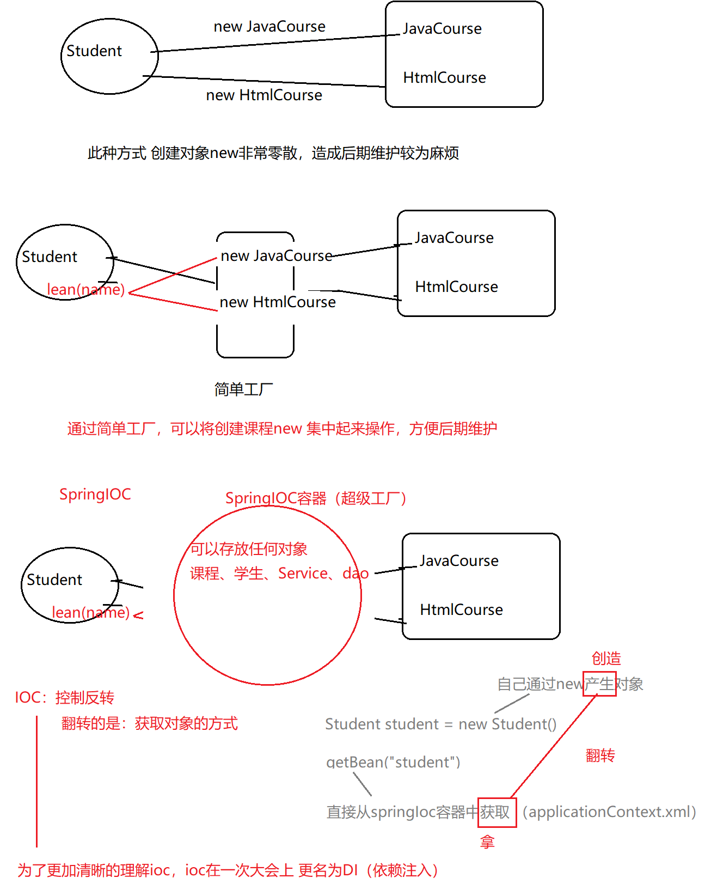
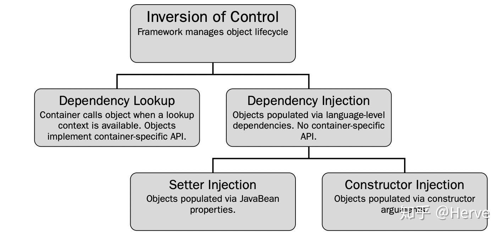

## Spring

#### jar

+ spring-aop.jar：开发AOP特性（外部依赖spring-beans，spring-core，*spring-*aoplliance）

+ spring-beans.jar：访问配置文件、创建和管理bean 以及进行Inversion of Control 、Dependency Injection（IoC/DI）操作相关的所有类

+ spring-context.jar：处理spring上下文，为Spring 核心提供了大量扩展。可以找到使用Spring ApplicationContext特性时所需的全部类，JDNI 所需的全部类，instrumentation组件以及校验Validation 方面的相关类

+ spring-core.jar：核心工具类，其它组件要都要使用到这个包里的类（外部依赖Commons-Logging）

+ spring-expression.jar：强大表达式解析语言，支持在运行时动态的解析表达式给对象赋值（外部依赖spring-core）

  ----

+ spring-web.jar：自动载入Web ApplicationContext 特性的类、文件上传的支持类、Filter 类和大量工具辅助类

+ spring-webmvc.jar：Spring MVC 框架相关的所有类。包括框架的Servlets、Web MVC框架，控制器和视图支持

+ spring-aspects.jar：提供对AspectJ的支持

+ spring-tx.jar：为JDBC、Hibernate、JDO、JPA、Beans等提供的一致的声明式和编程式事务管理支持（外部依赖spring-beans）

+ spring-jdbc.jar：包含对Spring 对JDBC 数据访问进行封装的所有类（外部依赖spring-tx）

+ commons-logging.jar：第三方提供的日志

#### IOC(Inversion of Control )

https://www.cnblogs.com/ITtangtang/p/3978349.html#a1

https://blog.csdn.net/it_man/article/details/4402245

https://blog.csdn.net/zhangcongyi420/article/details/89419715?depth_1-utm_source=distribute.pc_relevant.none-task-blog-BlogCommendFromBaidu-2&utm_source=distribute.pc_relevant.none-task-blog-BlogCommendFromBaidu-2

+ 概念：IOC是一种设计思想，为相互依赖的组件提供抽象，将依赖（低层模块）对象的获得交给第三方（系统）来控制**，**即依赖对象不再被依赖模块的类中直接通过new来获取；在Spring中，IOC主要是完成对象的创建和依赖的管理注入，Ioc意味着将你设计好的对象交给容器控制，而不是传统的在你的对象内部直接控制，所谓控制反转，就是把原先在对象内部那些直接对对象创建、依赖的操作反交给容器来帮忙实现

  即将创建对象、属性值的方式进行了反转转，从原本new、setXxx()  转变成了为了从springIOC容器getBean()

  无论要什么对象，都可以直接去springioc容器中获取，而不需要自己操作（new\setXxx()）所以要先给springioc中存放对象并赋值，然后就可以直接使用了

  + **在xml配置中，ioc中创建对象是通过反射调用构造方法，所以在定义bean的前提是该bean的类必须提供无参构造，若该类有有参构造，则必须声明无参构造**

  

#### DI(Dependency Injection)

+ 概念：将依赖对象的创建和绑定转移到被依赖对象类的外部来实现，即将属性值注入给属性，将属性注入给bean，将bean注入给ioc容器（底层通过反射完成）

+ 方式
  + set注入（通过调用set方法赋值）
  
    + 普通类型
  
      ```
      <property name="属性名" value="属性值"></property>
      ```
  
    + 对象类型
  
      ```
      <property name="属性名" ref="对象引用id"></property>
      ```
  
    + list类型
  
      ```
      <property name="属性名" >
      <list>
      	<value>属性值</value>
      	<value>属性值</value>
      </list>
      </property>
      ```
  
    + array类型
  
      ```
      <property name="属性名" >
      <array>
      	<value>属性值</value>
      	<value>属性值</value>
      </array>
      </property>
      ```
  
    + set类型
  
      ```
      <property name="属性名" >
      <set>
      	<value>属性值</value>
      	<value>属性值</value>
      </set>
      </property>
      ```
  
    + map类型
  
      ```
      <property name="属性名" >
      <map>
      	<entry>
      		<key>
      			<<value>键</value>
      		</key>
      		<value>值</value>
      	</entry>
      	<entry>
      		<key>
      			<<value>key值</value>
      		</key>
      		<value>值</value>
      	</entry>
      </map>
      </property>
      ```
  
    + Properties类型
  
      ```
      <property name="属性名" >
      <props>
      	<prop key="键">值</prop>
      </props>
      </property>
      ```
  
  + 构造器注入（通过有参构造方法赋值）
  
    **如果  <constructor-arg>的顺序与构造方法参数的顺序不一致，则需要通过type或者index或name指定**
  
    ```
    <constructor-arg value="属性值" name="属性名"></constructor-arg>
    ```
  
+ 自动装配（只适合对象类型，不需要声明<property>，不适用简单类型）

  ```
  public class Course {
  	private String courseName;
  	private int courseHour ;
  	private Teacher teacher ;//依赖于Teacher
  ```

  ```
  <bean id="course" class="com.entity.Course"  autowire="byName|byType|constructor|no" >  
  	<property name="courseName" value="java"></property>
  	<property name="courseHour" value="200"></property>
  </bean>
  ```

  + byName:  本质是byId，寻找其他bean的id值等于该Course类的属性名teacher
  + byType:  寻找其他bean的类型是否与该Course类的ref属性类型（Teacher ）一致  （此种方式 必须满足：当前Ioc容器中只能有一个Bean满足条件）  
  + constructor： 其他bean的类型(class)  是否与 该Course类的构造方法参数 的类型一致；此种方式的本质就是byType

  

#### IOC与DI区别

+ IOC

  + IoC 是一个很大的概念，可以用不同的方式来实现

    + 依赖查找：容器提供回调 接口和上下文环境给组件。 EJB 和 Apache Avalon 都是使用这种方式

    + 依赖注入：组件不做定位 查询，只是提供普通的 Java 方法让容器去决定依赖关系。容器全权负责组件的装配，它会把符合依赖关系的对象通过 JavaBean 属性或者构造子传递给需要的对象。通过 JavaBean 属性注射依赖关系的做法称为设值方法注入（ Setter Injection ）；将依赖关系作为构造子参数传入的做法称为构造方法注入（ Constructor Injection ）

      

  +  传统资源查找方式：要求组件向容器发起请求，查找资源作为回应，容器适时返回资源
  + IOC查找方式：容器主动将资源提供给它所管理的组件，组件只需要选择一个合适的方式来接收资源
  + 控制反转是从容器的角度在描述，描述完整点：容器控制应用程序，由容器反向的向应用程序注入应用程序所需要的外部资源
  + **创建对象实例的控制权由代码控制转移到IOC容器控制（new关键字转移到容器），即在XML文件中控制，控制权转移即所谓的反转，侧重于原理**

+ DI

  +  IOC另一种表达方式，组件以一些预先定义好的方式（如setter\getter)接收来自容器的资源注入
  + 依赖注入是从应用程序的角度在描述，可以把依赖注入描述完整点：应用程序依赖容器创建并注入它所需要的外部资源
  + **创建对象实例时，为这个对象注入属性值或其它对象实例，侧重于实现**

+ DI不能单独存在,DI需要在IOC的基础上来完成

**IOC/DI：由IoC容器帮对象找相应的依赖对象并注入，而不是由对象主动去找；有效的分离了对象和它所需要的外部资源，使得它们松散耦合，有利于功能复用，更重要的是使得程序的整个体系结构变得非常灵活**

#### 自动装配


#### AOP


ConcurrentHashMap


