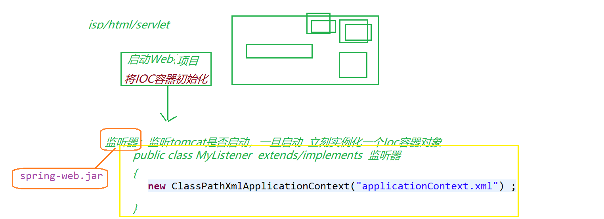
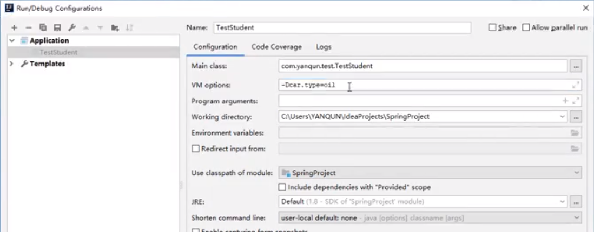
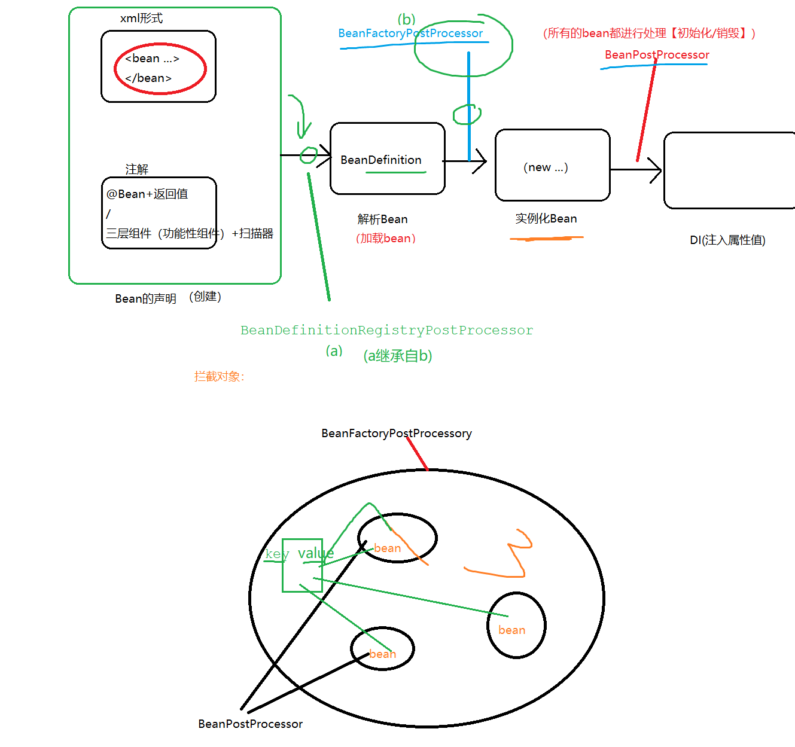

#### AOP

+ 连接点（JoinPoint）：允许你使用通知的地方，基本每个方法的前、后（两者都有也行），或抛出异常时都可以是连接点（spring只支持方法连接点.其他如aspectJ还可以让你在构造器或属性注入时都行）
+ 切入点（Pointcut）:连接点的基础上，来定义切入点，比如一个类里，有15个方法，那就有几十个连接点了，但是你并不想在所有方法附近都使用通知（使用叫织入）你只想让其中的几个，在调用这几个方法之前，之后或者抛出异常时干点什么，那么就用切点来定义这几个方法，让切点来筛选连接点，选中那几个你想要的方法
+ 通知（Advice）：想要实现的功能： 安全、事物、日志等。事先先定义好，然后在想用的地方用
+ 切面（Aspect）：切面是通知和切入点的结合，通知说明了干什么和什么时候干（什么时候通过方法名中的before,after，around等就能知道），而切入点说明了在哪干（指定到底是哪个方法），这就是一个完整的切面定义
+ 引入（introduction）：允许我们向现有的类添加新方法属性。也就是就是把切面（也就是新方法属性：通知定义的）用到目标类中
+ 目标（target）：引入中所提到的目标类，也就是要被通知的对象，也就是真正的业务逻辑，他可以在毫不知情的情况下，被咱们织入切面。而自己专注于业务本身的逻辑
+ 代理(proxy)：实现整套aop机制的，都是通过代理
+ 织入(weaving)：把切面应用到目标对象来创建新的代理对象的过程

前置通知、后置通知、异常通知、环绕通知（通过拦截器实现）

**环绕通知** 在目标方法的前后、异常发生时、最终等各个地方都可以 进行的通知，最强大的一个通知；可以获取目标方法的 全部控制权（目标方法是否执行、执行之前、执行之后、参数、返回值等）；在使用环绕通知时，目标方法的一切信息 都可以通过invocation参数获取到

+ 基于接口实现

```
package com.iwtrtw.myaop;
import org.aopalliance.intercept.MethodInterceptor;
import org.aopalliance.intercept.MethodInvocation;
public class AroudAdvice implements MethodInterceptor{
	@Override
	public Object invoke(MethodInvocation invocation) throws Throwable {
		Object result=null;
		try{
			System.out.println("前置通知");
			//控制目标方法的执行
			//result：目标方法的返回值
			result=invocation.proceed();
			System.out.println("后置通知");
		}catch(Exception e){
			System.out.println("异常通知");
		}
		//修改返回值
		result="返回值被修改";
		return result;
	}
}
```

+ 基于注解——先开启注解扫描@EnableAspectJAutoProxy

  @Before、@AfterReturning、@Around、@AfterThrowing

```
package com.iwtrtw;

import org.aspectj.lang.annotation.Aspect;
import org.aspectj.lang.annotation.Before;
import org.springframework.stereotype.Component;

@Component
@Aspect
public class NotVeryUsefulAspect {

	// the pointcut expression
	@Before(" execution(* com.iwtrtw.UserServie.*(..))") 
	private void anyOldTransfer(JoinPoint joinPoint) {
		//获取目标对象
		joinPoint.getTarget();
		//获取方法名
		joinPoint.getSignature().getName();
		//获取参数列表
		joinPoint.getArgs();
		System.out.println("TEST ASPECT");
	}
	
	
	
	@AfterReturning(pointcut = "execution(* com.iwtrtw.UserServie.*(..))",returning = "result")
	public void afterAdvice(JoinPoint joinPoint,Object result){
		//修改返回值
		result="返回值已被修改";
		System.out.println("后置通知");
	}


	@Around("execution(* com.iwtrtw.UserServie.*(..))")
	public void aroundAdic(ProceedingJoinPoint pJPoint){
		System.out.println("Around前置通知");
		try{
			//执行目标方法
			pJPoint.proceed();

		}catch (Throwable e){
			System.out.println("Aroundy异常通知");

		}
		System.out.println("Around后置通知");
	}
	
}
```

### Spring Web

Web项目始化SpringIOC容器 ：当服务启动时（tomcat），通过监听器将SpringIOC容器初始化一次（该监听器 spring-web.jar已经提供）
 用spring开发web项目至少需要7个jar： spring-java的6个jar + spring-web.jar（web项目的jar包 是存入到WEB-INF/lib中）

web项目启动时 ，会自动加载web.xml，因此需要在web.xml中加载监听器（ioc容器初始化）



+ Web项目启动时，启动实例化Ioc容器：web.xml

```
 <!-- 指定 Ioc容器（applicationContext.xml）的位置-->
  <context-param>
  		<!--  监听器的父类ContextLoader中有一个属性contextConfigLocation
  		该属性值 保存着 容器配置文件applicationContext.xml的位置 -->
  		<param-name>contextConfigLocation</param-name>
  		<param-value>classpath:applicationContext.xml</param-value>
  </context-param>  
  <listener>
  	<!-- 配置spring-web.jar提供的监听器
  	此监听器可以在服务器启动时初始化Ioc容器。
  		初始化Ioc容器（applicationContext.xml） ，
  			1.告诉监听器 此容器的位置：context-param
  			2.默认约定的位置	:WEB-INF/applicationContext.xml
  	 -->
  	<listener-class>org.springframework.web.context.ContextLoaderListener</listener-class>
  </listener>
```

在Servlet初始化时获取SpringIoc容器中的bean对象（SpringMvc底层实现？）

```
public class MyServelt extends HttpServlet{
	@Override
	public void init(){
	//Web项目获取Spring上下文对象
	ApplicationContext contect = WebApplicationContextUtils.getWebApplicationContext(this.getServletContext())
}
}

```

#### Spring整合Mybaits

Spring整合MyBatis 其实就是 将MyBatis的SqlSessionFactory 交给Spring

MyBatis最终是通过SqlSessionFactory来操作数据库:SqlSessionFactory → SqlSession →StudentMapper→CRUD;


使用Spring-MyBatis整合产物开发程序：通过spring产生mybatis最终操作需要的动态mapper对象(StudentMapper对象)；Spring产生动态mapper对象 有3种方法：

+ 第一种方式：编写DAO实现类继承 SqlSessionDaoSupport类(SqlSessionDaoSupport类提供了一个属性 SqlSession)

  + 先给DAO实现类注入SlqSessionFactory

  ```
  <bean id="studentMapper" class="org.lanqiao.dao.impl.StudentDaoImpl">
  	//将SPring配置的sqlSessionFactory 对象交给mapper(dao) 
  	<property name="sqlSessionFactory" ref="sqlSessionFacotry"></property>
  </bean>
  ```

  ```
  public class StudentDaoImpl extends SqlSessionDaoSupport implements StudentMapper {
  
  	@Override
  	public void addStudent(Student student) {
  		SqlSession session = super.getSqlSession() ;
  		StudentMapper stuDao = session.getMapper(StudentMapper.class) ;
  		//执行查询
  		stuDao.addStudent(student);
  	}
  	
  }
  ```

+ 第二种方式：就是省略DAO实现类，只需声明DAO接口即可；直接MyBatis提供的 Mapper实现类：org.mybatis.spring.mapper.MapperFactoryBean （缺点：每个mapper都需要一个配置一次）

  ```
  <bean id="studentMapper" class="org.mybatis.spring.mapper.MapperFactoryBean">
  	 <property name="mapperInterface" value="org.lanqiao.mapper.StudentMapper"></property>
  	 <property name="sqlSessionFactory" ref="sqlSessionFacotry"></property>
  </bean>
  ```

+ 第三种方式(批量配置mapper，自动生成实现类)

  org.mybatis.spring.mapper.MapperScannerConfigurer

  ```
  <bean class="org.mybatis.spring.mapper.MapperScannerConfigurer">
  	 <property name="sqlSessionFactoryBeanName" value="sqlSessionFacotry"></property>
  	 <!--指定批量产生 哪个包中的mapper对象-->
  	 <property name="basePackage" value="org.lanqiao.mapper"></property>
  </bean>
  ```

#### Spring IoC容器
IoC容器2种形式（两种形式获取的Ioc容器是独立的）

+ xml配置文件：applicationContext.xml

  + 存bean

    ```
    <bean id="" class=""></bean>
    ```

  + 取bean

    ```
    ApplicationContext context= new ClassPathXmlApplicationContext("applicationContext.xml");
    context.getBean();
    ```

+ 注解配置类：带有@Configuration注解的类（配置类）

  + 存bean（@Bean+方法返回值）

    ```
    @Configuration
    @ComponentScan("com.iwtrtw")
    public class AppConfig {
    
    	@Bean
    	@Scope()
    	//该bean的id默认为方法名"setUs"
    	public UserServie setUs(){
    		UserServie userServie = new UserServie("name");
    		return userServie;
    	}
    }
    ```

  + 取bean

    ```
    ApplicationContext context  = new AnnotationConfigApplicationContext(MyConfig.class)
    ```

+ IoC基于注解加入Bean的方法
  
  **要在SPring IOC容器中操作先确定操作方式对象：@Bean 、三层组件；不同对象的操作方式不同**
  
  + 三层组件： 扫描器 + 三层注解
  + 非三层组件① @Bean+返回值   ②@import  ③FactoryBean(工厂Bean)


#### 注解

Spring注解详解包扫描&bean注册https://blog.csdn.net/yangliuhbhd/article/details/80692990

Spring对注解(Annotation)处理源码分析1——扫描和读取Bean定义https://blog.csdn.net/chjttony/article/details/6301523

##### @ComponentScan

（在配置类处使用，只对三层组件负责，扫描@Componet @Service  @Respository @Component修饰的类**产生的对象增加到IOC容器中**）

```
@Configuration
@ComponentScan("com.yanqun")
public class AppConfig {

}
```

给扫描器指定规则——过滤类型：FilterType(ANNOTATION，ASSIGNABLE_TYPE，CUSTOM)

> ANNOTATION:Controller.class：指的是所有标有@Controller的类ASSIGNABLE_TYPE：值得是具体的一个类 StudentController.class

+ 排除三层注解@Controller、@Service

  ```
  @ComponentScan(value="com.yanqun",
  excludeFilters = {  @ComponentScan.Filter(type= FilterType.ANNOTATION,classes ={Controller.class，Service.class} )}  )		
  ```

+ 排除指定类(StudentDao)

  ```
  @ComponentScan(value="com.yanqun",
  excludeFilters = {  @ComponentScan.Filter(type= FilterType.ASSIGNABLE_TYPE,classes ={StudentDao.class} )}  )
  ```
  
+ 自定义排除(实现TypeFilter，重写其中的match，如果return true则加入IoC容器)

  ```
  @ComponentScan(value="com.yanqun",includeFilters = {@ComponentScan.Filter(type= FilterType.CUSTOM,classes ={ MyFilter.class})})
  ```
  
  ```
      public class MyFilter  implements TypeFilter {
      	@Override
      	public boolean match(MetadataReader metadataReader, MetadataReaderFactory metadataReaderFactory) throws IOException {
          AnnotationMetadata annotationMetadata = metadataReader.getAnnotationMetadata();
          //获取所有被ComponentScan扫描到的类（三层注解类）
          String className = annotationMetadata.getClassName();
          //只拿包含School
          if(className.contains("School"))
              return true ;
          return false;
      }
      }
  ```
  
+ 指定包含：includeFiltersuseDefaultFilters = false（spring默认只要不排除，都包含）
  
  ```
  @ComponentScan(value="com.yanqun",
  includeFilters = {@ComponentScan.Filter(type= FilterType.ANNOTATION,classes ={Controller.class})},
  useDefaultFilters = false)
  ```
  
##### @Aspect
需要开启@EnableAspectJAutoProxy

##### @Component
修饰的类是通过无参构造来创建的，默认可以不写，若已提供有参构造，则必须声明

##### @Conditional

修饰的类只有符合Conditional里面参数的条件下才可实例化、加入IoC容器

```
@Configuration
public class MyConfig {
	@Bean
    @Conditional(OilCarCondition.class)
    public Car oilCar(){
    	return new OilCar() ;
    }
```

先设置虚拟环境：-Dcar.type=oil



```
public class OilCarCondition  implements Condition {
    //如果当前环境是 oil，则加入OilCar
    @Override
    public boolean matches(ConditionContext conditionContext, AnnotatedTypeMetadata annotatedTypeMetadata) {
        //获取环境
        Environment environment = conditionContext.getEnvironment();
        String carType = environment.getProperty("car.type");
        if(carType.contains("oil")){
            return true ;
        }
        return false;
    }
}
```

##### @Import

+ 直接编写到@Import中，并且该bean的id值是全类名

  > @Import(User.class)
  >
  > @Import({User.class,Student.class})

+ 自定义ImportSelector接口的实现类，重写selectimports方法实现（方法的返回值 就是要纳入IoC容器的Bean） ; 并且 告知程序 自己编写的实现类。 >

  >  @Import(MyImportSelector.class)

  ```
  public class MyImportSelector implements ImportSelector {
      @Override
      public String[] selectImports(AnnotationMetadata importingClassMetadata) {
  		//返回值就是 要加入IOC容器的Bean的全类名
          return new String[]{"com.yanqun.entity.Apple","com.yanqun.entity.Banana"};  
      }
  }
  ```

+ 编写ImportBeanDefinitionRegistrar接口的实现类，重写方法

  > @Import(ImportBeanDefinitionRegistrar.class)
  >
  
  ```
  public class MyImportBeanDefinitionRegistrar implements ImportBeanDefinitionRegistrar {
      @Override
      public void registerBeanDefinitions(AnnotationMetadata importingClassMetadata, BeanDefinitionRegistry registry) {
          BeanDefinition beanDefinition =  new RootBeanDefinition("com.yanqun.entity.Orange") ;
          //注册bean{id:beanDefinition}
          registry.registerBeanDefinition("myorange", beanDefinition ); 
      }
  }
  ```

##### @Autowired|Resource|Inject

  Spring源码分析@Autowired原理分析https://segmentfault.com/a/1190000018077152

  + @Autowired (Spring)：CommonAnnotationBeanPostProcessor**会用后置处理器机制，来创建属性的实例，然后再利用反射机制，将实例化好的属性，赋值给对象上**

    **form** (javax.annotation.PostConstruct)

    + 在三层组件中：如果@Autowired在属性前标注，则不调用setXxx；如果标注在setXxx前面 ，则调用setXxx
    + 在@Bean+方法中：@Autowired  可以在方法的参数前（也可以省略）、方法前 （如果是通过有参构造方法注入属性，且构造方法只有一个时，则构造方法前的@Autowired也可以省略）

    默认按照类型装配的，默认情况下必须要求依赖对象必须存在，如果要允许null值，可以设置它的required属性为false如果我们想使用名称装配可以结合@Qualifier注解进行使用，如果含有多个相同类型则可以默认使用在其中一个上@Primary

    ```
    @Autowired() 
    @Qualifier("baseDao")    
    private BaseDao baseDao;
    ```

    ```
    @Primary
    @Component
    public class BaseDao{
    
    }
    ```

  + @Resource（JSR250）：AutowiredAnnotationBeanPostProcessor

    **form** org.springframework.beans.factory.annotation.Autowired

    **JDK1.6支持的注解**，**默认按照名称进行装配**，名称可以通过name属性进行指定，如果没有指定name属性，当注解写在字段上时，默认取字段名，按照名称查找，如果注解写在setter方法上默认取属性名进行装配。当找不到与名称匹配的bean时才按照类型进行装配。但是需要注意的是，如果name属性一旦指定，就只会按照名称进行装配
  
  + @Inject（JSR330）:默认根据类型匹配（**from**  javax.inject.ja）

  

#### Spring 组件

利用Spring底层组件进行开发 (三层组件);能够供我们使用的组件，都是Aware的子接口

以ApplicationContextAware为例:

+ 实现ApplicationContextAware，
+ 重写其中的方法，都包含了一个对象。只需要将该对象 赋值到属性中即可

	ApplicationContextAware，可以通过该接口获取到Ioc容器对象。
	先执行ApplicationContextAware实现类中的方法，通过该方法传入IoC容器
##### Bean

+ scope（作用域）
  + singleton：容器在初始化时，就会创建对象（唯一的一个）；以后再getBean时，不再产生新的bean。singleton也支持延迟加载（@Lazy懒加载）：在第一次使用时产生
  + prototype：容器在初始化时，不创建对象；只是在每次使用时（每次从容器获取对象时 ，context.getBean(Xxxx)）,再创建对象;并且  每次getBean()都会创建一个新的对象
  
+ 生命周期

  IoC容器：初始化容器、..使用容器、销毁容器

  Bean的生命周期：创建对象(构造方法.)、属性注入、初始化（init）、  ....、销毁(destroy，当容器关闭)

  + xml:

    > <bean init-method="myInit" destroy-method="myDestroy"></bean> 

  + 注解（@bean与三层注解）

    > @Bean(value="stu",initMethod = "myInit",destroyMethod = "myDestroy") 

    三层注解—— JAVA规范 ：JSR250

    > 给初始化方法加@PostConstruct（相当于init）
  >
    > 给销毁方法加@PreDestroy（相当于destroy）
  
    ```
  @Component(value="myConverter")
    public class MyIntToStringConverter {
        @PostConstruct
        public void init(){
            System.out.println("..Init...");
        }
        
         public MyIntToStringConverter(){
            System.out.println("无参构造");
        }
        
        @PreDestroy
        public void destroy(){
            System.out.println("..destroy...");
        }
    }
    ```
  
  + 实现接口（适用于三层组件（扫描器+三层组件））

    > InitializingBean 初始化
    >
    > DisposableBean 销毁 
    ```
  @Component
    public class MyFunction implements InitializingBean , DisposableBean {
    
        @Override
        public void afterPropertiesSet() throws Exception {
            System.out.println("初始化...");
        }
    
        @Override
        public void destroy() throws Exception {
            System.out.println("销毁...");
        }
    }
    ```
  
+ 加载时机

  + 同一个方法在不同地方（类、接口）的出现时机问题：a继承b，因此a中必然包含b中的方法(记c )：虽然a和b中都有c，但是 因此c出现的时机不同， 则c的执行顺序也不同
  + 如果是在a中出现，则先执行；如果是在b中执行 则后执行，在同一个地方（类、接口），的不同方法的出现时机问题
  + 在同一个地方（类、接口）的不同方法的出现时机问题
  
  
  
  声明bean（xml形式、注解）
  
  → BeanDefinitionRegistryPostProcessor（注册BeanDefinition）
  
  → BeanDefinition（解析bean）
  
   → BeanFactoryPostProcessor（拦截容器）
  
   → 实例化bean（创建对象）
  
   → BeanPostProcessor（拦截容器中的Bean）
  
   → 依赖注入（属性注入）
  
   → AOP
  
  
  
  

##### FactoryBean

通过FactoryBean可注册bean

1. 实现FactoryBean类和重写方法

```
public class MyFactoryBean implements FactoryBean {
    @Override
    public Object getObject() throws Exception {
        return new Apple();
    }

    @Override
    public Class<?> getObjectType() {
        return Apple.class;  //Apple
    }

    @Override
    public boolean isSingleton() {
        return true;
    }
}
```

2. 注册到@Bean中

```
@Configuration
public class MyConfig {
	@Bean
    public FactoryBean<Apple> myFactoryBean(){
       return new MyFactoryBean();//到底是什么？MyFactoryBean 、Apple ？
    }
```

3 . 通过&区分 获取的对象

+ 不加&：获取的是最内部真实的Apple(返回工厂创建的实例)
+ 加&，获取的是FacotryBean(返回工厂本身)

```
public class Test{
	ApplicationContext context= new ClassPathXmlApplicationContext("applicationContext.xml");
	Object obj = context.getBean("myFactoryBean");
    System.out.println(obj);//Apple
	Object obj2 = context.getBean("&myFactoryBean");
	System.out.println(obj2);//Factory
}
```

##### BeanPostProcessor

拦截了所有中容器的Bean，可以对bean进行修改，并且可以进行bean的初始化 、销毁

```
public class MyBeanPostProcessor implements BeanPostProcessor {

    //执行Init前
    @Override
    public Object postProcessBeforeInitialization(Object bean, String beanName) throws BeansException {
        if(bean instanceof Student){
            System.out.println("Before Init");
            return stu ;
        }
        return bean;
    }

	//执行Init后
    @Override
    public Object postProcessAfterInitialization(Object bean, String beanName) throws BeansException {
        if(bean instanceof Student) {
          System.out.println("After Init");
        }
            return bean;
    }
}
```

##### AnnotationConfigApplicationContext

Spring切换环境

```
@Profile("myApple")
@Bean("apple")
public Fruit apple(){
       return new Apple() ;
}
```

+ 激活方式一

  -Dspring.profiles.active=@Profile（环境名）

  > -Dspring.profiles.active=myApple
  
 + 激活方式二

   ```
   AnnotationConfigApplicationContext context = new AnnotationConfigApplicationContext() ;
   ConfigurableEnvironment environment = (ConfigurableEnvironment)context.getEnvironment();
   //切换指定环境
   environment.setActiveProfiles("myApple");
   //保存点
   context.register(MyConfig.class);
   context.refresh();
   ```

执行顺序

>  AnnotationConfigApplicationContext无参构造
>  MyBeanFactoryPostProcessor无参构造（implements BeanFactoryPostProcessor）
>  MyBeanPostPorcessor 无参构造   (implements BeanPostProcessor)
>  AppConfi 无参构造		(@Configuration)
>  NotVeryUsefulAspect 无参构造		(@Aspect)
>  MyContainer 无参构造		(implements ApplicationContextAware)
>  UserServie 无参构造		(@Component）
>  postProcessBeforeInitialization		（postProcessBeforeInitialization（...））
>  UserService Init		（@PostConstruct）
>  postProcessAfterInitialization			(postProcessAfterInitialization(...) )

#### MySQL事务

MySQL 事务主要用于处理操作量大，复杂度高的数据。在 MySQL 中只有使用了 Innodb 数据库引擎的数据库或表才支持事务；事务处理可以用来维护数据库的完整性，保证成批的 SQL 语句要么全部执行，要么全部不执行，事务用来管理 insert,update,delete 语句；一般来说，事务是必须满足4个条件（ACID）：：原子性（**A**tomicity，或称不可分割性）、一致性（**C**onsistency）、隔离性（**I**solation，又称独立性）、持久性（**D**urability）

+ **原子性：**一个事务（transaction）中的所有操作，要么全部完成，要么全部不完成，不会结束在中间某个环节。事务在执行过程中发生错误，会被回滚（Rollback）到事务开始前的状态，就像这个事务从来没有执行过一样

+ **一致性：**在事务开始之前和事务结束以后，数据库的完整性没有被破坏。这表示写入的资料必须完全符合所有的预设规则，这包含资料的精确度、串联性以及后续数据库可以自发性地完成预定的工作

+ **隔离性：**数据库允许多个并发事务同时对其数据进行读写和修改的能力，隔离性可以防止多个事务并发执行时由于交叉执行而导致数据的不一致。事务隔离分为不同级别，包括读未提交（Read uncommitted）、读提交（read committed）、可重复读（repeatable read）和串行化（Serializable）

+ **持久性：**事务处理结束后，对数据的修改就是永久的，即便系统故障也不会丢失

  在 MySQL 命令行的默认设置下，事务都是自动提交的，即执行 SQL 语句后就会马上执行 COMMIT 操作。因此要显式地开启一个事务务须使用命令 BEGIN 或 START TRANSACTION，或者执行命令 SET AUTOCOMMIT=0，用来禁止使用当前会话的自动提交

