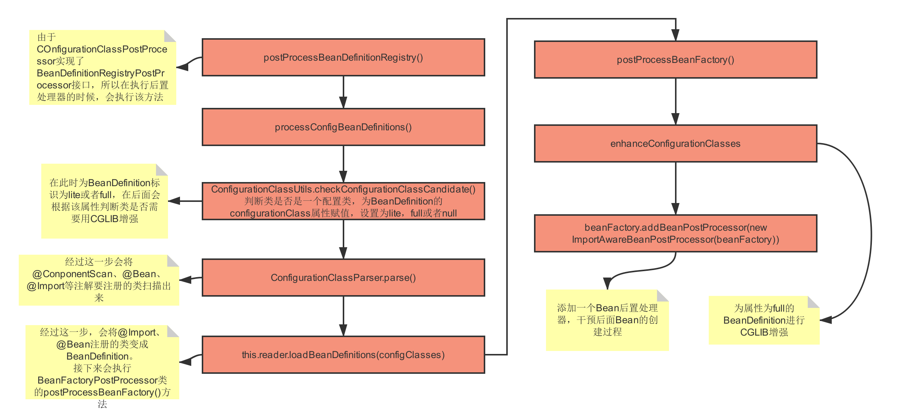

### Spring拓展

实现spring提供的接口，插手spring工厂初始化、bean实例化的过程

##### BeanFactoryPostProcessor

```
public interface BeanFactoryPostProcessor {

	 /*Modify the application context's internal bean factory after its standard initialization. 在应用程序上下文的标准初始化之后修改它的内部bean工厂。
	 *All bean definitions will have been loaded,所有的bean定义都将被加载，
	 *but no beans will have been instantiated yet.但是还没有实例化bean。
	 *This allows for overriding or adding properties even to eager-initializing beans.这允许 覆盖或添加属性，甚至对急于初始化的bean也是如此。
	 *@param beanFactory the bean factory used by the application context
	 *@throws org.springframework.beans.BeansException in case of errors*/
	 
	 
	void postProcessBeanFactory(ConfigurableListableBeanFactory beanFactory) throws BeansException;
}
```

```
public interface BeanDefinitionRegistryPostProcessor extends BeanFactoryPostProcessor {

	/* Modify the application context's internal bean definition registry after its standard initialization.在应用程序上下文的标准初始化之后修改其内部bean定义注册表。
	 * All regular bean definitions will have been loaded,所有常规的bean定义都会被加载，
	 * but no beans will have been instantiated yet.但是还没有实例化bean。
	 * This allows for adding further bean definitions before the next post-processing phase kicks in. 这允许在下一个后处理阶段开始之前添加更多的bean定义。
	 * @param registry the bean definition registry used by the application context
	 * @throws org.springframework.beans.BeansException in case of errors
	 */
	 
	 
	void postProcessBeanDefinitionRegistry(BeanDefinitionRegistry registry) throws BeansException;

}
```

可以在bean实例化之前参与BeanFactory的建设（处理BeanDefinition的产生、修改，往BeanDefintionMap中加入beanDefinition）

+ **BeanDefinitionRegistryProcessor (extends BeanFactoryPostProcessor )** 

  解析配置类（@Configuration、@ComponentScan、@Import、@Bean）扫描bean

  + **ConfigurationClassPostProcessor**

    > **postProcessBeanFactory()**：对@Configuration类加上cglib代理、向Spring中添加一个后置处理器ImportAwareBeanPostProcessor

    > **postProcessBeanDefinitionRegistry()**：解析配置类（@Configuration、@ComponentScan、三种@Import、@Bean）；注册beanDefinition；判断配置类是否是一个完成的配置类（@Configuration是完整类，会被加cglib代理；而其它非@Configuration则不会加cglib代理）



**Tip**：在spirng 5.x中先调用BeanDefinitionRegistryProcessor（包括用户自定义手动添加的BeanDefinitionRegistryProcessor，而且先执用户手动添加的），后调用BeanFactoryPostProcessor——源码是通过两个list分开存储BeanDefinitionRegistryProcessor和BeanFactoryPostProcessor

##### BeanPostProcessor

可以干涉bean的实例化过程（即beanDefinitionMap→singletionObject的过程，即在bean实例化new之后而没有没加入singletionObject之前）

  + 生命周期回调init：@PostContruct——CommonAnotationBeanPostProcessor
  + AOP：AspectJAwareAdvisorAutoProxyCreator

##### ImportSelector 

收集需要导入的配置类：可以通过实现该接口，用于选择性、有条件导入一些被@Configuration注解修饰的类

```
public interface ImportSelector {

	  
	String[] selectImports(AnnotationMetadata importingClassMetadata);
}
```

+ **DeferredImportSelector**：DeferredImportSelector用在处理@Conditional相关的导入时特别有用；Spring Bootn的自动配置功能就是通过DeferredImportSelector接口的实现类EnableAutoConfigurationImportSelector做到的。

##### ImportBeanDefinitionRegistrar

实现bean的动态注入：可以支持我们自己写的代码封装成BeanDefinition对象;实现此接口的类会回调postProcessBeanDefinitionRegistry方法，注册到spring容器中。把bean注入到spring容器

```
public interface ImportBeanDefinitionRegistrar {
	 
	void registerBeanDefinitions(AnnotationMetadata importingClassMetadata, BeanDefinitionRegistry registry);

}
```

+ **MapperScannerRegistrar**：spring在整合mybatis中通过扫描mapper并注入spring容器中。


### 向Spring注册类的不同方式

+ AnnotationConfigApplicationContext.register(xxx.class)

+ @CompoentScan(@Service、@Contorller、@Component、@Bean)

+ 实现ImportBeanDefinitionRegistrar接口——BeanDefinition

  > register和扫描所需的是一个类，将其转换成BeanDefinition的过程是有Spring内部完成的，
  >
  > 而ImportBeanDefinitionRegistrar可以让用户参与BeanDefinition的生成过程 （@MapperScan的原理）


@MapperScan：扫描Mapper并将其变成对象放入Spring Contex中

```
@Import(MapperScannerRegistrar.class)
public @interface MapperScan{

}
```


**MapperScannerRegistrar**   implements ImportBeanDefinitionRegistrar


**ImportBeanDefinitionRegistrar**

```
public interface ImportBeanDefinitionRegistrar {
	void registerBeanDefinitions(AnnotationMetadata importingClassMetadata, BeanDefinitionRegistry registry);

}
```


@Import （xxx.class）

+ 普通类
+ ImportSelect（实现此接口可以向Spring Context注册一个bean，但必须先有个类）
+ ImportBeanDefinitionRegistara

```
@Import(MyImportSelect.class)
@Configuration
public class AppConfig {

}
```

```
public class MyImportSelect implements ImportSelector{
	@Override
	public String[] selectImports(AnnotationMetadata importingClassMetadata) {
		return new String[]{MyController.class.getName()};
	}
}
```


