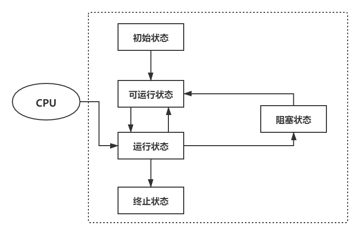
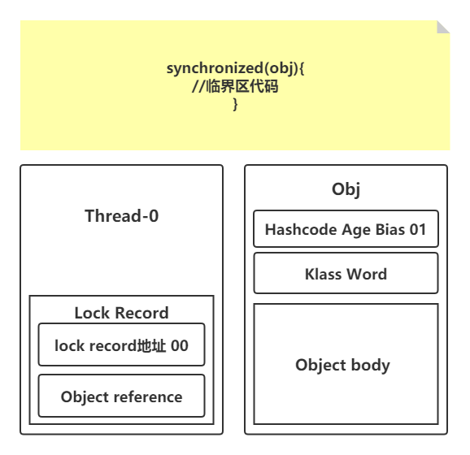
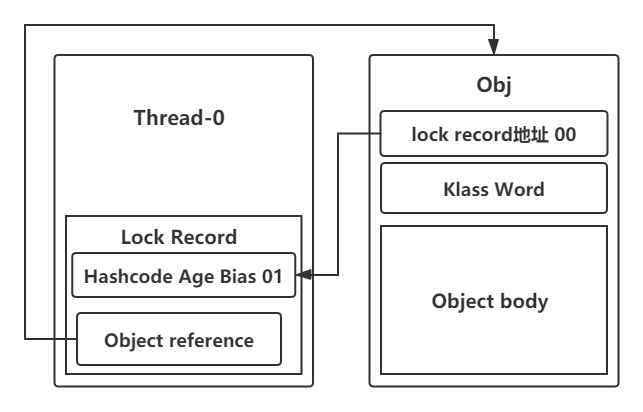
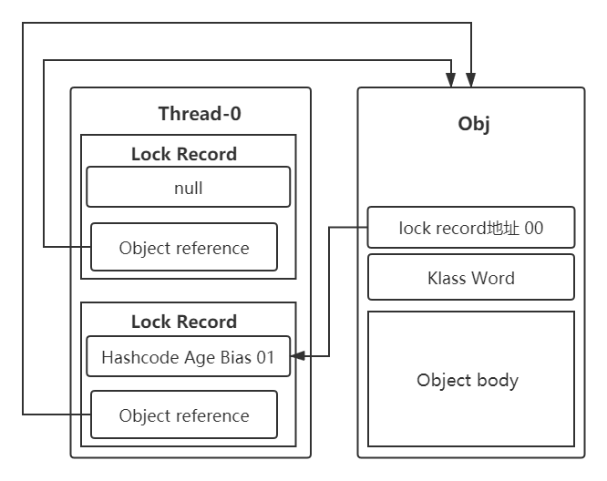
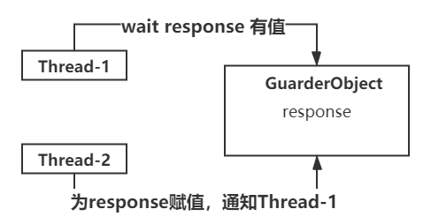
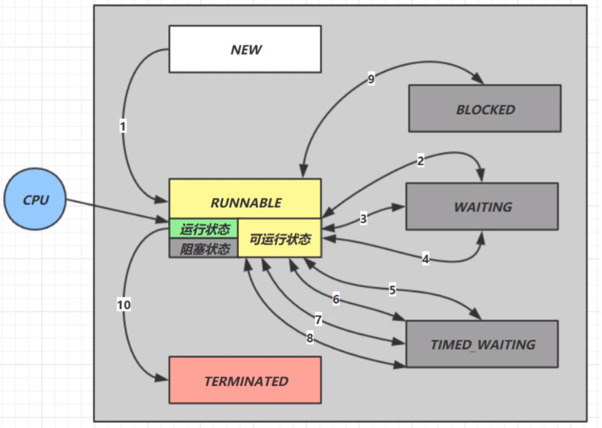
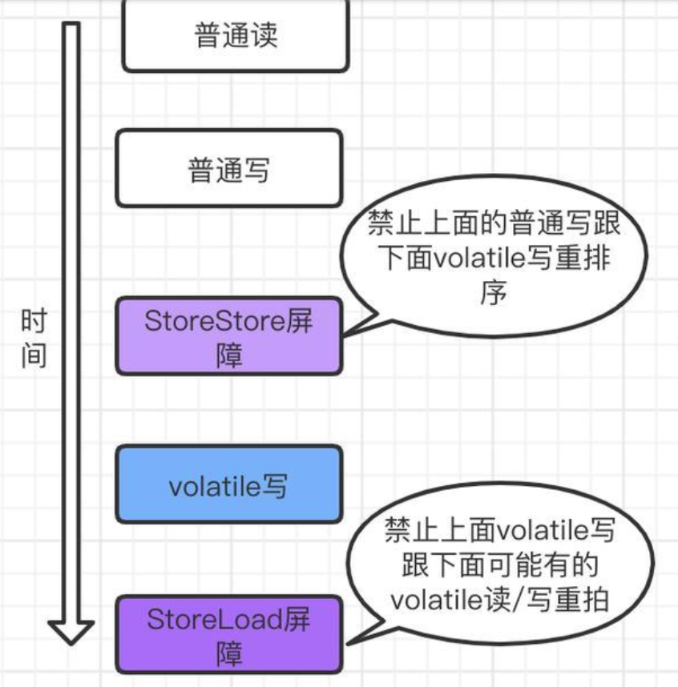
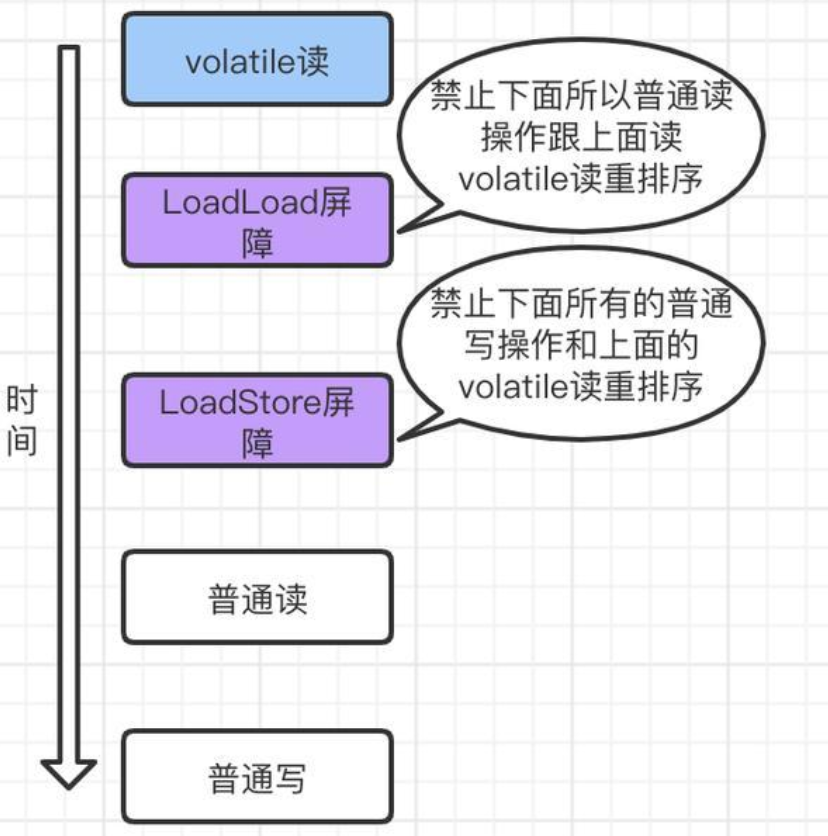

## 并发   

​      进程可以看做一个程序的实例，一个进程可以分为多个线程，在Java中，线程作为最小的调度单位，进程作为资源分配的最小单位。进程间是相互独立的，进程间的通信较为复杂，同一台计算机内的进程通信称为IPC(Inter-process communication)，不同计算机之间的进程通信，需要通过网络，并遵守共同的协议，例如HTTP。一个进程内的线程共享内存空间与部分资源，线程间的通信相对简单，线程更加轻量级，线程的上下文切换成本一般会比进程的上下文切换低

**Windows下时间片最小约为15毫秒，人类的反应速度大约100~300毫秒**

+ 并发(concurrent)是同一时间内应对多件事情的能力
+ 并行(parallel)是同一时间动手做多件事情的能力
+ 同步调用：需要等待结果返回才能继续运行
+ 异步调用：不需要等待结果返回就能继续执行

​      多线程可以让方法执行变为异步，在多核CPU下，使用多线程可以提高运行效率。而在单核CPU下，多线程不能实际提高程序运行效率，只是为了能够在不同的任务之间切换，不同线程轮流使用CPU，不至于一个线程总占用CPU，别的线程无法干活。虽然多核CPU是可以并行跑多个线程，但能否提高程序运行效率要看实际情况(有些任务是不能拆分，无法并行执行的)

### 线程

​      线程是交替执行的，谁先谁后不由控制

+ 线程创建

```java
//线程创建
Thread t = new Thread("mythread"){
    @Override
    public void run(){
        //要执行的任务
    }
}
//线程启动
t.start()
    
/* 匿名线程 */
new Thread(() -> {
    System.out.println("anonymity");
},"athred").start();
```

```java
Runnable runnable = new Runnable(){
    @Override
    public void run(){
        //要执行的任务
    }
}
//创建线程对象
Thread t = new Thread(runnable)
//启动线程
t.start()
```

在创建Thread对象时若传入Runnable对象，如果有则执行Runnable的run方法；否则会执行Thread对象自己的run方法

```java
/*
java.lang.Thread
target:Runnable对象
*/
@Override
    public void run() {
        if (target != null) {
            target.run();
        }
    }
```

使用Runnable更容易与线程池等高级API配合，而且可以不用继承Thread

**FutureTask**

```java
//FutureTask间接继承Runnable接口
FutureTask<Integer> task = new FutureTask<Integer>(new Callable<Integer>() {
    public Integer call() throws Exception {
        return 100;
    }
});
Thread t = new Thread(task,"mythrad");
t.start();
//获取返回结果
System.out.println(task.get());  //100
```

+ 查看进程线程

> ps -ef 查看所有进程
>
> ps -fT -p <PID>  查看
>
> kill <pid>  杀死进程
>
> top  动态查看进程信息
>
> top -H -p <PID>  动态查看某个进程(PID)的所用线程

>  jps 查看所有Java进程
>
> jstack <PID> 查看某个进程(PID)某一刻的所有线程状态信息

+ 线程上下文切换(Thread Context Switch)：由于某些原因，CPU不再执行当前线程转而执行另一个线程的代码。当发生Context Switch时，操作系统需要保存当前线程的状态，并恢复另一个线程的状态，在Java中线程的转台包括：程序计数器、虚拟机栈中每个栈帧的信息(局部变量表、操作数栈、返回地址)。Context Switch频繁发生会影响性能

  + 线程的cpu时间片用完
  + 垃圾回收
  + 更高优先级的线程需要运行
  + 线程自己调用了sleep、yield、wait、join、park、synchronized、lock等方法


#### 常见方法

| 方法名           | 功能说明                                                   | 注意                                                         |
| ---------------- | ---------------------------------------------------------- | ------------------------------------------------------------ |
| start()          | 启动一个新线程，在新的线程运行run方法中的方法中的代码      | start方法只是让线程进入就绪，run方法里面的代码不一定立刻执行(CPU时间片还没分给它)。每个线程对象的start方法只能调用一次，如果调用多次会出现IllegalThreadStateException |
| run()            | 新线程启动后调用的方法                                     | 如果在构造Thread对象时传递了Runnable参数，则线程启动会调用Runnable的run方法，否则默认不执行任何操作。可以通过创建Thread的子类对象并重写run方法来覆盖默认行为 |
| join()           | 等待线程结束                                               |                                                              |
| join(long   n)   | 等待线程运行结束，最多等待n毫秒                            |                                                              |
| getId()          | 获取线程长整型的id                                         | id唯一                                                       |
| getName()        | 获取线程名                                                 |                                                              |
| getName(String)  | 修改线程名                                                 |                                                              |
| getPriority()    | 获取线程优先级                                             | 默认优先级为5                                                |
| setPriority(int) | 修改线程优先级                                             | java中规定线程优先级是1~10的整数，较大的优先级能提高该线程被CPU调度的几率 |
| getState()       | 获取线程状态                                               | Java中线程状态是用6个enum表示，分别为：NEW、RUNNABLE、BLOCKED、WAITING、TIMED_WAITING、TERMINATED |
| isInterrupted()  |                                                            | 不会清除(打断标记)                                           |
| interrupt()      | 打断线程                                                   | 如果被打断线程正在sleep、wait、join会导致被打断的线程抛出InterruptedException并清除打断标记，如果打断的正在运行的线程，则会设置打断标记，park的线程被打断，也会设置打断标记 |
| isAlive()        | 线程是否存活                                               |                                                              |
| interrupted()    | 判断当前线程是否被打断                                     | 会清除打断标记                                               |
| currentThread()  | 获取当前正在执行的线程                                     |                                                              |
| sleep(long n)    | 让当前执行的线程休眠n毫秒，休眠是让出CPU的时间片给其他线程 |                                                              |
| yield()          | 提示线程调度器让出当前线程对CPU的使用                      | 主要为了测试和调试                                           |

+ **sleep**：调用sleep会让当前线程从Running进入TimedWaiting状态；其他线程可以使用interrupt方法打断正在睡眠的线程，这时sleep方法会抛出InterruptedException；睡眠结束后的线程未必会立刻得到执行；建议用TimeUnit的sleep代替Thread的sleep来获得更好的可读性

> TimeUnit.SECONDS.sleep(1)    //线程睡眠1秒
>
> Thread.sleep(1000)    //线程睡眠1秒

+ **yield**：调用yield会让当前线程从Running进入Runnable就绪状态，然后调度执行其他线程；具体的实现依赖于操作系统的任务调度器

+ 优先级：线程优先级会提示调度器优先调度该线程，但这仅仅是一个提示，调度可以忽略它；如果CPU比较忙，那么优先级高的线程会获得更多的时间片，但CPU闲时，优先级几乎不起作用

​      当没有利用CPU进行计算时，while(true){}循环体内最好使用yield或sleep来让出cpu的使用权给其他程序，避免CPU在while(true)空转而造成资源浪费。另外可以使用wait或条件变量达到类似的效果，不同的是，这两种方式都需要加锁，并且需要对应的唤醒操作，一般适用于要进行同步的场景，而sleep适用于无需锁同步的场景

+ **join**：当主线程调用A线程的join方法时，若A线程还没有结束，则主线程会进入阻塞状态，等待A线程结束才继续往下运行；若A线程结束了，则没啥事似地往下运行

```java
int a = 0;
Thread t1 = new Thread(() -> {
    sleep(1)
    a = 10
},"mythread")
t1.start()
System.out.println(a)  //0
t1.join()   //等待t1线程结束
System.out.println(a)  //10
```

##### 两阶段终止

+ 不推荐使用的方法:某些方法已经过时，容易破坏同步代码块，造成线程死锁

| 方法名    | 功能说明           |
| --------- | ------------------ |
| stop()    | 停止线程运行       |
| suspend() | 挂起(暂停)线程运行 |
| resume()  | 恢复线程运行       |

+ 守护线程：默认情况下，Java进程需要等待所有线程都运行结束，才会结束。有一种特殊的线程叫做守护线程，只要其它非守护线程运行结束了，那么守护线程将会被强制结束
  + 垃圾回收器线程就是一种守护线程
  + Tomacat中的Acceptor和Poller线程都是守护线程，所以Tomcat接收到shutdown命令后，不会等待它们处理完成当前请求

#### 线程状态

##### 五种状态——操作系统层面

+ 初始状态：仅仅是在语言层面创建了线程对象，还未与操作系统线程关联
+ 可运行状态：线程已经被创建(与操作系统线程关联)，可以由CPU调度执行
+ 运行状态：获取了CPU时间片运行中的状态(当CPU时间片用完时，会从运行状态转换到可运行状态，这会导致线程的上下文切换)
+ 阻塞状态：如果调用了阻塞API，如BIO读写文件，这时该线程实际不会用到CPU，会导致线程上下文切换，进入阻塞状态，等待BIO操作完毕后，会由操作系统唤醒阻塞的线程，装换至可运行状态。与可运行状态区别的是对阻塞状态的线程来说只要它们一直不被唤醒，调度器就一直不会考虑调度它们
+ 终止状态：表示线程已经执行完毕，生命周期已经结束，不会装换为其他状态



##### 六种状态——Java API

+ NEW：线程刚被创建，还没有调用start()方法
+ RUNNABLE：当调用了start()方法之后（Java API层面的RUNNABLE状态涵盖了操作系统层面的可运行状态、运行状态、阻塞状态）
+ BLOCKED：等待另一个锁的释放
+ WAITING：无限等待(调用A线程的join方法，但A线程在死循环)
+ TIMED_WAITING：限时等待(调用sleep(n)方法)
+ TERMINATED：当线程代码运行结束

### 原子性

**i++**在字节码层面实际会产生如下的JVM字节码指令

```java
getstatic i		//获取静态变量i的值
iconst_1		//准备常量1
iadd		//自增
pustatic i		//将修改后的值存入静态变量i
```

+ 临界区(Critical Section)：一段代码块如果存在对共享资源的多线程读写操作，称这段代码块为临界区。一个程序运行多个线程本身是没有问题的，而问题可能出在多个线程访问共享资源：多个线程读共享资源其实也没有问题，而在多个线程对共享资源读写操作时发生指令交错就会出现问题。
+ 竞态条件(Race Condition)：多个线程在临界区内执行，由于代码的执行序列不同而导致结果无法预测，称之为发生了竞态条件。为了避免临界区的竞态条件的发生，可以使用如下解决方案：
  + 阻塞式解决方案：synchronized、Lock
  + 非阻塞式的解决方案：原子变量

#### synchronized

​      synchronized采用互斥的方式让同一时刻至多只有一个线程持有对象锁，其它线程在想要获取这个对象锁时就会被阻塞主，这样就能保证拥有锁的线程可以安全地执行临界区内的代码，不用担心线程上下文切换。在java中互斥和同步都可以采用synchronized来实现，但它们还是有区别的:

+ 互斥是保证临界区的竞态条件发生，同一时刻只能有一个线程执行临界区代码
+ 同步是由于线程执行的先后、顺序不同、需要一个线程等待其他线程运行到某个点

```java
synchronized(对象){
	临界区
}
```

当A线程获取到synchronized对象锁后，其他线程将无法进入临界区，即使A线程的时间片不幸用完，其他线程也无法进入临界区，直到A线程重新获取时间片，将临界区的代码运行完之后并释放锁，其他线程才能获取锁

```java
class Test{
    public synchronized void test(){
        
    }
}
//成员方法锁的是当前对象
class Test{
    public void test(){
        synchronized(this){
            
        }
    }
}
```

```java
class Test{
    public synchronized static void test(){
        
    }
}
//静态方法锁的是当前类对象
class Test{
    public static void test(){
         synchronized(Test.class){
            
        }
    }
}
```

##### 变量线程安全分析

+ 成员变量和静态变量：如果它们没有共享，则线程安全；如果它们被共享了，如果只有读操作，则线程安全，如果有读写操作且这段代码时临界区则需要考虑线程安全
+ 局部变量：局部变量是线程安全（因为每个线程的栈帧内存中被创建多份）；但局部变量引用的对象未必安全，如果该对象没有逃离方法的作用访问，它是线程安全的，如果该对象逃离方法的作用范围则需要考虑线程安全

##### 常见线程安全类

​      String、Integer、StringBuffer、Random、Vector、Hashtable以及java.util.concurrent包下的类属于线程安全，当多个线程调用它们同一个实例的某个方法时是线程安全的，但它们的多个方法的组合不是原子的

​      String、Integer等都是不可变类，因为其内部的状态不可以改变，因此它们的方法都是线程安全的

##### Mark Word

|                        | state                  |
| ---------------------- | ---------------------- |
| 010                    | Normal(无锁)           |
| 101                    | Biased(偏向锁)         |
| lock_record+00         | Light Locked(轻量级锁) |
| heavyweight_monitor+10 | Heavy Locked(重量级锁) |

##### Monitor

​      每个Java对象都可以关联一个Monitor对象（Monitor是由操作系统提供的），如果使用synchronized给对象上锁(重量级)之后，该对象头的Mark Word中就被设置指向Monitor对象的指针


**synchronized原理**

```java
static final Object lock = new Object()
static int counter = 0
public static void main(String[] args){
    synchronized(lock){
        counter++
    }
}
```

```java
public class com.iwtrtw.cc.SynTheory {
  static final java.lang.Object lock;

  static int counter;

  public com.iwtrtw.cc.SynTheory();
    Code:
       0: aload_0
       1: invokespecial #1 // Method java/lang/Object."<init>":()V
       4: return

  public static void main(java.lang.String[]);
    Code:
       0: getstatic     #2//获取lock引用(synchronized)
       3: dup
       4: astore_1        //将lock存入局部变量表(后面用于解锁)
       5: monitorenter   //将lock对象MakrWord置为Monitor指针
       6: getstatic     #3     // 获取counter:I
       9: iconst_1           //准备常数 1
      10: iadd              //+1操作
      11: putstatic     #3       // 写入counter:I
      14: aload_1               //获取lock引用
    15:monitorexit//将lock对象MarkWord重置并唤醒EntryList
      16: goto          24
     /*
     监测异常：如果synchronized方法体出现异常也可正确解锁
     */
      19: astore_2   //exception -> slot2
      20: aload_1   //获取lock引用
   21: monitorexit//将lock对象MarkWord重置并唤醒EntryList
      22: aload_2    //获取exception
      23: athrow     //抛出异常thorw exception
      24: return
    Exception table:
       from    to  target type
           6    16    19   any
          19    22    19   any

  static {};
    Code:
       0: new           #4      // class java/lang/Object
       3: dup
       4: invokespecial #1// Method java/lang/Object."<init>":()V
       7: putstatic     #2// Field lock:Ljava/lang/Object;
      10: iconst_0
      11: putstatic     #3     // Field counter:I
      14: return
}
```

+ 偏向锁：轻量级锁在没有竞争时，每次重入都需要执行CAS操作。在Java 6中引入了偏向锁来做进一步优化，只有第一次使用CAS将线程ID设置到对象的Mark Word头，之后若再次加锁时发现这个线程ID仍是自己是则表示没有竞争，不用重新CAS（只要不发生竞争，该对象就归该线程所有）。一个对象在创建时，如果开启偏向锁(默认开启)，那么在对象创建之后，markword值的最后3位为101，这是他的threadID、epoch、age均为零（但偏向锁时默认延迟的，不会再程序启动后立即加载，可以通过-XX：BiasedLockingStartupDelay=0来禁用延迟）。如果使用-XX：-UseBiasedLocking禁用偏向锁，那么进行加锁时则直接升级到轻量级锁。**当一个可偏向对象调用它的hashCode方法时，那么将会撤销该对象的可偏向性，因为偏向锁需要存线程id，没有额外空间存hashCode了，而轻量级锁会把hashcode存到锁记录中，重量级锁会把hashcode存到Monitor中**

  ```java
  Dog d = new Dog()
  d.hashCode()  //调用hasCode()会禁用偏向锁
  ```

+ 轻量级锁：一个对象虽然有多个线程访问，但多线程访问的时间是错开的(即没有竞争)，那么可以使用轻量级锁解决(轻量级锁对使用者是透明的，即语法仍然是synchronized)。当一个线程遇到synchronized的时候，会在其栈帧中创建锁记录Lock Record对象（内部可以存储锁定对象的Mark Word），锁记录中Object reference指向锁对象，并尝试用**CAS**替换Object的Mark Word，将Mark Word的值存入锁记录。



**CAS成功**：如果CAS替换成功，对象头存储了锁记录地址和状态00，表示由该线程给对象加锁



**重入锁** ：如果CAS失败那么有两种情况

+ 一种情况是已持有锁对象再次执行synchronized锁重入，那么会在该线程中栈帧中再次添加一条Lock Record作为重入的计数。当退出synchronized代码块(解锁时)，如果有取值为null的锁记录，表示有重入，这时清掉锁记录，重入计数减一

  

  当轻量级锁在退出synchronized代码块(解锁时)，锁记录的值不为null，这时使用cas将Mark Word的值恢复给对象头，若成功则说明解锁成功；若失败则说明轻量级锁进行了锁膨胀或已经升级为重量级锁，需要进入重量级解锁流程(按照Monitor地址找到Monitor对象，设置其Owner为null，然后唤醒EntryList中BLOCKED线程)

+ 另一种是其它线程已经持有了该Object的轻量级锁，这表明出现了竞争，则会进行锁膨胀，由轻量级锁升级为重量级锁（即为Obj先向操作系统申请Monitor锁，让Obj指向重量级锁地址）

+ 重量级锁：在重量级锁竞争时，可以使用自旋重试来进行优化，如果自旋成功(即表明持锁线程已经退出了同步代码块，释放了锁)，那么当前线程可以避免进入阻塞。在Java 6之后自旋锁是自适应的(比如对象刚刚的一次自旋操作成功之后，那么认为这次自旋成功的可能性会比较高，然后就会多自旋几次，反之，就会减少自旋次数甚至不自旋)；自旋会占用CPU时间，单核CPU自旋就是浪费，多核CPU自旋才能发挥优势

##### wait/notify

Owner线程发现条件不满足，当调用wait方法时，即可进入WiatSet变为WAINTING状态，BLOCKED和WAITING的线程都处于阻塞状态，不占用CPU时间片，BLOCKED线程会在Owner线程调用notify或notifyAll唤醒，但唤醒并不意味着可以立刻获取到锁，仍然需要进入EntryList重新竞争。

+ obj.wait() 让进入object监视器的线程到wiatSet等待
+ obj.notify()在object上正在waitSet等待的线程随机唤醒一个
+ obj.notifyAll()让object上正在waitSet等待线程全部唤醒

###### sleep&wait

+ sleep是Thread方法，而wait是Object的方法
+ sleep不需要强制和synchronized配合使用，但wait需要和synchronized一起用
+ sleep在睡眠的同时，不会释放对象锁的，但wait在等待的时候会释放对象锁

##### 保护性暂停

​     保护性暂停是一种同步模式，即Guarded Suspension，应用于一个线程等待另一个先后才能的执行结果的场合



+ 有一个结果需要从一个线程传递到另一个线程，让他们关联同一个GuardedObject
+ 如果有结果不断从一个线程到另一个线程那么可以使用消息队列
+ 在JDK中，join、Future的实现均采用此模式


```java
class GuardedObject {
    // 标识 Guarded Object
    private int id;

    public GuardedObject(int id) {
        this.id = id;
    }

    public int getId() {
        return id;
    }

    // 结果
    private Object response;

    // 获取结果
    // timeout 表示要等待多久
    public Object get(long timeout) {
        synchronized (this) {
            // 开始时间
            long begin = System.currentTimeMillis();
            // 经历的时间
            long passedTime = 0;
            while (response == null) {
                // 这一轮循环应该等待的时间
                long waitTime = timeout - passedTime;
                // 经历的时间超过了最大等待时间时，退出循环
                if (timeout - passedTime <= 0) {
                    break;
                }
                try {
                    this.wait(waitTime); 
                } catch (InterruptedException e) {
                    e.printStackTrace();
                }
                // 求得经历时间
             passedTime = System.currentTimeMillis() - begin; 
            }
            return response;
        }
    }

    // 产生结果
    public void complete(Object response) {
        synchronized (this) {
            // 给结果成员变量赋值
            this.response = response;
            this.notifyAll();
        }
    }
}
```

###### join原理

```java
public final synchronized void join(long millis)
    throws InterruptedException {
        long base = System.currentTimeMillis();
        long now = 0;

        if (millis < 0) {
            throw new IllegalArgumentException("timeout value is negative");
        }
        if (millis == 0) {
            while (isAlive()) {
                wait(0);
            }
        } else {
            while (isAlive()) {
                long delay = millis - now;
                if (delay <= 0) {
                    break;
                }
                wait(delay);
                now = System.currentTimeMillis() - base;
            }
        }
    }
```

##### Park&Unpark

```
//暂停当前线程
LockSupport.park()

//恢复某个线程的运行
LockSupport.unpark()
```

```java
    public static void main(String[] args) {
        Thread t1 = new Thread(() -> {
            log.debug("start...");
            sleep(2);
            log.debug("park...");
            LockSupport.park();
            log.debug("resume...");
        }, "t1");
        t1.start();

        sleep(1);
        log.debug("unpark...");
        LockSupport.unpark(t1);
    }
```

+ 特点
  + wait/notify和notifyAll必须配合Object Monitor一起使用，而unpark不必
  + park&unpark是以线程为单位来阻塞和唤醒线程的，而notify只能随机唤醒一个等待线程，notifyAll唤醒所有等待线程
  + park&unpark可以先执行unpark，而wait&notify不能先执行notify
+ 原理：每个线程都有自己的一个Parker对象，每个线程由\_conuter、\_cond和\_metex组成。当线程调用Unsafe.park()方法时，会先检查\_conuter是否为零，若为零，则获得\_metex互斥锁并进入\_cond等待队列里面阻塞，然后重新设置\_conuter为0。当调用Unsafe.unpark(Thread-0)方法时，则先设置\_conuter为1，接着唤醒\_cond条件变量中的Thread-0，使得Thread-0恢复运行，随后将\_conuter设置为0

##### 线程状态转换



+ **NEW → RUNNABLE**：调用thread.start()时(**thread**)
+ **RUNNABLE → WAITING**：调用obj.wait()时(**当前线程**)、当前线程调用thread.join()时(**当前线程在thread线程对象的监视器上等待**)、当前线程调用LockSupport.park()(**当前线程**)、
+ **WAITING →RUNNABLE**：调用obj.notify()、obj.notifyAll()、thread.interrupt()且锁竞争成功时(**thread**)、当前线程在调用thread.join()后thread运行结束时(**当前线程**)、调用LockSupport.unpark(thread)（**thread**）
+ **WITING →BLOCKED**：调用obj.notify()、obj.notifyAll()、thread.interrupt()且锁竞争失败时(**thread**)
+ **RUNNABLE→TIMED_WAITING**：调用obj.wait(long n)方法时(**当前线程**)、调用Thread.sleep(long n)、当前线程调用LockSupport. parkNanos (long nanos)或LockSupport.parkUntil(long millis)时(**当前线程**)
+ **TIMED_WAITING→RUNNABLE**：wait(long n)的等待时间超时时(**调用obj.wait(long n)的线程**)、调用obj.notify()、obj.notifyAll()、thread.interrupt()且锁竞争成功时(**thread**)、Thread.sleep(long n)的等待时间超时时(**调用Thread.sleep(long n)的线程**)、调用LockSupport.unpark (**thread**)或者调用**thread**.interrupt()
+ **TIMED_WAITING→BLOCKED**：调用obj.notify()、obj.notifyAll()、thread.interrupt()且锁竞争失败时(**thread**)
+ **RUNNABLE→BLOCKED**：t线程用synchronized(obj)获取对象锁失败时
+ **BLOCKED→RUNNABLE**：持有obj锁线程的同步代码块执行完毕会唤醒该对象上所有的BLOCKED的线程重新竞争，竞争成功的线程从blocked→runnable，其他竞争失败的线程仍然BLOCKED

> 定位死锁  jstack pid

>  饥饿线程：一个线程由于优先级太低而可能一直得不到CPU调用执行并且也不能结束

>  使用顺序加锁可能可以解决死锁问题

##### ReentrantLock

​      ReentrantLock相较于synchronized具备如下特点：可中断、可以设置超时时间、可以设置为公平锁、支持多个条件变量

```java
ReentrantLock lock = new ReentrantLock()
//获取锁（不可打断）
lock.lock()
try{
    //临界区
}finally{
    //释放锁
    lock.unlock()
}
```

+ 可中断：当竞争锁失败时进入阻塞队列时，可被其他线程打断重新唤醒该线程（一定程度上可以防止无限等待而造成的死锁）

```java
ReentrantLock lock = new ReentrantLock()
try{
    lock.lockInterruptibly()
    //临界区
}catch(InterruptException e){
    //被其他线程打断
    e.printStackTrace()
}
```

+ 锁超时：当竞争锁失败一段时间后放弃等待

```java
ReentrantLock lock = new ReentrantLock()
//尝试获取锁，获取到时返回true
try{
    if(lock.tryLock(long time,TimeUnit.SECONDS)}{
        try{
            //临界区
        }finally{
            //释放锁
            lock.unlock()
        }
    }
}catch(InterruptedException e){
    //被打断
    e.printStackTrace()
}
```

+ 公平锁：ReentrantLock默认也是不公平的（锁释放方式阻塞队列中的线程竞争抢锁，并不是先来先的），可以通过构造方法设置为公平锁，阻塞队列在唤醒时按先进先出进行，但公平锁会降低并发性

+ 支持多个条件变量：多个wait队列
  + await前需要获得锁
  + await执行后会释放锁，进入Condition等待
  + await的线程被唤醒(或打断、或超时)时重新竞争lock锁
  + 竞争lock锁成功后，从await后继续执行

```java
ReentrantLock lock = new ReentrantLock()
//创建一个新的条件变量
Condition cond1 = new Condition()
Condition cond2 = new Condition()
//获取锁
lock.lock()
//当前线程进入wait等待
cond1.await()

    

//唤醒某个condition中的线程
cond1.signal()
cond2.signalAll()
```

### 可见性

​      JMM即Java Memory Model，它定义了主存、工作内存抽象概念，底层对应着CPU寄存器、缓存、硬件内存、CPU指令优化等。JMM体现在以下几个方面：

+ 原子性：保证指令不受到线程上下文切换的影响
+ 可见性：保证指令不会受到cpu缓存的影响
+ 有序性：保证指令不会受到cpu指令并行优化的影响

```
Thra
```

### 有序性

​      JVM会在不影响最终结果正确性的前提下对语句的执行顺序进行重排，在多线程下指令重排会影响正确性

#### volatile

​     volatile可以保证线程可见性且提供了一定的有序性，但是无法保证原子性。 volatile可以用来修饰成员变量和静态成员变量，可以避免线程从自己的工作缓存中查找变量值，必须到主存中获取它的值，线程操作volatile变量都是直接操作主存。

​      volatile禁止指令重排序也有一些规则：

> a.当程序执行到volatile变量的读操作或者写操作时，在其前面的操作的更改肯定全部已经进行，且结果已经对后面的操作可见；在其后面的操作肯定还没有进行；

> b.在进行指令优化时，不能将在对volatile变量访问的语句放在其后面执行，也不能把volatile变量后面的语句放到其前面执行。

**即执行到volatile变量时，其前面的所有语句都执行完，后面所有语句都未执行。且前面语句的结果对volatile变量及其后面语句可见。**

​      在JVM底层volatile是采用“内存屏障”来实现的。观察加入volatile关键字和没有加入volatile关键字时所生成的汇编代码发现，加入volatile关键字时，会多出一个lock前缀指令，lock前缀指令实际上相当于一个内存屏障（也成内存栅栏），内存屏障会提供3个功能：

**I. 它确保指令重排序时不会把其后面的指令排到内存屏障之前的位置，也不会把前面的指令排到内存屏障的后面；即在执行到内存屏障这句指令时，在它前面的操作已经全部完成；**

**II. 它会强制将对缓存的修改操作立即写入主存；**

**III. 如果是写操作，它会导致其他CPU中对应的缓存行无效。**

+ 在每个volatile写操作前插入StoreStore屏障，在写操作后插入StoreLoad屏障



+ 在每个volatile读操作的后面插入一个LoadLoad屏障,在每个volatile读操作的后面插入一个LoadStore屏障



##### DCL(double-checked-locking)

​      截止至JDK1.8, Java 里只有 volatile 变量是能实现禁止指令重排的， synchronized 块里的非原子操作依旧可能发生指令重排，synchronized 虽不能禁止指令重排，但却能保证有序性。synchronized 是因为块与块之间看起来是原子操作，块与块之间有序可见；volatile 是在底层通过内存屏障防止指令重排的，变量前后之间的指令与指令之间有序可见。

​     synchronized 靠操作系统内核互斥锁实现的，相当于 JMM 中的 lock 和 unlock。退出代码块时一定会刷新变量回主内存；而volatile 靠插入内存屏障指令防止其后面的指令跑到它前面去了

```java
/*
懒惰实例化：每次调用getInstance都需进入synchronized，这样会造成性能浪费，因为单例只有第一次调用的时候才需要创建
*/
public final class Singleton{
    private Singleton(){}
    private static Singleton INSTANCE = null
    public static synchronized Singleton getInstance(){
        if(INSTANCE==null){
            INSTANCE = new Singleton()
        }
        return INSTANCE
    }
}
```

+ 双重校验

```java
/*
缩小synchronized范围,但synchronized方法最后创建的对象能被其他线程访问到，但是可能会是无状态的(对象还没创建完成。使得该对象虽存在但并不是一个可用的对象)从而造成错误
*/
public final class Singleton{
    private Singleton(){}
    private static Singleton INSTANCE = null
    public static Singleton getInstance(){
        //首次访问会同步，而之后的使用没有用到synchronized
        if(INSTANCE==null){
            synchronized(Singleton.class){
                if(INSTANCE==null){
                     INSTANCE = new Singleton()
                }
            }
        }
        return INSTANCE
    }
}
```

+ volatile：new 指令是非原子操作，底层是分成几条指令来执行的，加上 volatile 可用于禁止指令重排，保证别的线程读到的时候一定是状态和引用正常的、一个完整的对象，防止其他线程看到的是对象还没有完全实例化的内容。

```java
/*
避免不可用对象被引用volatile
*/
public final class Singleton{
    private Singleton(){}
    private static volatile Singleton INSTANCE = null
    public static Singleton getInstance(){
        //首次访问会同步，而之后的使用没有用到synchronized
        if(INSTANCE==null){
            synchronized(Singleton.class){
                if(INSTANCE==null){
                     INSTANCE = new Singleton()
                }
            }
        }
        return INSTANCE
    }
}
```

#### happens-before

#### 单例

+ 饿汉：类加载时就会导致该单例对象被创建

```java
public final class Singleton implements Serializable{
    private Singleton(){   
    }
    
    private static final Singleton INSTANCE = new Singleton()
    
    public static Singleton getInstance(){
        return INSTANCE
    }
    
    //防止反序列化破坏单例
    public Object readResovle(){
        return INSTANCE
    }
}
```

+ 懒汉：类加载不会导致该单实例对象被创建，而是首次使用该对象时才会创建

```java
public class Singleton {  
    private static Singleton instance;  
    private Singleton (){}  
    public static synchronized Singleton getInstance() {  
    if (instance == null) {  
        instance = new Singleton();  
    }  
    return instance;  
    }  
}
```

+ 枚举：

```java
public enum Singleton{
    INSTANCE
}
```

+ 静态内部类:静态内部类不会在单例加载时就加载，而是在调用getInstance ()方法时才进行加载，达到了类似懒汉模式的效果，而这种方法又是线程安全的

```java
public class Singleton {  
    private static class SingletonHolder {  
        private static final Singleton INSTANCE = new Singleton();  
    }  
    private Singleton (){}  
    public static final Singleton getInstance() {  
        return SingletonHolder.INSTANCE;  
    }  
}
```

### CAS

​      CAS(Compare And Swap)底层使用的是lock cmpxchg指令(X86架构)，在单核CPU和多核CPU下都能够保证[比较-交换]的原子性：在多核状态下，某个核执行到带lock的指令时，CPU会让总线锁住，当这个核把该指令执行完毕后再开启总线；这个过程不会被线程的调度机制所打断，保证了多个线程对内存操作的准确性，是原子的。

```java
private AtomicInteger balance
public void withdraw(Integer amount){
    while(true){
        //获取余额的最新值
        int prev = balance.get()
        
        //将要修改成的值
        int next = prev - amount
            
        //真正修改balance
        if(balance.compareAndSet(prev,next)){
            break;
        }
    }
    
}
```

 ```java
public class AtomicInteger extends Number implements java.io.Serializable {
     private volatile int value;
}
 ```

​      CAS必须借助volatile才能读取到共享变量的最新值来实现[比较并交换]的效果。在线程数少、多核CPU的场景下比较适合使用CAS完成无锁并发（因为没有使用synchronized，所以线程不会陷入阻塞；但如果竞争过于激烈，那么重试会频繁发生，这会导致效率下降）

+ CAS是基于乐观锁：不管别的线程是否来修改共享变量，如果改了那就重试
+ synchronized基于悲观锁：上锁防止其他线程来修改变量，只有解锁了其他线程才能访问

#### 原子整数

+ AtomicInteger

```java
AtomicInteger i = new AtomicInteger(0);//0
System.out.println(i.incrementAndGet());//1
System.out.println(i.getAndIncrement());//1
System.out.println(i.get());//2
System.out.println(i.getAndAdd(3));//2
System.out.println(i.addAndGet(3));//8
```

#### 原子引用

+ AtomicReference

```java
private AtomicReference<BigDecimal> blance;
public void withdraw(Integer amount){
    while(true){
        //获取余额的最新值
        BigDecimal prev = balance.get()
        
        //将要修改成的值
        BigDecimal next = prev.substract(amount)
            
        //真正修改balance
        if(balance.compareAndSet(prev,next)){
            break;
        }
    }
    
}
```

+ ABA：无法判断出共享变量是否曾被修改过又改回来

```java
private AtomicReference<String> strRef = new AtomicReference<>("A");
public void withdraw(Integer amount){
    while(true){
        //获取strRef最新值
        String prcv = strRef.get()
        
        //ABA
        otherchange()
        
        //将要修改成的值
        String next = "C"
            
        //真正修改strRef
        if(strRef.compareAndSet(prev,next)){
            break;
        }
    }
}
private static void otherchange(){
    strRef.compareAndSet(strRef.get(),"B")
    strRef.compareAndSet(strRef.get(),"A")
}
```

+ AtomicStampedReference（可以感知ABA的存在）

```

```


#### 原子数组

#### 字段更新器

#### 原子累加器


