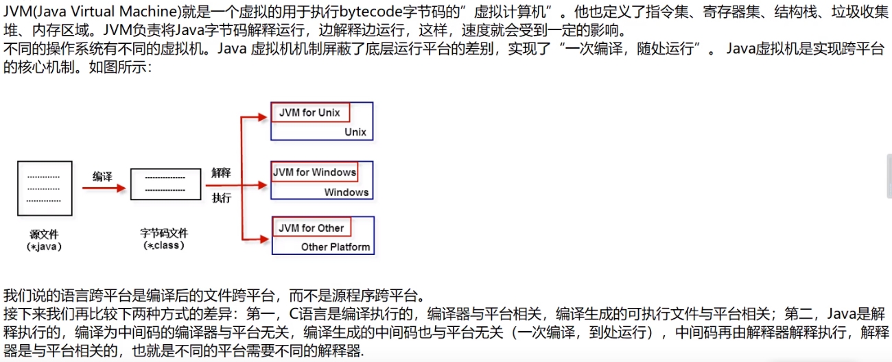

## java

#### 概述		

+ JDK（Java Development kit）可用于编写、运行Java程序
+ JRE（Java Runtime Enviroment）可用于运行Java程序

JDK里面也有自己的JRE,负责运行JDK本身自带的Java工具(javac等程序)


+ JVM是整个java实现跨平台的最核心部分，所有的java程序会首先被编译成.class的类文件，这种类文件可以在虚拟机上执行，class文件并不直接与机器的操作系统相对应，而是经过虚拟机间接与操作系统交互，有虚拟机将程序解释给本地系统执行。但JVM是不能单独搞定class的执行，解释class的时候需调用解释所需的类库lib。在JDK下的jre目录里面有两个文件夹bin和lib，在这里可以认为bin就是jvm，lib则是jvm工作所需的类库。
+ JVM+Lib = JRE：JDK目录下的bin下的jvm.dll文件无法单独工作，当jvm.dll启动后，会使用explicit的方法（使用Win 32 API之中的LoadLibrary()与GetProcAddress()来载入辅助用的动态链接库）而这些辅助用的动态链接库(.dll)都必须位于jvm.dll所在目录的父目录中

+ 编译 (javac) 与执行 (java) 

> javac HelloWorld.java   将*.java编译成 *.class
>
> java HelloWorld   执行*.class文件

+ 文档注释 

> /**    */
>
> javadoc -d myHello -author -version HelloWorld3.java   将HelloWorld.java生成说明文档myHello（index.html）


+ 编译(源代码→class)与反编译(class→源代码)

  ​	jvac、javadoc等命令一个java源文件中可以有多个类，但只能有一个类被public修饰；包含多个类的源文件在编译时会为每个类生成独立的字节码文件。从java 9开始是，jdk的目录改变了


##### 垃圾回收

​		垃圾收集主要是对内存的释放，将不再使用的内存空间回收；Java消除了程序员回收无用内存空间的职责，提供一种系统级线程跟踪存储空间的分配情况。在JVM空闲时，检查并释放可被释放的存储器空间；GC的自动回收，提高了内存空间的利用效率，很大程度上减少了因为没有释放空间而导致的内存泄漏

##### 跨平台

+ java：一次编译，到处运行


+ C语言跨平台




##### DOS命令

**c:  e: d:**  切换盘符

**dir**  显示详细信息

**cls**  清屏

**md**  创建目录

**rd**   删除目录

**copy**  复制文件

> copy  demo.txt  a\cop.txt  复制demo到a目录下

**del**   删除文件


#### 基本语法


+ 标识符不能以数字开头，float虽然同int只是4个字节，但其可表示范围比int大的所多，因为其底层存储结构是将整数位与小数位分开存储（符号位+指数位+尾数位）最好不要进行浮点类型的值比较（表面相等的结果通常为false）,而浮点类型数据参与计算时得到的结果也只是一个近似结果

+ 如果只是声明一个变量而没有赋值时，那么其实这个变量相当于没定义(在编译时会忽略)；而变量使用前必需先初始化

  > int age ;

##### 编码

+ ASCII ：英文字符集（一个字节7位）
+ IOS8859：西欧字符集（一个字节8位）
+ GB2312：简体中文字符集（兼容ASCII字符，最多使用两个字节——编码中文2个字节，ascii一个字节）
+ GBK：GB2312的升级，加入了繁体字（兼容ASCII字符，最多使用两个字节——编码中文2个字节，ascii一个字节）


+ Unicode：国际通用字符集，融合了目前人类使用的所有字符，为每个字符分配唯一的字符码（UTF-8、UTF-16、UTF-32）


java中使用单引号来表示字符常量，char类型用来表示在Unicode编码表中的字符。char是指单引号引起来的**单个字符** ，Java中的char本质是UTF-16编码，而UTF-16实际上是一个变长编码（2字节或4字节）；但char是不能存放4字节的，char中只能存放UTF-16编码下只占2字节的那些字符。char在进行计算时，实际是按照一个码进行计算的

> ‘A’ + 90  // 65 + 90 = 155
>
> char ch = (char)20013   //中
>
> int  num = '中'   //20013
>
> char ch = 20013   //中

+ 转义字符


+ boolean

  ​		boolean类型的值只有true和false两种逻辑值，在编译后会使用1和0来表示，这两个数在内存中只需要1位（bit）即可存储，位是计算机最小的存储单位。虽然编译后1和0只需占用1位空间，但计算机处理数据的最小单位是1个字节，1个字节等于8位，实际存储的空间是：用1个字节的最低位存储，其他7位用0填补，如果值是true的话则存储的二进制为：0000 0001，如果是false的话则存储的二进制为：0000 0000 。

  ​		《Java虚拟机规范》一书中的描述：“虽然定义了boolean这种数据类型，但是只对它提供了非常有限的支持。在Java虚拟机中没有任何供boolean值专用的字节码指令，Java语言表达式所操作的boolean值，在编译之后都使用Java虚拟机中的int数据类型来代替，而boolean数组将会被编码成Java虚拟机的byte数组，每个元素boolean元素占8位”。这样我们可以得出boolean类型占了单独使用是4个字节，在数组中又是1个字节。

+ 类型级别：多种数据类型参与运算的时候，整数类型、浮点类型、字符类型都可以参与运算，唯有布尔类型不可以参与运算

  >  byte,short,char → int → long → float → double

  > 左 = 右 ：直接赋值
  >
  > 左 < 右 ：需要强转(否则报错)
  >
  > 左 > 右 ：直接自动转换

  + 特殊情况：对于byte、short、char类型来说，只要在它们的**表数范围**中，赋值的时候就不需要进行强转，直接赋值即可

    > byte b = 10    //12
    >
    > byte c = (byte)270   //14


##### 运算符

+ / 除法     %取余

+ **+**  左右两侧的任意一测有字符串时，那么此时加号的左右是字符串拼接


**a+=b** 可读性稍差，但编译效率高，底层会自动进行类型转换

**a=a+b** 可读性好，但编译效率低，需手动进行类型转换

> byte a = 10 
> int b = 20
> a+=b  //自动转换类型
> a = a + b //报错，应表达为 a =(byte)(a+b)

a=a+b与a=b+a：对于基本数据类型来说没有区别，但对于String类型就不一样了

+ **||** 短路或：只要第一表达式为true，那么第二个表达式将不会被计算
+ **^** 异或：当两个操作数相同时，结果为false；不相同时，结果为true
+ **switch** ：switch后面是一个()，()中的表达式返回的结果是一个等值，这个等值的类型可以为int、byte、short、char、String、枚举类型（double、float、long、boolean均不可以）。如果default语句在所有case最后，此时可以不加break 如果default语句之后还有case语句，如果不加break，则default语句执行过之后会继续下面的case语句，此时必须要在default之后加break语句，不过这种default用法是不推荐的，default顾名思义是缺省情况，只有任何条件都不匹配的情况下才会执行，所以应该将default语句放在所有case结束之后

##### 数组

​		数组本身是引用数据类型，而数组中的元素可以是任何数据类型（包括基本数据类型和引用数据类型）；创建数组对象会在内存中开辟一整块连续的空间，而数组名引用的是这块**连续**空间的首地址。数组的长度一旦确定，就不能修改

+ 元素默认初始值

  + 整型(byte、short、int、long)：默认为0

  + 浮点型(float、double)：默认为0.0

  + 字符型(char)：默认为0或'\u0000'（'\u0000'表示每个二进制位都为0的Unicode字符；使用print输出的效果是类似 一个空格，但实际不是空格）

    > ```
    > System.out.println(cdv[0]=='\u0000');    //true
    > ```

  + 布尔型(boolean)：默认为false
  + 引用类型：默认为null

  


+ 二维数组：一维数组作为另一个一维数组的元素（外层元素存放的是地址）

  >    //静态初始化
  >    int[\][\]  twoDimension = new int[\][\]{{1,2,3},{1,2}};
  >
  >    //动态初始化
  >    int  dtd[\][\] = new int[2\][2\];
  >    int[\]  dtd2[\] = new int[3][\]; 
  >
  >    //类型推断 
  >    int[\][\] td = {{2,5},{6,87}};
  >
  >    double[\][\] arr3 = new double[4\][\]
  >    System.out.println(arr3[1\])     //null


+ 数组反转

```java
String arr = new String[]{"A","B","C","D","E"}
for(int i=0;i<arr.length/2;i++){
    String temp = arr[i]
    arr[i] = arr[arr.lenght-i-1]
    arr[arr.lenght-i-1] = temp
}


for(int i=0,j=arr.length-1;i<j;i++,j--){
    String temp = arr[i]
    arr[i] = arr[j]
    arr[j] = temp
}
```

+ Arrays

| boolean equals(int[] a,int[] b)   | 判断两个数组是否相等       | 顺序必须一样才一样 |
| --------------------------------- | -------------------------- | ------------------ |
| String to String(int[] a)         | 输出数组信息               |                    |
| void fill(int[] a,int val)        | 将制定值填充到数组之中     |                    |
| void sort(int[] a)                | 对数组进行排序             |                    |
| int binarySearch(int[] a,int key) | 对排序后的数据进行二分查找 |                    |


#### 面向对象

