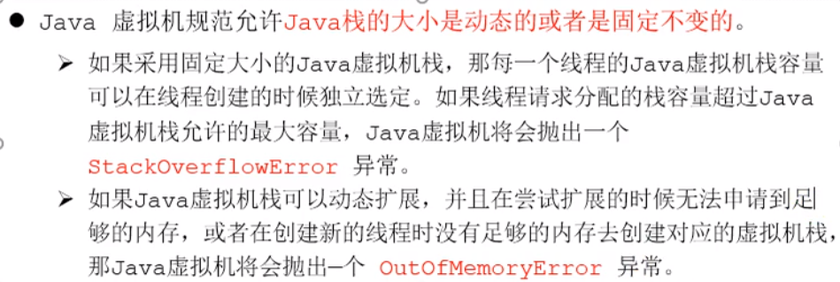
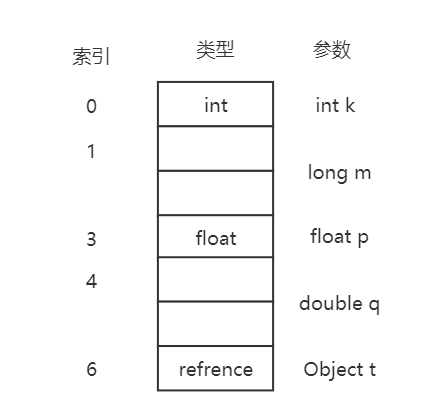
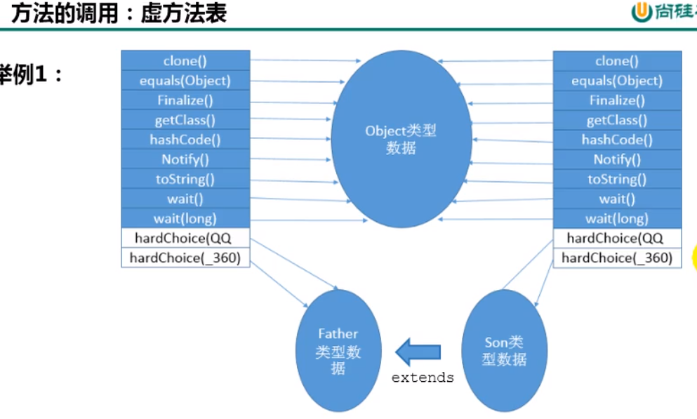
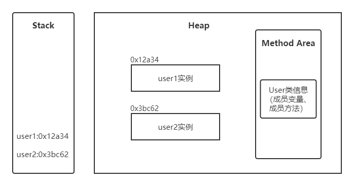
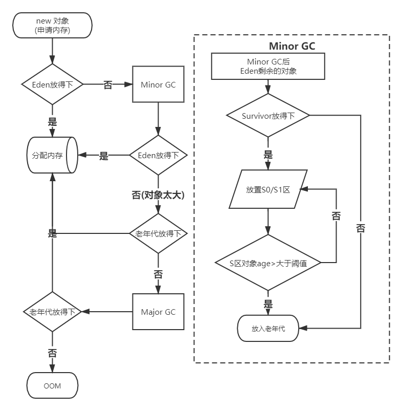
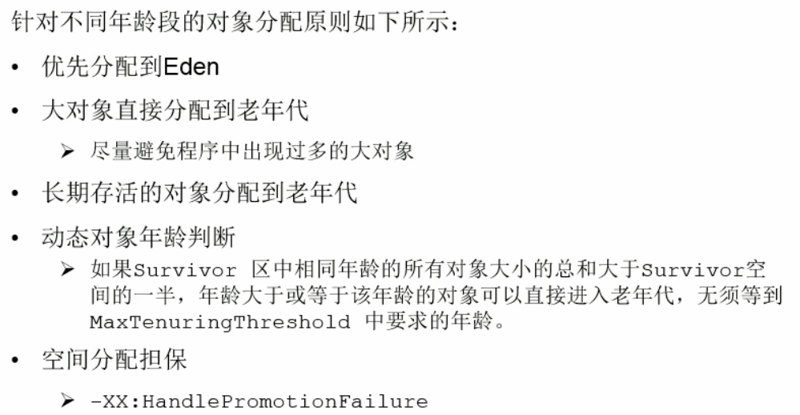
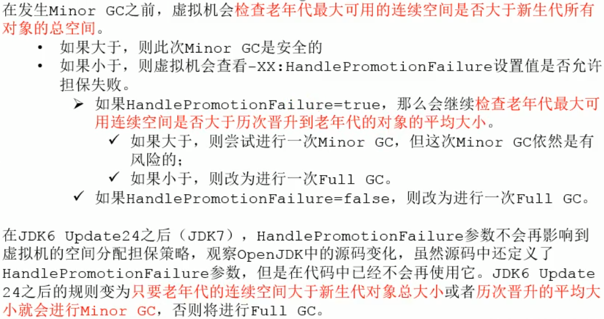
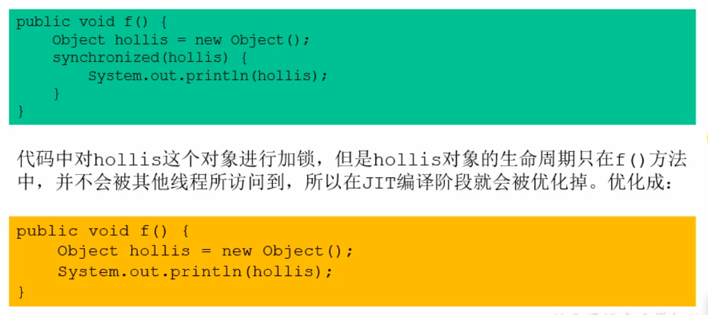
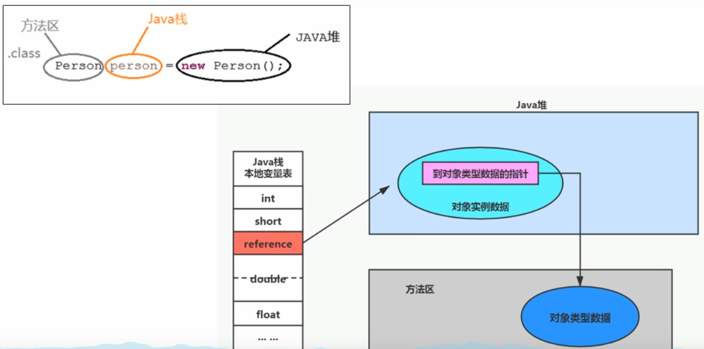

## JVM


+ 字节码：任何能在jvm平台上执行的字节码格式都是一样的；不同的编译器可以编译出相同的字节码文件，字节码文件也可以在不同的JVM上运行；JVM与Java语言没有必然的联系，它只与特定的二进制文件——class文件格式所关联，class文件中包含了Java虚拟机指令集(或者称为字节码、Bytecode)和符号表，还有一些其他辅助信息。

+ Java虚拟机就是二进制字节码的运行环境，负责装载字节码到其内部，解释/编译为对应平台上的机器指令执行。对于每一条Java指令，Java虚拟机规范中都有详细定义，如怎么去操作数，怎么处理操作数，处理结果放在哪里。
  + 一次编译，到处运行
  + 自动内存管理
  + 自动垃圾回收功能

+ jvm整体架构(hotspot)：由于跨平台性的设计，Java的指令是根据栈来设计的，其优点是跨平台、指令集小、编译器容易实现；缺点是执行性能比寄存器差，实现同样的功能需要更多的指令


+ java代码执行流程


+ JVM生命周期
  + 启动：通过引导类加载器（bootstrap class loader）创建一个初始类（initial class）来完成，这个类是虚拟机的具体实现指定的
  + 执行：一个运行中的Java虚拟机有着一个清晰的任务，该任务就是Java程序；程序开始执行时才运行，程序结束后才停止；执行一个所谓的Java程序的时候，真正在执行的是一个叫做Java虚拟机的进程
+ jvm内存模型：jvm内存布局规定了Java在运行过程中内存申请、分配、管理的策略，保证了jvm的高效稳定运行。不同的jvm对于内存的划分方式和管理机制存在着部分差异。每个线程私有程序计数器、虚拟机栈、本地栈；而堆、堆外空间(永久代或元空间、代码缓存)是线程间共享的。每个java程序只有一个java.lang.Runtime实例(即运行时环境)；一般来说，启动一个Java程序时，一个JVM实例就产生了，任何一个拥有public static void main(String[] args)函数的class都可以作为JVM实例运行的起点


### 类加载子系统


​		类加载子系统负责从文件系统或网络中加载class文件到内存中（class文件有着规范的格式，在文件开头有着特定的文件标识cafebabe）;ClassLoder只负责class文件的加载，至于它是否可以运行，则由ExecutionEngine决定；加载的类信息存放于一块称为方法区的内存空间。除了类信息外，方法区还存放运行时常量池信息，可能还包括字符串字面量和数字常量（这部分常量信息是class文件中常量池部分的内存映射）

**example**：存放于物理磁盘上的HelloWorld.class通过ClassLoder加载到JVM中方法区，变成DNA元数据模板


##### 加载(loading)

​		通过一个类的全限定名(全类名)获取定义此类的二进制字节流，将这个字节流所代表的静态存储结构转化为方法区(具体实现：jdk 1.7叫做永久代 / jdk 1.8叫做元数据)的运行时数据结构，然后在内存中生成一个代表这个类的java.lang.Class对象，作为方法区这个类的各种数据访问入口

+ 类加载器分类：JVM支持两种类型的类加载器，分别为引导类加载器（Bootstrap ClassLoder   **C/C++实现**）和自定义类加载器（User-Defined ClassLoder，指的的是所有派生与抽象类ClassLoder的类加载器   **Java实现**）

  **类加载器之间的关系不是靠继承实现的，而是靠组合关系实现的**


```java
public class ClassifyClassLoader {
    public static void main(String[] args) {

        //获取系统类加载器sun.misc.Launcher$AppClassLoader@18b4aac2
        ClassLoader systemClassLoader = ClassLoader.getSystemClassLoader();
        System.out.println(systemClassLoader);

        //获取扩展类加载器sun.misc.Launcher$ExtClassLoader@1b6d3586
        ClassLoader extClassLoader = systemClassLoader.getParent();
        System.out.println(extClassLoader);

        //尝试获取bootstrap,无法获取
        ClassLoader bootstrapClassLoader = extClassLoader.getParent();
        System.out.println(bootstrapClassLoader);

        //对于用户自定义类来说，默认使用系统类加载器进行加载
        //sun.misc.Launcher$AppClassLoader@18b4aac2
        ClassLoader myClassLoader = ClassifyClassLoader.class.getClassLoader();
        System.out.println(myClassLoader);

        //Java的核心类库都是使用引导类加载器加载的
        ClassLoader stringClassLoarder = String.class.getClassLoader();
        System.out.println(stringClassLoarder);//null
        
    }
}

```

+ 启动类加载器(引导类加载器,Bootstrap ClassLoader)：此类加载时使用C/C++语言实现的，嵌套在JVM内部

  + 加载Java的和核心库(JAVA_HOME/jre/lib/rt.jar、resources.jar或sun.boot.class.path路径下的内容)，用于提供JVM自身需要的类
  + 加载拓展类和应用类程序类加载器，是它们的父类加载器(这里不是指继承)
  + 出于安全考虑，Bootstrap启动类加载器只加载包名为java、javax、sun等开头的类

+ 拓展类加载器(Extension ClassLoader)：使用Java语言实现，由sun.misc.Launcher$ExtClassLoader实现（Launcher的内部类）

  + 从java.ext.dirs系统属性所指定的目录中加载类库，或从JDK的安装目录的jre/lib/ext子目录(扩展目录)下加载类库。**如果用户创建的JAR放在此目录下，也会自动有扩展类加载器加载**
  + 父类加载器为启动类加载器(这里不是指继承)
  + ExtClassLoader间接继承于ClassLoader类
  + 加载应用程序类加载器

+ 应用程序类加载器(也叫系统类加载器,AppClassLoader)：使用Java语言编写，有sun.misc.Launcher$AppClassLoader实现

  + 负责加载环境变量classpath或系统属性java.class.path指定路径下的类库
  + 该类加载时程序中默认的类加载器，一般来说，Java应用的类都是由该类完成加载的
  + 父类加载器为扩展类加载器(这里不是指继承)

  + AppClassLoader间接继承于ClassLoader类

+ 用户自定义类加载器：在Java的日常应用程序开发中，类的加载几乎是由上述3种类加载器相互配合执行的，在必要时，我们还可以自定类加载器，来定制类的加载方式。那么为什么要自定义类加载器呢？

  + 隔离加载类
  + 修改类加载的方式
  + 扩展加载源
  + 防止源码泄漏

+ 获取ClassLoader的途径


+ 双亲委派机制：如果一个类加载器收到了类加载请求，它并不会自己先去加载，而是把这个请求委托给父类加载器去执行；如果父类加载器还存在其父类加载器，则进一步向上委托，依次递归，类加载请求最终会到达顶层的启动类加载器；如果父类加载器可以完成类加载任务，就成功返回，倘若父类加载器无法完成此加载任务，子加载器才会尝试自己去加载。

  + 双亲委派机制可以避免类的重复加载，保护程序安全，防止核心API被随意篡改（不会加载用户自定义仿java核心库的相关类，因为java核心库会被引导类去完成加载，引导类会加载真正java核心类库的中类，而不是用户自定义类；**不允许使用java.lang为包名自定义类，会抛出安全警告异常，阻止该类加载**）

  

  Java虚拟机对class文件采用的是按需加载的方式，也就是说当需要使用该类时才会将它的class文件加载到内存生成class对象。而且加载某个类的class文件时，Java虚拟机采用的是双亲委派模式，即将请求交由父类处理，它是一种任务委派模式

  **example1** :假设有一个自定义一个类java.lang.String(试图覆盖java原生string)，那么要使用这个类时需要使用系统类加载器，但当ParentDelegate需要加载String类时，系统类加载器并不会立即加载自定的java.lang.String类，而是会向上委托给拓展类加载器，然后再向上委托给引导类加载器(String属于java核心库，引导类可以完成加载，则最终加载到的String类时java核心类库里的，而不是自定义的)；同样，当需要加载一般类ParentsDelgate(用户自定义类)时，系统类加载器会向上委托到引导类加载器，但引导类加载器和拓展类加载器都不会加载此类，则由系统类加载器自己完成ParentsDelgate的加载

  ```java
  //自定义String
  package java.lang;
  public class String {
      static {
          System.out.println("自定义String静态代码块");
      }
      //执行此main方法时会报错，因为执行该方法时，加载的String是Java核心库里面的String，而那个String是没有main方法的
       public static void main(String[] args) {
          System.out.println("自定义java.lang.String");
      }
  }
  ```

  ```java
  public class ParentsDelegate {
      public static void main(String[] args) {
          String  str = new java.lang.String();//加载String
          System.out.println("双亲委派机制");
          
          ParentsDelegate pd = new ParentsDelegate();
          //获取pd所属类的类加载器AppClassLoader
          System.out.println(pd.getClass().getClassLoader());
      }
  }
  ```

**example2** :在jdbc加载中，引导类加载器只加载接口，接口的具体实现类(属于第三方)则由系统类加载器加载


+ 沙箱安全机制


##### 链接(linking)

+ 验证(verification)：目的在于确保class文件的字节流包含信息符合当前虚拟机要求，保证被加载类的正确性，确保虚拟机自身的安全（文件格式验证、元数据验证、字节码验证、符号引用验证）
+ 准备(preparation)：为类变量分配内存并且设置该类变量的默认初始值，但不包含用final修饰的static，因为final在编译的时候就会分配了，准备阶段会显示初始化，实例变量在此阶段不会分配初始化，类变量会分配在方法区中，而实例变量是随着对象一起分配到Java堆中

> class HelloWorld{
>
> ​		private static int a=1;   //  准备阶段 a = 0      初始化阶段 a= 1
>
> }

+ 解析(resolution)：将常量池内的符号引用转换为直接引用的过程，事实上，解析操作往往会伴随着JVM在执行完初始化之后再执行。符号引用就是一组来描述所引用的目标。符号引用的字面量形式明确定义在《java虚拟机规范》的class文件格式中。直接引用就是直接指向目标的指针、相对偏移量或一个间接定位到目标的句柄。解析动作主要针对类或接口、字段、类方法、接口方法、方法类型等、对应常量池中的CONSTANT_Class_info、CONSTANT_Fieldref_info、CONSTANT_Methodref_info等

##### 初始化(initialization)

​		初始化阶段就是执行类构造方法< clinit >()的过程，clinit方法不需要定义，它是javac编译器自动收集类中的所有类变量的赋值动作和静态代码块中的语句而来的（若类中不存在静态变量、静态方法块时则编译后的字节码不会存在该方法）；**构造器方法中的指令按语句在源文件中出现的顺序执行**


+ clinit


< clinit >()不同于**类的构造方法**（类的构造方法在虚拟机视角下为< init > ()）;若该类具有父类，JVM会保证子类的< clinit>() 执行前先加载完父类(即父类会经历一系列加载、链接、初始化过程)；一个类的< clinit >方法在多线程下是同步加锁的，即JVM在执行clinit的时候底层是加了锁的，保证< clinit >只会被调用一次

**exapmle**：一个类的静态代码块在初始化< clinit >过程中是加锁的，只允许一个线程访问


+ 当有一个线程进入此静态代码块时，其他线程无法进入


在JVM中表示两个class对象是否为同一个类存在两个必要条件

+ 类的完整类名必须一致，包括包名
+ 加载这个类的ClassLoader（指ClassLoader实例对象）必须相同

在JVM中，即使这两个类对象(class对象)来源同一个Class文件，被同一个虚拟机所加载，但只要加载它们的ClassLoader实例对象不同，那么这两个类对象也是不相等的。

### 程序计数器

​		jvm中的程序计数器（Program Counter Register）并非物理寄存器，而是一种抽象模拟，PC寄存器用来存储指向下一条指令的地址，也即将要执行的指令代码，由执行引擎读取下一条指令。PC寄存器是一块很小的内存空间，几乎可以忽略不计，也是运行速度最快的存储区域。在JVM规范中，每个线程都有他自己的程序计数器，是线程私有的，生命周期与线程的生命周期保持一致。任何时间一个线程都只有一个方法在执行，也就是所谓的当前方法。程序计数器会存储当前线程正在执行的Java方法的jvm指令地址。如果执行native方法，则是未指定值undefined。程序计数器是Java虚拟机规范中唯一没有OOM情况的区域


+ interview


### 虚拟机栈

​		栈是运行时的单位，而堆是存储的单位。栈解决程序的运行问题，即程序如何执行，或者说如何处理数据。堆解决的数据存储的问题，即数据怎么放、放在哪。栈是一种快速有效的分配存储方式，其访问速度仅次于程序计数器

​		Java虚拟机栈（java virtual machine stack）负责java程序的运行，保存方法的局部变量、部分结果，并参与方法的调用和返回。每个线程在创建时都会创建一个虚拟机栈，其内存保存着一个个栈帧（stack frame）,对应着一次次的java方法调用



> -Xss 1024k   //设置栈的大小为1024kb

​		每个线程都有自己的栈，栈中的数据都是以栈帧的形式存在的，在这个线程上正在执行的每个方法都各自对应一个栈帧。在一条活动线程中，一个时间点上，只会有一个活动的栈帧，即只有当前正在执行的方法的栈帧是有效的，这个栈帧称为当前栈帧，**执行引擎运行的所有字节码指令只针对当前栈帧进行操作**。如果在该方法中调用了其他方法，对应的新的栈帧会被创建出来，放在栈的顶端，成为新的当前帧。

​		不同线程中所包含的栈帧是不允许存在相互引用的，即不可能在一个栈帧之中引用另一个线程的栈帧。java方法返回函数的方式有两种，一种是正常的函数返回，使用return指令；另一种是抛弃异常。不管使用哪种方式，都会导致栈帧被弹出。

##### 局部变量表

​		局部变量表(Local Variables)主表要用于存储方法的参数和定义在方法体内的局部变量（各类基本数据类型、对象引用以及returnAddress）；局部变量表所需容量的大小是在编译期确定下来的，并保存在方法的code属性的maxximum local variavles数据项中，在方法运行期间是不会改变局部变量表的大小

​		**局部变量表底层是一个数组**，其最基本存储单元为slot，32位以内的数据类型只占用一个slot(包括引用类型)；64位的数据类型(long和double)占用两个slot；byt、short、char在存储前会被转换为int，boolean也会被转换为int，0表示false，非零表示true。JVM会为局部变量表中的每一个slot都分配一个访问索引，通过这个索引即可成功访问到局部变量表中指定的局部变量值。

+ 如果需要访问局部变量表中一个64bit的局部变量值时，只需要使用前一个索引即可
+ 如果当前帧是由构造方法或者实例方法创建的，那么该对象引用this将放在index为0的slot处，其余参数按照参数表顺序继续排列（静态方法不存在this）



+ 栈帧中的局部变量表中的槽位是可以重用的，如果一个局部变量过了其作用域，那么在其作用域之后申明的新的局部变量很有可能会复用这个过期的局部变量的槽位，从而达到节约资源的目的

  ```java
  public void test(){
      int a = 0;
      {
          int b=0;
          b = a+1;
      }
      //变量b作用域在此时销毁了，c会使用它的槽位
      int c = a+1;
  }
  ```

  + 成员变量：经历过默认初始化赋值之后即可使用；类变量在linking的prepare阶段会赋予默认值，在initail阶段会显式赋值；实例变量会随着对象的创建在对空间分配实例变量空间，并进行默认赋值，后续显式赋值
  + 局部变量：在使用前必须进行显式赋值，否则编译不通过

##### 操作数栈

​		操作数栈主要用于保存计算过程的中间结果，同时作为计算过程中变量临时的存储空间。在方法执行的过程中，某些操作(复制、交换、求和等操作)是要使用到操作数栈的。如果被调用的方法是带有返回值的，其返回值会被压入当前栈帧(调用该方法的方法)的操作数栈中，并更新PC寄存器中下一条需要执行的字节码指令。当一个方法刚开始执行的时候，一个新的栈帧也会随之被创建出来，但这个方法的操作数栈是空的。

​		操作数栈的底层也是一个数组，栈中的任何一个元素都是可以任意java数据类型(32bit的类型占用一个栈的单位深度，64bit的类型占用两个栈单位深度)。栈的最大深度在编译器就定义好了，保存在方法的code属性中，为max_stack的值

##### 动态链接

​		每一个栈帧内部都包含一个指向运行时常量池中该栈帧所属方法的引用。包含这个引用的目的就是为了支持当前方法的代码能够实现动态链接。在Java源文件被编译到字节码文件中时，所有的变量和方法引用都作为符号引用保存在class文件的常量池里。比如：描述一个方法调用了另外的其他方法时，就是通过常量池中指向方法的符号引用来表示的，那么动态链接的作用就是为了将这些符号引用转换为调用方法的直接引用。

+ 静态链接：当一个字节码文件被装载进JVM内部时，如果被调用的目标方法在编译期可知，且运行期保持不变时，这种情况下将调用方法的符号引用转换为直接引用的过程称之为静态链接。

+ 动态链接：如果被调用的方法在编译期无法被确定下来，只能在程序运行期将调用方法的符号引用转换为直接引用，由于这种引用转换过程具备动态性，因此称之为动态链接。

  ​		绑定是一个字段、方法或者类在符号引用被替换为直接引用的过程，这仅仅发生一次。面向对象的编程语言都具有封装、继承和多态等特性，多态的特性意味着具备早起绑定和晚期绑定。java中任何一个普通方法都具备虚函数的特征（即运行时才可以确定），使用关键字final来标记的方法不再具有虚函数特征

+ 早起绑定：使用静态链接的方式将符号引用转换为直接引用

+ 晚期绑定：使用动态链接的方式将符号引用转换为直接引用

+ 非虚方法：如果方法在编译期就确定了具体的调用版本，这个版本在运行时是不可变的，这样的方法称为非虚方法（简单来说就是不可被重写的方法）。静态方法、私有方法、final方法、实例构造器、父类方法(super)都是非虚方法；而其它方法都称为虚方法。为了提高性能，方便重写方法的寻找与执行，JVM采用在类的方法区建立一个虚方法表来实现，使用索引表来代替查找，每个类中都有一个虚方法表，表中存放着各个方法的实际入口。虚方法表会在类加载的链接阶段被创建并开始初始化，类的变量初始值准备完成之后，JVM会把该类的方法也初始化完毕。



+ 方法调用指令

  > invokestatic：调用静态方法（解析阶段确定唯一方法版本）
  >
  > invokespecial：调用<init>方法、私有方法以及父类方法（解析阶段确定唯一方法版本）
  >
  > invokevirtual：调用所有虚方法
  >
  > invokeinterface：调用接口方法
  >
  > invokedynamic：动态解析出需要调用的方法，然后执行（为了实现动态类型语言支持）

  + 动态类型语言和静态类型语言两者的区别在与对类型的检查是在编译期还是运行期，前者是静态类型语言，后者是动态类型语言

##### 方法返回地址

​		方法返回地址用于存放调用该方法的原方法当时PC寄存器的值，即执行该方法之后的原方法的下一条指令的地址。方法的退出就是当前栈帧出栈的过程，此时，需要恢复上层方法的局部变量表、操作数栈、将返回值压入调用这栈帧的操作数栈、设置PC寄存器值等，让调用者的方法继续执行下去

> ireturn 返回值为boolean、byte、char、short、int
>
> lreturn 返回值为long
>
> freturn 返回值为float
>
> dretrun 返回值为double
>
> areturn 返回值为引用类型
>
> return void方法、实例初始化方法、类和接口的初始化方法

### 本地方法接口

​		一个native method就是一个java调用非java代码的接口；该方法的实现是由非java语言实现的（C/C++实现，因为JVM需要依赖底层操作系统的支持，通过使用本地方法，得以用java实现了的jre与底层系统的交互，jvm部分是用C写的）

### 本地方法栈

​		java虚拟机栈用于管理java方法的调用，而本地方法栈则用于管理本地方法的调用（其内存大小可以设置成固定值也可以动态分配，在内存溢出方面和虚拟机栈是相同的）本地方法是使用C语言实现的，在本地方法栈登记的native方法在Execution Engine执行时加载本地方法库。

​		当某个线程调用一个本地方法时，它就进入了一个全新的并且不在受虚拟机的限制的世界（即jvm内存之外的地方）。本地方法可以通过本地方法接口来访问虚拟机内部的运行时数据区。它可以直接使用本地处理器中的寄存器，可以直接从本地内存的堆中分配任意数量的内存

### 堆

​		每个java程序运行起来对应一个进程，一个进程对应一个jvm实例，一个jvm实例对应一个运行时数据区，即一个JVM实例只存在一个堆内存。所有线程java堆区在JVM启动的时候即被创建，其空间大小也就确定了，是JVM管理的最大一块内存空间（但堆内存的大小是可以调节的）一个进程中的所有线程共享一个java堆，但在在堆中可以划分出线程私有的缓冲区(Thread Local Allocation Buffer,TLAB)

​		几乎所有的对象实例和数组都在堆中分配内存（经逃逸分析后对象可能栈上分配）在方法结束后，堆中的对象不会马上移除，仅仅在垃圾收集的时候才会被移除



+ jdk7及以前：Young Generation Space新生区(Eden区、Survivor 0/1区)、Tenure Generation Space老年代、Permanent Space永久代(方法区的实现)
+ jdk8及之后：Young Generation Space新生区(Eden区、Survivo 0/1区)、Tenure Generation Space老年代、Meta Space元空间(方法区的实现)

	​		堆默认情况下，初始内存大小为电脑物理内存大小/64，最大内存大小为电脑物理内存大小/4；通常会将 -Xms和-Xmx两个参数设置相同的值，其目的为了能够在java垃圾回收机制在清理堆区后不需要重新分隔计算堆区的大小，从而提高性能。一旦堆区中的内存大小一旦超过 -Xmx所指的最大内存时，将抛出OutOfMemoryError异常

> -Xms   设置堆的起始大小
>
> -Xmx   设置堆的最大内存
>
> -XX:+PrintGCDetails   打印GC细节

> jstat -gc 9344  //查看当前JVM进程9344的GC统计信息
>
> jfino -flag SurvivorRatio 6988  //查看进程6988的SurvivoRatio属性的值

##### 新生区&老年代

​		几乎所有的java对象都是在Eden区被new出来的，绝大部分的java对象的销毁都在新生区进行。垃圾回收频繁发生在新生区，较少发生在老年代，几乎不发生在方法区

> -XX:NewRatio=2  //默认 新生代：老年代 = 2：1
>
> -XX:SurivivorRatio=8	//在hotspot中，Eden：Survivor 0：Survivor 1 = 8:1:1
>
> -XX:-UseAdaptivesSizPolicy  //关闭自适应的内存分配策略（暂时不用）
>
> -Xmn 设置新生代最大内存大小

+ 对象分配

  + 新new出来对象先放在Eden，若Eden的空间已满时，则会先对Eden进行Minor GC：将Eden和Survivor FROM区中的不再被其他对象所引用的对象进行销毁，然后将Eden中剩余的对象移到Survivor TO区（若Survivor TO放不下，则这些对象会直接放到老年代）同时将Survivor FROM区中的全部对象移到Survivor TO区并标记对象的age，并判断Survivor区中符合条件AGE的对象移到老年代(默认age>15)（此时to与from名称交换，to区永远是空的）
  + 经过Minor GC后Eden已为空，若Eden放得下新创建的对象则放入Eden，否则直接放入老年代，若老年代的剩余空间也放不下则进行Major GC对老年代的对象进行垃圾回收，若Major GC后老年代仍放不下，则触发堆空间的OOM异常

  

  > -XX:MaxTenuringThreshold = AGE  //设置Survivor晋升老年代的age大小

针对HotSpot VM的实现，它里面的GC按照回收区域分为两大类：部分回收(Parial GC)与整堆回收(Full GC)

+ 部分收集
  + Minor GC：新生代收集。当Eden区内存空间不足时触发，Survivor区空间不足并不会引发GC；每次Minor GC都会清理新生代中的内存(包括Eden、Survivor)，Minor GC会引发SWT，暂停其他用户进程，等垃圾回收接收后用户线程才恢复进行
  + Major GC：老年代收集（目前只有CMS GC会有单独收集老年代的行为；很多Major GC和Full GC混淆使用，需要具体分辨是老年代回收还是整堆回收）在老年代空间不足时，会先尝试触发Minor GC；如果之后空间还不足，则会触发Major GC。Major GC的速度一般会比Minor GC慢10倍以上、STW时间更长；如果Major GC后内存还不足就会报OOM错误。
  + 混合收集：收集整个新生代以及部分老年代的垃圾收集(目前只有G1 GC会有这种行为)
+ 整堆收集(Full GC)：收集整个java堆和方法区的垃圾收集（在开发或调优中要尽量避免full gc）。触发Full GC的机制如下：
  + 调用System.gc()时，系统会建议执行Full GC，但不必然执行
  + 老年代空间不足
  + 方法区空间不足
  + 通过Minor GC后进入老年代的平均大小大于老年代的可用内存
  + 由Eden区、From区向To区复制时，对象大小大于TO区可用内存，则把该对象转存到老年代，但老年代的可用内存小于该对象的大小

##### 内存分配策略

​		如果对象在Eden新创建并经过第一次Minor GC后仍然存活，并且能被Survivor容纳时，将会被Survivor空间中，并将对象age设为1。对象在Survivor区中每熬过一次Minor GC，age就增加1，当age增加到一定时(默认为15)就会晋升到老年代。针对不同age的对象分配原则如下：



##### TLAB

​		JVM在Eden区开辟一部分区域为线程分配一个私有缓存区域；多线程同时分配内存时，使用TLAB可以避免一系列的线程安全问题。尽管不是所有的对象实例都能够在TLAB中成功分配内存，但JVM确实是将TLAB作为内存分配的首选，默认情况下，TLAB空间的内存非常小，仅栈整个Eden空间的1%，一旦对象在TLAB空间分配内存失败时，JVM就会尝试着通过使用加锁机制确保数据操作的原子性，从而直接在Eden空间分配内存

> -XX:+UseTLAB  //设置开启TLAB空间
>
> -XX:TLABWasteTargetPercent  //设置TLAB空间所占Eden空间的百分比大小

##### 堆空间常用命令

>  * -XX:+PrintFlagsInitial : 查看所有的参数的默认初始值
>  * -XX:+PrintFlagsFinal  ：查看所有的参数的最终值（可能会存在修改，不再是初始值）
>  * 具体查看某个参数的指令： jps：查看当前运行中的进程
>
>    jinfo -flag SurvivorRatio 进程id
>  * -Xms：初始堆空间内存 （默认为物理内存的1/64）
>  * -Xmx：最大堆空间内存（默认为物理内存的1/4）
>  * -Xmn：设置新生代的大小。(初始值及最大值)
>  * -XX:NewRatio：配置新生代与老年代在堆结构的占比
>  * -XX:SurvivorRatio：设置新生代中Eden和S0/S1空间的比例
>  * -XX:MaxTenuringThreshold：设置新生代垃圾的最大年龄
>  * -XX:+PrintGCDetails：输出详细的GC处理日志
>  * 打印gc简要信息：① -XX:+PrintGC   ② -verbose:gc
>  * -XX:HandlePromotionFailure：是否设置空间分配担保



##### 逃逸分析

​		当一个对象在方法中被定义后，对象只在方法内部使用，则认为没有发生逃逸。当一个对象在方法中被定义后，它被外部方法所引用，则认为发生逃逸。通过逃逸分析，Java Hotspot编译器能够分析出一个新的对象的引用使用范围从而决定是否要将这个对象分配到堆上。**Hotspot JVM中并没有使用栈上分配，使用的是标量替换；即在HotSopt JVM中所有的对象实例是分配在堆上的**

+ 栈上分配：如果经过逃逸分析（Escape Analysis）后发现一个对象并没有逃逸出方法的话，那么就可能被优化成栈上分配（这样就无需再堆上分配内存，即也无需垃圾回收）分配完成后，继续在调用栈内执行，最后线程结束，栈空间被回收，局部变量对象也被回收（给成员变量赋值、方法返回对象、实例引用传递到另一方法等情况都发生了逃逸）
+ 同步省略：在动态编译同步代码块的时候，JIT编译器可以借助逃逸分析来判断同步块所使用的锁对象是否只能够被一个线程访问而没有发布到其他线程中。如果没有，那么JIT编译器在编译这个同步块的时候就会取消对这部分代码的同步；这样可以大大提高并发性和性能。



+ 标量替换：有的对象可能不需要作为一个连续的内存结构存在也可以被访问到，那么对象的部分（或全部）可以不存储在内存(堆空间)，而是存储在CPU寄存器中（栈内存）。标量是指一个无法再分解成更小的数据的数据。Java中的原始数据类型就属于标量，相对的，那些还可以分解的数据叫做聚合量，java中的对象就是聚合量，因为它可以分解成其他聚合量和标量。在JIT阶段，如果经过逃逸分析，发现一个对象不会被外界访问，那么经过JIT优化，就会把这个对象拆解成若干个其中包含的若干个成员变量来代替，这个过程就是标量替换。

  > -XX:+EliminateAllocations   //开启标量替换，允许将对象打散分配在栈上（默认开启）

### 方法区

