## JVM

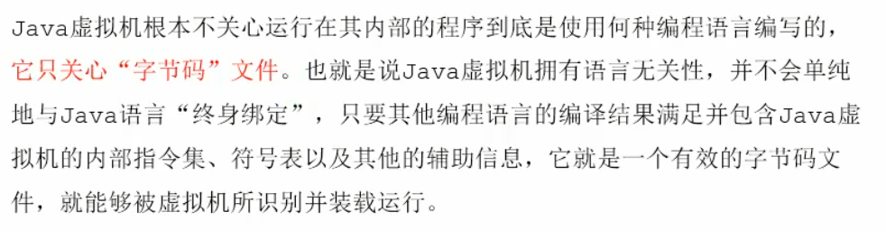

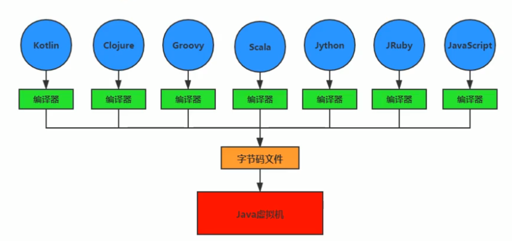

+ 字节码：任何能在jvm平台上执行的字节码格式都是一样的；不同的编译器可以编译出相同的字节码文件，字节码文件也可以在不同的JVM上运行；JVM与Java语言没有必然的联系，它只与特定的二进制文件——class文件格式所关联，class文件中包含了Java虚拟机指令集(或者称为字节码、Bytecode)和符号表，还有一些其他辅助信息。

+ Java虚拟机就是二进制字节码的运行环境，负责装载字节码到其内部，解释/编译为对应平台上的机器指令执行。对于每一条Java指令，Java虚拟机规范中都有详细定义，如怎么去操作数，怎么处理操作数，处理结果放在哪里。
  + 一次编译，到处运行
  + 自动内存管理
  + 自动垃圾回收功能

+ jvm整体架构(hotspot)：由于跨平台性的设计，Java的指令是根据栈来设计的，其优点是跨平台、指令集小、编译器容易实现；缺点是执行性能比寄存器差，实现同样的功能需要更多的指令

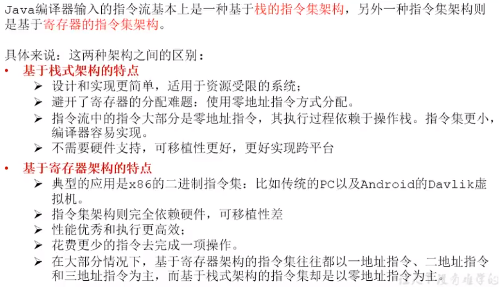

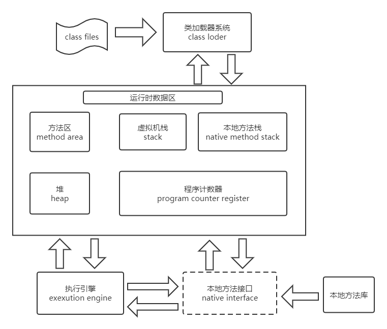

+ java代码执行流程

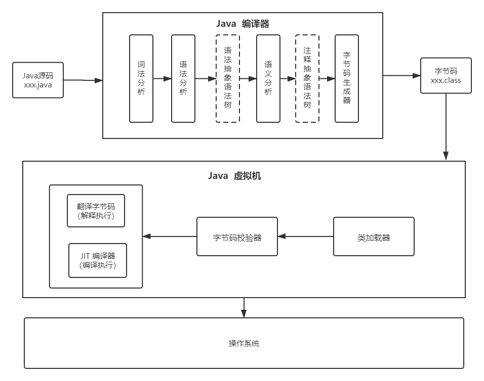

+ JVM生命周期
  + 启动：通过引导类加载器（bootstrap class loader）创建一个初始类（initial class）来完成，这个类是虚拟机的具体实现指定的
  + 执行：一个运行中的Java虚拟机有着一个清晰的任务，该任务就是Java程序；程序开始执行时才运行，程序结束后才停止；执行一个所谓的Java程序的时候，真正在执行的是一个叫做Java虚拟机的进程
+ jvm内存模型：jvm内存布局规定了Java在运行过程中内存申请、分配、管理的策略，保证了jvm的高效稳定运行。不同的jvm对于内存的划分方式和管理机制存在着部分差异。每个线程私有程序计数器、虚拟机栈、本地栈；而堆、堆外空间(永久代或元空间、代码缓存)是线程间共享的。每个java程序只有一个java.lang.Runtime实例(即运行时环境)；一般来说，启动一个Java程序时，一个JVM实例就产生了，任何一个拥有public static void main(String[] args)函数的class都可以作为JVM实例运行的起点

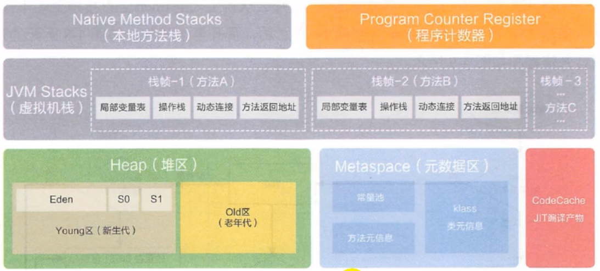

### 类加载子系统

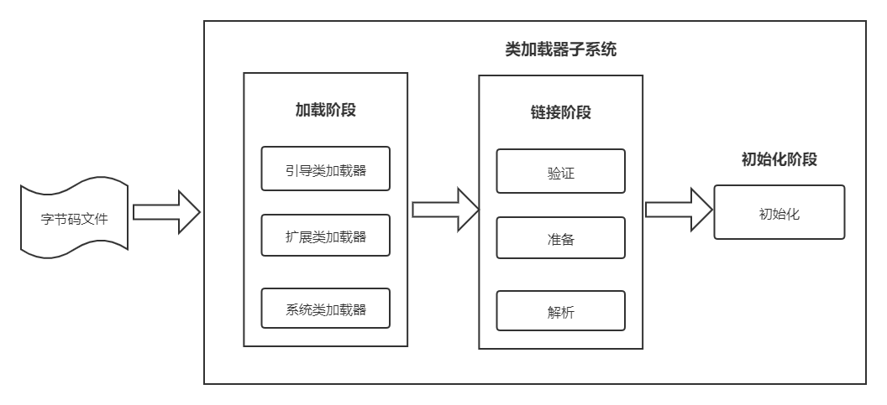

​		类加载子系统负责从文件系统或网络中加载class文件到内存中（class文件有着规范的格式，在文件开头有着特定的文件标识cafebabe）;ClassLoder只负责class文件的加载，至于它是否可以运行，则由ExecutionEngine决定；加载的类信息存放于一块称为方法区的内存空间。除了类信息外，方法区还存放运行时常量池信息，可能还包括字符串字面量和数字常量（这部分常量信息是class文件中常量池部分的内存映射）

**example**：存放于物理磁盘上的HelloWorld.class通过ClassLoder加载到JVM中方法区，变成DNA元数据模板


##### 加载(loading)

​		通过一个类的全限定名(全类名)获取定义此类的二进制字节流，将这个字节流所代表的静态存储结构转化为方法区(具体实现：jdk 1.7叫做永久代 / jdk 1.8叫做元数据)的运行时数据结构，然后在内存中生成一个代表这个类的java.lang.Class对象，作为方法区这个类的各种数据访问入口

+ 类加载器分类：JVM支持两种类型的类加载器，分别为引导类加载器（Bootstrap ClassLoder   **C/C++实现**）和自定义类加载器（User-Defined ClassLoder，指的的是所有派生与抽象类ClassLoder的类加载器   **Java实现**）

  **类加载器之间的关系不是靠继承实现的，而是靠组合关系实现的**

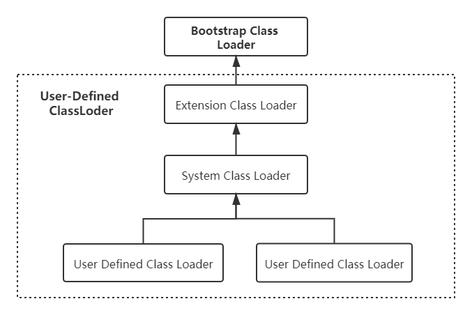

```java
public class ClassifyClassLoader {
    public static void main(String[] args) {

        //获取系统类加载器sun.misc.Launcher$AppClassLoader@18b4aac2
        ClassLoader systemClassLoader = ClassLoader.getSystemClassLoader();
        System.out.println(systemClassLoader);

        //获取扩展类加载器sun.misc.Launcher$ExtClassLoader@1b6d3586
        ClassLoader extClassLoader = systemClassLoader.getParent();
        System.out.println(extClassLoader);

        //尝试获取bootstrap,无法获取
        ClassLoader bootstrapClassLoader = extClassLoader.getParent();
        System.out.println(bootstrapClassLoader);

        //对于用户自定义类来说，默认使用系统类加载器进行加载
        //sun.misc.Launcher$AppClassLoader@18b4aac2
        ClassLoader myClassLoader = ClassifyClassLoader.class.getClassLoader();
        System.out.println(myClassLoader);

        //Java的核心类库都是使用引导类加载器加载的
        ClassLoader stringClassLoarder = String.class.getClassLoader();
        System.out.println(stringClassLoarder);//null
        
    }
}

```

+ 启动类加载器(引导类加载器,Bootstrap ClassLoader)：此类加载时使用C/C++语言实现的，嵌套在JVM内部

  + 加载Java的和核心库(JAVA_HOME/jre/lib/rt.jar、resources.jar或sun.boot.class.path路径下的内容)，用于提供JVM自身需要的类
  + 加载拓展类和应用类程序类加载器，是它们的父类加载器(这里不是指继承)
  + 出于安全考虑，Bootstrap启动类加载器只加载包名为java、javax、sun等开头的类

+ 拓展类加载器(Extension ClassLoader)：使用Java语言实现，由sun.misc.Launcher$ExtClassLoader实现（Launcher的内部类）

  + 从java.ext.dirs系统属性所指定的目录中加载类库，或从JDK的安装目录的jre/lib/ext子目录(扩展目录)下加载类库。**如果用户创建的JAR放在此目录下，也会自动有扩展类加载器加载**
  + 父类加载器为启动类加载器(这里不是指继承)
  + ExtClassLoader间接继承于ClassLoader类
  + 加载应用程序类加载器

+ 应用程序类加载器(也叫系统类加载器,AppClassLoader)：使用Java语言编写，有sun.misc.Launcher$AppClassLoader实现

  + 负责加载环境变量classpath或系统属性java.class.path指定路径下的类库
  + 该类加载时程序中默认的类加载器，一般来说，Java应用的类都是由该类完成加载的
  + 父类加载器为扩展类加载器(这里不是指继承)

  + AppClassLoader间接继承于ClassLoader类

+ 用户自定义类加载器：在Java的日常应用程序开发中，类的加载几乎是由上述3种类加载器相互配合执行的，在必要时，我们还可以自定类加载器，来定制类的加载方式。那么为什么要自定义类加载器呢？

  + 隔离加载类
  + 修改类加载的方式
  + 扩展加载源
  + 防止源码泄漏

+ 获取ClassLoader的途径

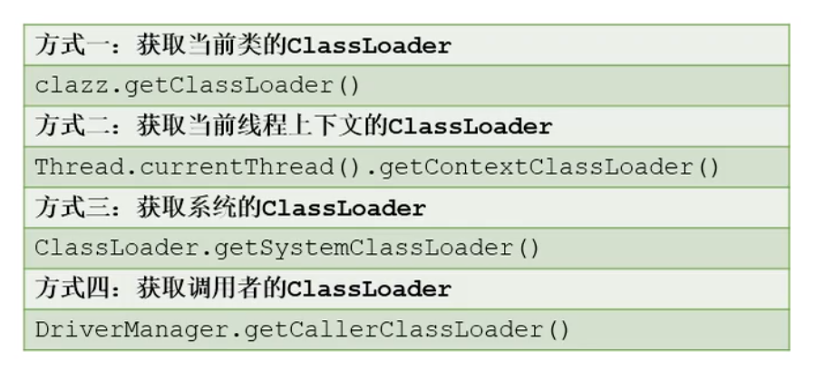

+ 双亲委派机制：如果一个类加载器收到了类加载请求，它并不会自己先去加载，而是把这个请求委托给父类加载器去执行；如果父类加载器还存在其父类加载器，则进一步向上委托，依次递归，类加载请求最终会到达顶层的启动类加载器；如果父类加载器可以完成类加载任务，就成功返回，倘若父类加载器无法完成此加载任务，子加载器才会尝试自己去加载。

  + 双亲委派机制可以避免类的重复加载，保护程序安全，防止核心API被随意篡改（不会加载用户自定义仿java核心库的相关类，因为java核心库会被引导类去完成加载，引导类会加载真正java核心类库的中类，而不是用户自定义类；**不允许使用java.lang为包名自定义类，会抛出安全警告异常，阻止该类加载**）

  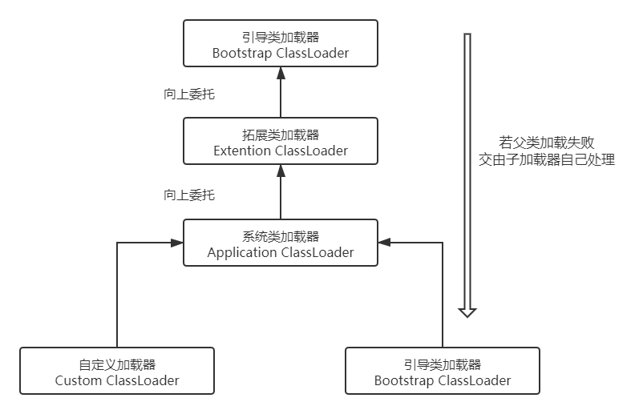

  Java虚拟机对class文件采用的是按需加载的方式，也就是说当需要使用该类时才会将它的class文件加载到内存生成class对象。而且加载某个类的class文件时，Java虚拟机采用的是双亲委派模式，即将请求交由父类处理，它是一种任务委派模式

  **example1** :假设有一个自定义一个类java.lang.String(试图覆盖java原生string)，那么要使用这个类时需要使用系统类加载器，但当ParentDelegate需要加载String类时，系统类加载器并不会立即加载自定的java.lang.String类，而是会向上委托给拓展类加载器，然后再向上委托给引导类加载器(String属于java核心库，引导类可以完成加载，则最终加载到的String类时java核心类库里的，而不是自定义的)；同样，当需要加载一般类ParentsDelgate(用户自定义类)时，系统类加载器会向上委托到引导类加载器，但引导类加载器和拓展类加载器都不会加载此类，则由系统类加载器自己完成ParentsDelgate的加载

  ```java
  //自定义String
  package java.lang;
  public class String {
      static {
          System.out.println("自定义String静态代码块");
      }
      //执行此main方法时会报错，因为执行该方法时，加载的String是Java核心库里面的String，而那个String是没有main方法的
       public static void main(String[] args) {
          System.out.println("自定义java.lang.String");
      }
  }
  ```

  ```java
  public class ParentsDelegate {
      public static void main(String[] args) {
          String  str = new java.lang.String();//加载String
          System.out.println("双亲委派机制");
          
          ParentsDelegate pd = new ParentsDelegate();
          //获取pd所属类的类加载器AppClassLoader
          System.out.println(pd.getClass().getClassLoader());
      }
  }
  ```

**example2** :在jdbc加载中，引导类加载器只加载接口，接口的具体实现类(属于第三方)则由系统类加载器加载

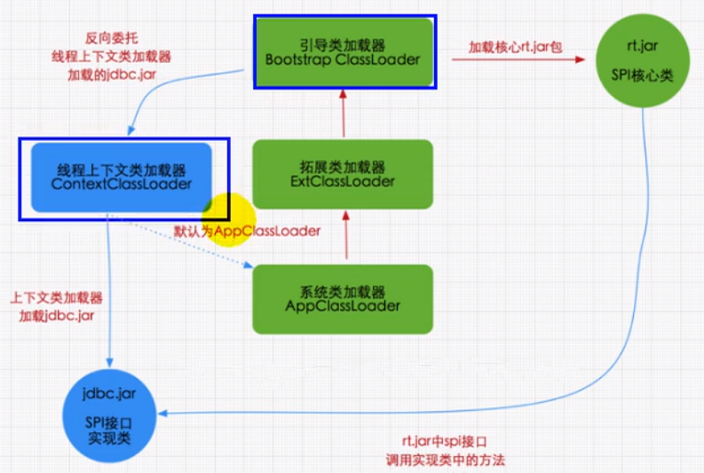

+ 沙箱安全机制

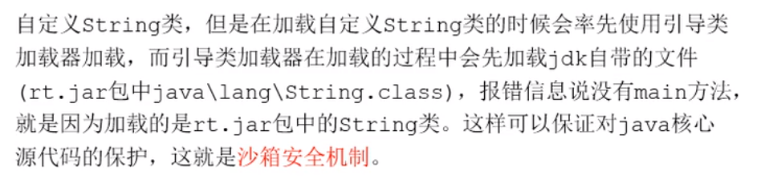

##### 链接(linking)

+ 验证(verification)：目的在于确保class文件的字节流包含信息符合当前虚拟机要求，保证被加载类的正确性，确保虚拟机自身的安全（文件格式验证、元数据验证、字节码验证、符号引用验证）
+ 准备(preparation)：为类变量分配内存并且设置该类变量的默认初始值，但不包含用final修饰的static，因为final在编译的时候就会分配了，准备阶段会显示初始化，实例变量在此阶段不会分配初始化，类变量会分配在方法区中，而实例变量是随着对象一起分配到Java堆中

> class HelloWorld{
>
> ​		private static int a=1;   //  准备阶段 a = 0      初始化阶段 a= 1
>
> }

+ 解析(resolution)：将常量池内的符号引用转换为直接引用的过程，事实上，解析操作往往会伴随着JVM在执行完初始化之后再执行。符号引用就是一组来描述所引用的目标。符号引用的字面量形式明确定义在《java虚拟机规范》的class文件格式中。直接引用就是直接指向目标的指针、相对偏移量或一个间接定位到目标的句柄。解析动作主要针对类或接口、字段、类方法、接口方法、方法类型等、对应常量池中的CONSTANT_Class_info、CONSTANT_Fieldref_info、CONSTANT_Methodref_info等

##### 初始化(initialization)

​		初始化阶段就是执行类构造方法< clinit >()的过程，clinit方法不需要定义，它是javac编译器自动收集类中的所有类变量的赋值动作和静态代码块中的语句而来的（若类中不存在静态变量、静态方法块时则编译后的字节码不会存在该方法）；**构造器方法中的指令按语句在源文件中出现的顺序执行**

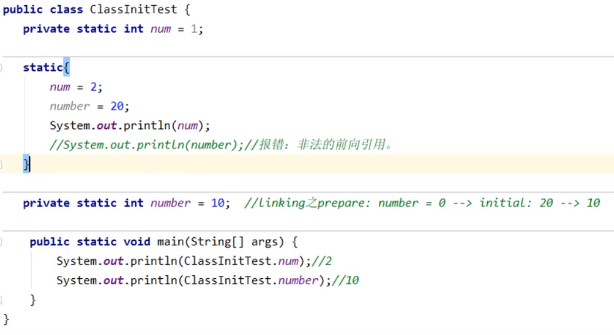

+ clinit

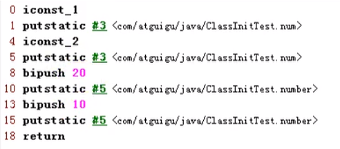

< clinit >()不同于**类的构造方法**（类的构造方法在虚拟机视角下为< init > ()）;若该类具有父类，JVM会保证子类的< clinit>() 执行前先加载完父类(即父类会经历一系列加载、链接、初始化过程)；一个类的< clinit >方法在多线程下是同步加锁的，即JVM在执行clinit的时候底层是加了锁的，保证< clinit >只会被调用一次

**exapmle**：一个类的静态代码块在初始化< clinit >过程中是加锁的，只允许一个线程访问

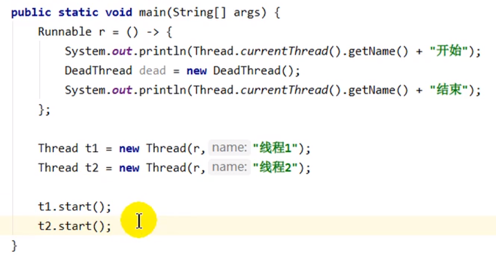

+ 当有一个线程进入此静态代码块时，其他线程无法进入

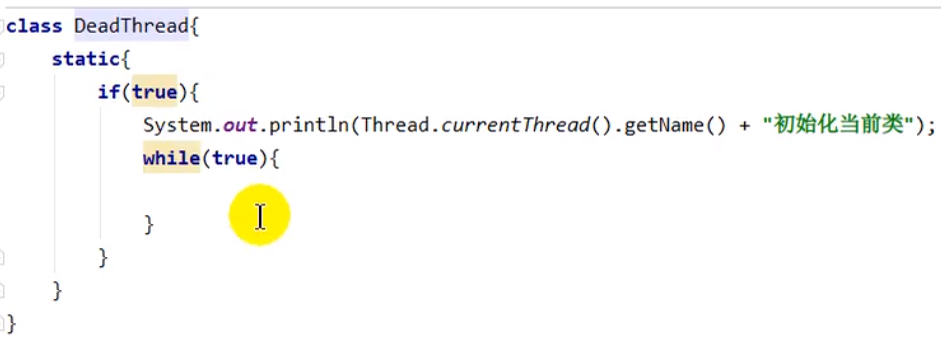

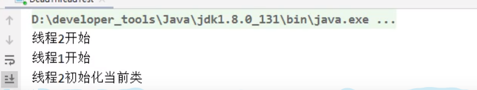

在JVM中表示两个class对象是否为同一个类存在两个必要条件

+ 类的完整类名必须一致，包括包名
+ 加载这个类的ClassLoader（指ClassLoader实例对象）必须相同

在JVM中，即使这两个类对象(class对象)来源同一个Class文件，被同一个虚拟机所加载，但只要加载它们的ClassLoader实例对象不同，那么这两个类对象也是不相等的。

### 程序计数器

​		jvm中的程序计数器（Program Counter Register）并非物理寄存器，而是一种抽象模拟，PC寄存器用来存储指向下一条指令的地址，也即将要执行的指令代码，由执行引擎读取下一条指令。PC寄存器是一块很小的内存空间，几乎可以忽略不计，也是运行速度最快的存储区域。在JVM规范中，每个线程都有他自己的程序计数器，是线程私有的，生命周期与线程的生命周期保持一致。任何时间一个线程都只有一个方法在执行，也就是所谓的当前方法。程序计数器会存储当前线程正在执行的Java方法的jvm指令地址。如果执行native方法，则是未指定值undefined。程序计数器是Java虚拟机规范中唯一没有OOM情况的区域

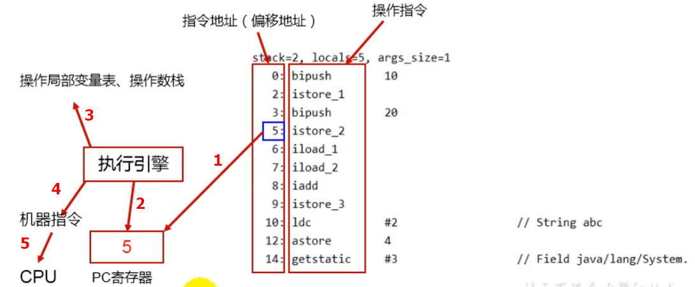

+ interview

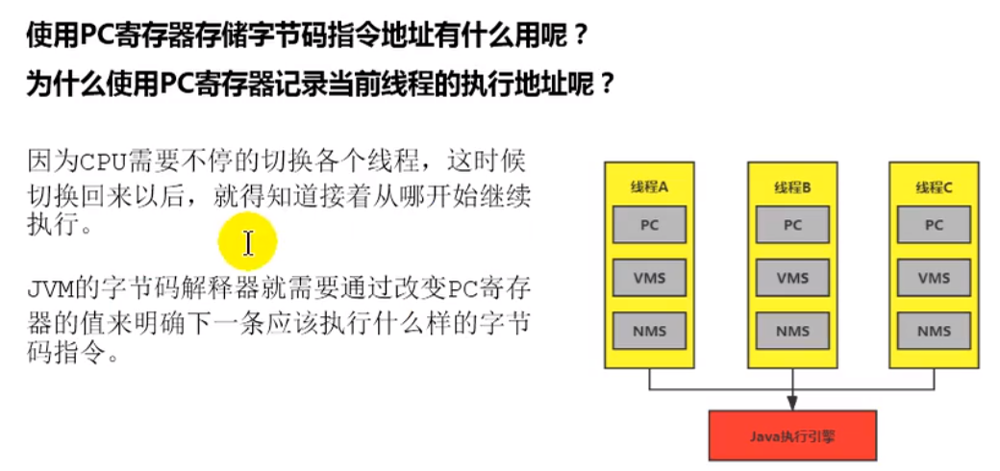

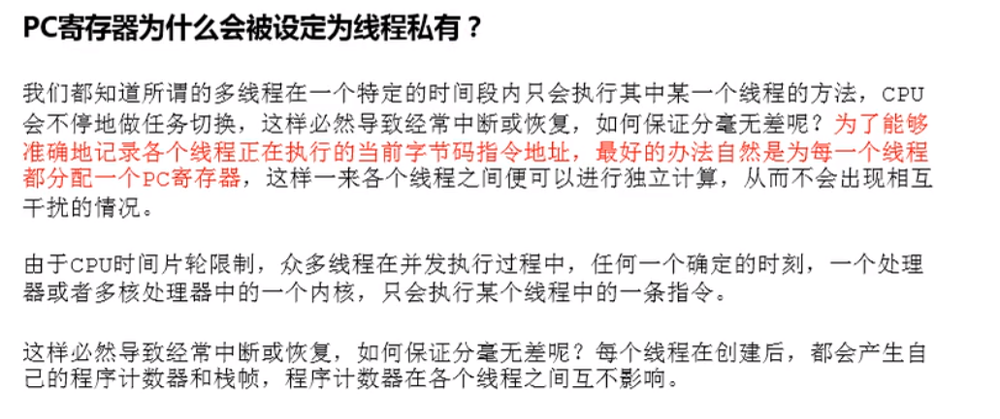