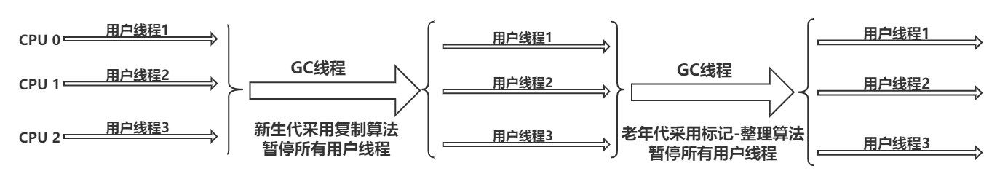

## JVM


+ 字节码：任何能在jvm平台上执行的字节码格式都是一样的；不同的编译器可以编译出相同的字节码文件，字节码文件也可以在不同的JVM上运行；JVM与Java语言没有必然的联系，它只与特定的二进制文件——class文件格式所关联，class文件中包含了Java虚拟机指令集(或者称为字节码、Bytecode)和符号表，还有一些其他辅助信息。

+ Java虚拟机就是二进制字节码的运行环境，负责装载字节码到其内部，解释/编译为对应平台上的机器指令执行。对于每一条Java指令，Java虚拟机规范中都有详细定义，如怎么去操作数，怎么处理操作数，处理结果放在哪里。
  + 一次编译，到处运行
  + 自动内存管理
  + 自动垃圾回收功能

+ jvm整体架构(hotspot)：由于跨平台性的设计，Java的指令是根据栈来设计的，其优点是跨平台、指令集小、编译器容易实现；缺点是执行性能比寄存器差，实现同样的功能需要更多的指令


+ java代码执行流程


+ JVM生命周期
  + 启动：通过引导类加载器（bootstrap class loader）创建一个初始类（initial class）来完成，这个类是虚拟机的具体实现指定的
  + 执行：一个运行中的Java虚拟机有着一个清晰的任务，该任务就是Java程序；程序开始执行时才运行，程序结束后才停止；执行一个所谓的Java程序的时候，真正在执行的是一个叫做Java虚拟机的进程
+ jvm内存模型：jvm内存布局规定了Java在运行过程中内存申请、分配、管理的策略，保证了jvm的高效稳定运行。不同的jvm对于内存的划分方式和管理机制存在着部分差异。每个线程私有程序计数器、虚拟机栈、本地栈；而堆、堆外空间(永久代或元空间、代码缓存)是线程间共享的。每个java程序只有一个java.lang.Runtime实例(即运行时环境)；一般来说，启动一个Java程序时，一个JVM实例就产生了，任何一个拥有public static void main(String[] args)函数的class都可以作为JVM实例运行的起点


### 类加载子系统


​		类加载子系统负责从文件系统或网络中加载class文件到内存中（class文件有着规范的格式，在文件开头有着特定的文件标识cafebabe）;ClassLoder只负责class文件的加载，至于它是否可以运行，则由ExecutionEngine决定；加载的类信息存放于一块称为方法区的内存空间。除了类信息外，方法区还存放运行时常量池信息，可能还包括字符串字面量和数字常量（这部分常量信息是class文件中常量池部分的内存映射）

**对于声明为final static的常量在编译成字节码文件的时候就已经赋值了**

**example**：存放于物理磁盘上的HelloWorld.class通过ClassLoder加载到JVM中方法区，变成DNA元数据模板


##### 加载(loading)

​		通过一个类的全限定名(全类名)获取定义此类的二进制字节流，将这个字节流所代表的静态存储结构转化为方法区(具体实现：jdk 1.7叫做永久代 / jdk 1.8叫做元数据)的运行时数据结构，然后在内存中生成一个代表这个类的java.lang.Class对象，作为方法区这个类的各种数据访问入口

+ 类加载器分类：JVM支持两种类型的类加载器，分别为引导类加载器（Bootstrap ClassLoder   **C/C++实现**）和自定义类加载器（User-Defined ClassLoder，指的的是所有派生与抽象类ClassLoder的类加载器   **Java实现**）

  **类加载器之间的关系不是靠继承实现的，而是靠组合关系实现的**


```java
public class ClassifyClassLoader {
    public static void main(String[] args) {

        //获取系统类加载器sun.misc.Launcher$AppClassLoader@18b4aac2
        ClassLoader systemClassLoader = ClassLoader.getSystemClassLoader();
        System.out.println(systemClassLoader);

        //获取扩展类加载器sun.misc.Launcher$ExtClassLoader@1b6d3586
        ClassLoader extClassLoader = systemClassLoader.getParent();
        System.out.println(extClassLoader);

        //尝试获取bootstrap,无法获取
        ClassLoader bootstrapClassLoader = extClassLoader.getParent();
        System.out.println(bootstrapClassLoader);

        //对于用户自定义类来说，默认使用系统类加载器进行加载
        //sun.misc.Launcher$AppClassLoader@18b4aac2
        ClassLoader myClassLoader = ClassifyClassLoader.class.getClassLoader();
        System.out.println(myClassLoader);

        //Java的核心类库都是使用引导类加载器加载的
        ClassLoader stringClassLoarder = String.class.getClassLoader();
        System.out.println(stringClassLoarder);//null
        
    }
}

```

+ 启动类加载器(引导类加载器,Bootstrap ClassLoader)：此类加载时使用C/C++语言实现的，嵌套在JVM内部

  + 加载Java的和核心库(JAVA_HOME/jre/lib/rt.jar、resources.jar或sun.boot.class.path路径下的内容)，用于提供JVM自身需要的类
  + 加载拓展类和应用类程序类加载器，是它们的父类加载器(这里不是指继承)
  + 出于安全考虑，Bootstrap启动类加载器只加载包名为java、javax、sun等开头的类

+ 拓展类加载器(Extension ClassLoader)：使用Java语言实现，由sun.misc.Launcher$ExtClassLoader实现（Launcher的内部类）

  + 从java.ext.dirs系统属性所指定的目录中加载类库，或从JDK的安装目录的jre/lib/ext子目录(扩展目录)下加载类库。**如果用户创建的JAR放在此目录下，也会自动有扩展类加载器加载**
  + 父类加载器为启动类加载器(这里不是指继承)
  + ExtClassLoader间接继承于ClassLoader类
  + 加载应用程序类加载器

+ 应用程序类加载器(也叫系统类加载器,AppClassLoader)：使用Java语言编写，有sun.misc.Launcher$AppClassLoader实现

  + 负责加载环境变量classpath或系统属性java.class.path指定路径下的类库
  + 该类加载时程序中默认的类加载器，一般来说，Java应用的类都是由该类完成加载的
  + 父类加载器为扩展类加载器(这里不是指继承)

  + AppClassLoader间接继承于ClassLoader类

+ 用户自定义类加载器：在Java的日常应用程序开发中，类的加载几乎是由上述3种类加载器相互配合执行的，在必要时，我们还可以自定类加载器，来定制类的加载方式。那么为什么要自定义类加载器呢？

  + 隔离加载类
  + 修改类加载的方式
  + 扩展加载源
  + 防止源码泄漏

+ 获取ClassLoader的途径


+ 双亲委派机制：如果一个类加载器收到了类加载请求，它并不会自己先去加载，而是把这个请求委托给父类加载器去执行；如果父类加载器还存在其父类加载器，则进一步向上委托，依次递归，类加载请求最终会到达顶层的启动类加载器；如果父类加载器可以完成类加载任务，就成功返回，倘若父类加载器无法完成此加载任务，子加载器才会尝试自己去加载。

  + 双亲委派机制可以避免类的重复加载，保护程序安全，防止核心API被随意篡改（不会加载用户自定义仿java核心库的相关类，因为java核心库会被引导类去完成加载，引导类会加载真正java核心类库的中类，而不是用户自定义类；**不允许使用java.lang为包名自定义类，会抛出安全警告异常，阻止该类加载**）

  

  Java虚拟机对class文件采用的是按需加载的方式，也就是说当需要使用该类时才会将它的class文件加载到内存生成class对象。而且加载某个类的class文件时，Java虚拟机采用的是双亲委派模式，即将请求交由父类处理，它是一种任务委派模式

  **example1** :假设有一个自定义一个类java.lang.String(试图覆盖java原生string)，那么要使用这个类时需要使用系统类加载器，但当ParentDelegate需要加载String类时，系统类加载器并不会立即加载自定的java.lang.String类，而是会向上委托给拓展类加载器，然后再向上委托给引导类加载器(String属于java核心库，引导类可以完成加载，则最终加载到的String类时java核心类库里的，而不是自定义的)；同样，当需要加载一般类ParentsDelgate(用户自定义类)时，系统类加载器会向上委托到引导类加载器，但引导类加载器和拓展类加载器都不会加载此类，则由系统类加载器自己完成ParentsDelgate的加载

  ```java
  //自定义String
  package java.lang;
  public class String {
      static {
          System.out.println("自定义String静态代码块");
      }
      //执行此main方法时会报错，因为执行该方法时，加载的String是Java核心库里面的String，而那个String是没有main方法的
       public static void main(String[] args) {
          System.out.println("自定义java.lang.String");
      }
  }
  ```

  ```java
  public class ParentsDelegate {
      public static void main(String[] args) {
          String  str = new java.lang.String();//加载String
          System.out.println("双亲委派机制");
          
          ParentsDelegate pd = new ParentsDelegate();
          //获取pd所属类的类加载器AppClassLoader
          System.out.println(pd.getClass().getClassLoader());
      }
  }
  ```

**example2** :在jdbc加载中，引导类加载器只加载接口，接口的具体实现类(属于第三方)则由系统类加载器加载


+ 沙箱安全机制


##### 链接(linking)

+ 验证(verification)：目的在于确保class文件的字节流包含信息符合当前虚拟机要求，保证被加载类的正确性，确保虚拟机自身的安全（文件格式验证、元数据验证、字节码验证、符号引用验证）
+ 准备(preparation)：为类变量分配内存并且设置该类变量的默认初始值，但不包含用final修饰的static，因为final在编译的时候就会分配了，准备阶段会显示初始化，实例变量在此阶段不会分配初始化，类变量会分配在方法区中，而实例变量是随着对象一起分配到Java堆中

> class HelloWorld{
>
> ​		private static int a=1;   //  准备阶段 a = 0      初始化阶段 a= 1
>
> }

+ 解析(resolution)：将常量池内的符号引用转换为直接引用的过程，事实上，解析操作往往会伴随着JVM在执行完初始化之后再执行。符号引用就是一组来描述所引用的目标。符号引用的字面量形式明确定义在《java虚拟机规范》的class文件格式中。直接引用就是直接指向目标的指针、相对偏移量或一个间接定位到目标的句柄。解析动作主要针对类或接口、字段、类方法、接口方法、方法类型等、对应常量池中的CONSTANT_Class_info、CONSTANT_Fieldref_info、CONSTANT_Methodref_info等

##### 初始化(initialization)

​		初始化阶段就是执行类构造方法< clinit >()的过程，clinit方法不需要定义，它是javac编译器自动收集类中的所有类变量的赋值动作和静态代码块中的语句而来的（若类中不存在静态变量、静态方法块时则编译后的字节码不会存在该方法）；**构造器方法中的指令按语句在源文件中出现的顺序执行**


+ clinit


< clinit >()不同于**类的构造方法**（类的构造方法在虚拟机视角下为< init > ()）;若该类具有父类，JVM会保证子类的< clinit>() 执行前先加载完父类(即父类会经历一系列加载、链接、初始化过程)；一个类的< clinit >方法在多线程下是同步加锁的，即JVM在执行clinit的时候底层是加了锁的，保证< clinit >只会被调用一次

**exapmle**：一个类的静态代码块在初始化< clinit >过程中是加锁的，只允许一个线程访问


+ 当有一个线程进入此静态代码块时，其他线程无法进入


在JVM中表示两个class对象是否为同一个类存在两个必要条件

+ 类的完整类名必须一致，包括包名
+ 加载这个类的ClassLoader（指ClassLoader实例对象）必须相同

在JVM中，即使这两个类对象(class对象)来源同一个Class文件，被同一个虚拟机所加载，但只要加载它们的ClassLoader实例对象不同，那么这两个类对象也是不相等的。

### 程序计数器

​		jvm中的程序计数器（Program Counter Register）并非物理寄存器，而是一种抽象模拟，PC寄存器用来存储指向下一条指令的地址，也即将要执行的指令代码，由执行引擎读取下一条指令。PC寄存器是一块很小的内存空间，几乎可以忽略不计，也是运行速度最快的存储区域。在JVM规范中，每个线程都有他自己的程序计数器，是线程私有的，生命周期与线程的生命周期保持一致。任何时间一个线程都只有一个方法在执行，也就是所谓的当前方法。程序计数器会存储当前线程正在执行的Java方法的jvm指令地址。如果执行native方法，则是未指定值undefined。程序计数器是Java虚拟机规范中唯一没有OOM情况的区域


+ interview


### 虚拟机栈

​		栈是运行时的单位，而堆是存储的单位。栈解决程序的运行问题，即程序如何执行，或者说如何处理数据。堆解决的数据存储的问题，即数据怎么放、放在哪。栈是一种快速有效的分配存储方式，其访问速度仅次于程序计数器

​		Java虚拟机栈（java virtual machine stack）负责java程序的运行，保存方法的局部变量、部分结果，并参与方法的调用和返回。每个线程在创建时都会创建一个虚拟机栈，其内存保存着一个个栈帧（stack frame）,对应着一次次的java方法调用


> -Xss 1024k   //设置栈的大小为1024kb

​		每个线程都有自己的栈，栈中的数据都是以栈帧的形式存在的，在这个线程上正在执行的每个方法都各自对应一个栈帧。在一条活动线程中，一个时间点上，只会有一个活动的栈帧，即只有当前正在执行的方法的栈帧是有效的，这个栈帧称为当前栈帧，**执行引擎运行的所有字节码指令只针对当前栈帧进行操作**。如果在该方法中调用了其他方法，对应的新的栈帧会被创建出来，放在栈的顶端，成为新的当前帧。

​		不同线程中所包含的栈帧是不允许存在相互引用的，即不可能在一个栈帧之中引用另一个线程的栈帧。java方法返回函数的方式有两种，一种是正常的函数返回，使用return指令；另一种是抛弃异常。不管使用哪种方式，都会导致栈帧被弹出。

##### 局部变量表

​		局部变量表(Local Variables)主表要用于存储方法的参数和定义在方法体内的局部变量（各类基本数据类型、对象引用以及returnAddress）；局部变量表所需容量的大小是在编译期确定下来的，并保存在方法的code属性的maxximum local variavles数据项中，在方法运行期间是不会改变局部变量表的大小

​		**局部变量表底层是一个数组**，其最基本存储单元为slot，32位以内的数据类型只占用一个slot(包括引用类型)；64位的数据类型(long和double)占用两个slot；byt、short、char在存储前会被转换为int，boolean也会被转换为int，0表示false，非零表示true。JVM会为局部变量表中的每一个slot都分配一个访问索引，通过这个索引即可成功访问到局部变量表中指定的局部变量值。

+ 如果需要访问局部变量表中一个64bit的局部变量值时，只需要使用前一个索引即可
+ 如果当前帧是由构造方法或者实例方法创建的，那么该对象引用this将放在index为0的slot处，其余参数按照参数表顺序继续排列（静态方法不存在this）


+ 栈帧中的局部变量表中的槽位是可以重用的，如果一个局部变量过了其作用域，那么在其作用域之后申明的新的局部变量很有可能会复用这个过期的局部变量的槽位，从而达到节约资源的目的

  ```java
  public void test(){
      int a = 0;
      {
          int b=0;
          b = a+1;
      }
      //变量b作用域在此时销毁了，c会使用它的槽位
      int c = a+1;
  }
  ```

  + 成员变量：经历过默认初始化赋值之后即可使用；类变量在linking的prepare阶段会赋予默认值，在initail阶段会显式赋值；实例变量会随着对象的创建在对空间分配实例变量空间，并进行默认赋值，后续显式赋值
  + 局部变量：在使用前必须进行显式赋值，否则编译不通过

##### 操作数栈

​		操作数栈主要用于保存计算过程的中间结果，同时作为计算过程中变量临时的存储空间。在方法执行的过程中，某些操作(复制、交换、求和等操作)是要使用到操作数栈的。如果被调用的方法是带有返回值的，其返回值会被压入当前栈帧(调用该方法的方法)的操作数栈中，并更新PC寄存器中下一条需要执行的字节码指令。当一个方法刚开始执行的时候，一个新的栈帧也会随之被创建出来，但这个方法的操作数栈是空的。

​		操作数栈的底层也是一个数组，栈中的任何一个元素都是可以任意java数据类型(32bit的类型占用一个栈的单位深度，64bit的类型占用两个栈单位深度)。栈的最大深度在编译器就定义好了，保存在方法的code属性中，为max_stack的值

##### 动态链接

​		每一个栈帧内部都包含一个指向运行时常量池中该栈帧所属方法的引用。包含这个引用的目的就是为了支持当前方法的代码能够实现动态链接。在Java源文件被编译到字节码文件中时，所有的变量和方法引用都作为符号引用保存在class文件的常量池里。比如：描述一个方法调用了另外的其他方法时，就是通过常量池中指向方法的符号引用来表示的，那么动态链接的作用就是为了将这些符号引用转换为调用方法的直接引用。

+ 静态链接：当一个字节码文件被装载进JVM内部时，如果被调用的目标方法在编译期可知，且运行期保持不变时，这种情况下将调用方法的符号引用转换为直接引用的过程称之为静态链接。

+ 动态链接：如果被调用的方法在编译期无法被确定下来，只能在程序运行期将调用方法的符号引用转换为直接引用，由于这种引用转换过程具备动态性，因此称之为动态链接。

  ​		绑定是一个字段、方法或者类在符号引用被替换为直接引用的过程，这仅仅发生一次。面向对象的编程语言都具有封装、继承和多态等特性，多态的特性意味着具备早起绑定和晚期绑定。java中任何一个普通方法都具备虚函数的特征（即运行时才可以确定），使用关键字final来标记的方法不再具有虚函数特征

+ 早起绑定：使用静态链接的方式将符号引用转换为直接引用

+ 晚期绑定：使用动态链接的方式将符号引用转换为直接引用

+ 非虚方法：如果方法在编译期就确定了具体的调用版本，这个版本在运行时是不可变的，这样的方法称为非虚方法（简单来说就是不可被重写的方法）。静态方法、私有方法、final方法、实例构造器、父类方法(super)都是非虚方法；而其它方法都称为虚方法。为了提高性能，方便重写方法的寻找与执行，JVM采用在类的方法区建立一个虚方法表来实现，使用索引表来代替查找，每个类中都有一个虚方法表，表中存放着各个方法的实际入口。虚方法表会在类加载的链接阶段被创建并开始初始化，类的变量初始值准备完成之后，JVM会把该类的方法也初始化完毕。


+ 方法调用指令

  > invokestatic：调用静态方法（解析阶段确定唯一方法版本）
  >
  > invokespecial：调用<init>方法、私有方法以及父类方法（解析阶段确定唯一方法版本）
  >
  > invokevirtual：调用所有虚方法
  >
  > invokeinterface：调用接口方法
  >
  > invokedynamic：动态解析出需要调用的方法，然后执行（为了实现动态类型语言支持）

  + 动态类型语言和静态类型语言两者的区别在与对类型的检查是在编译期还是运行期，前者是静态类型语言，后者是动态类型语言

##### 方法返回地址

​		方法返回地址用于存放调用该方法的原方法当时PC寄存器的值，即执行该方法之后的原方法的下一条指令的地址。方法的退出就是当前栈帧出栈的过程，此时，需要恢复上层方法的局部变量表、操作数栈、将返回值压入调用这栈帧的操作数栈、设置PC寄存器值等，让调用者的方法继续执行下去

> ireturn 返回值为boolean、byte、char、short、int
>
> lreturn 返回值为long
>
> freturn 返回值为float
>
> dretrun 返回值为double
>
> areturn 返回值为引用类型
>
> return void方法、实例初始化方法、类和接口的初始化方法

### 本地方法接口

​		一个native method就是一个java调用非java代码的接口；该方法的实现是由非java语言实现的（C/C++实现，因为JVM需要依赖底层操作系统的支持，通过使用本地方法，得以用java实现了的jre与底层系统的交互，jvm部分是用C写的）

### 本地方法栈

​		java虚拟机栈用于管理java方法的调用，而本地方法栈则用于管理本地方法的调用（其内存大小可以设置成固定值也可以动态分配，在内存溢出方面和虚拟机栈是相同的）本地方法是使用C语言实现的，在本地方法栈登记的native方法在Execution Engine执行时加载本地方法库。

​		当某个线程调用一个本地方法时，它就进入了一个全新的并且不在受虚拟机的限制的世界（即jvm内存之外的地方）。本地方法可以通过本地方法接口来访问虚拟机内部的运行时数据区。它可以直接使用本地处理器中的寄存器，可以直接从本地内存的堆中分配任意数量的内存

### 堆

​		每个java程序运行起来对应一个进程，一个进程对应一个jvm实例，一个jvm实例对应一个运行时数据区，即一个JVM实例只存在一个堆内存。所有线程java堆区在JVM启动的时候即被创建，其空间大小也就确定了，是JVM管理的最大一块内存空间（但堆内存的大小是可以调节的）一个进程中的所有线程共享一个java堆，但在在堆中可以划分出线程私有的缓冲区(Thread Local Allocation Buffer,TLAB)

​		几乎所有的对象实例和数组都在堆中分配内存（经逃逸分析后对象可能栈上分配）在方法结束后，堆中的对象不会马上移除，仅仅在垃圾收集的时候才会被移除


+ jdk7及以前：Young Generation Space新生区(Eden区、Survivor 0/1区)、Tenure Generation Space老年代、Permanent Space永久代(方法区的实现)
+ jdk8及之后：Young Generation Space新生区(Eden区、Survivo 0/1区)、Tenure Generation Space老年代、Meta Space元空间(方法区的实现)

	​		堆默认情况下，初始内存大小为电脑物理内存大小/64，最大内存大小为电脑物理内存大小/4；通常会将 -Xms和-Xmx两个参数设置相同的值，其目的为了能够在java垃圾回收机制在清理堆区后不需要重新分隔计算堆区的大小，从而提高性能。一旦堆区中的内存大小一旦超过 -Xmx所指的最大内存时，将抛出OutOfMemoryError异常

> -Xms   设置堆的起始大小
>
> -Xmx   设置堆的最大内存
>
> -XX:+PrintGCDetails   打印GC细节

> jstat -gc 9344  //查看当前JVM进程9344的GC统计信息
>
> jfino -flag SurvivorRatio 6988  //查看进程6988的SurvivoRatio属性的值

##### 新生区&老年代

​		几乎所有的java对象都是在Eden区被new出来的，绝大部分的java对象的销毁都在新生区进行。垃圾回收频繁发生在新生区，较少发生在老年代，几乎不发生在方法区

> -XX:NewRatio=2  //默认 新生代：老年代 = 1：2
>
> -XX:SurivivorRatio=8	//在hotspot中，Eden：Survivor 0：Survivor 1 = 8:1:1
>
> -XX:-UseAdaptivesSizPolicy  //关闭自适应的内存分配策略（暂时不用）
>
> -Xmn 设置新生代最大内存大小

+ 对象分配

  + 新new出来对象先放在Eden，若Eden的空间已满时，则会先对Eden进行Minor GC：将Eden和Survivor FROM区中的不再被其他对象所引用的对象进行销毁，然后将Eden中剩余的对象移到Survivor TO区（若Survivor TO放不下，则这些对象会直接放到老年代）同时将Survivor FROM区中的全部对象移到Survivor TO区并标记对象的age，并判断Survivor区中符合条件AGE的对象移到老年代(默认age>15)（此时to与from名称交换，to区永远是空的）
  + 经过Minor GC后Eden已为空，若Eden放得下新创建的对象则放入Eden，否则直接放入老年代，若老年代的剩余空间也放不下则进行Major GC对老年代的对象进行垃圾回收，若Major GC后老年代仍放不下，则触发堆空间的OOM异常

  

  > -XX:MaxTenuringThreshold = AGE  //设置Survivor晋升老年代的age大小

针对HotSpot VM的实现，它里面的GC按照回收区域分为两大类：部分回收(Parial GC)与整堆回收(Full GC)

+ 部分收集
  + Minor GC：新生代收集。当Eden区内存空间不足时触发，Survivor区空间不足并不会引发GC；每次Minor GC都会清理新生代中的内存(包括Eden、Survivor)，Minor GC会引发SWT，暂停其他用户进程，等垃圾回收接收后用户线程才恢复进行
  + Major GC：老年代收集（目前只有CMS GC会有单独收集老年代的行为；很多Major GC和Full GC混淆使用，需要具体分辨是老年代回收还是整堆回收）在老年代空间不足时，会先尝试触发Minor GC；如果之后空间还不足，则会触发Major GC。Major GC的速度一般会比Minor GC慢10倍以上、STW时间更长；如果Major GC后内存还不足就会报OOM错误。
  + 混合收集：收集整个新生代以及部分老年代的垃圾收集(目前只有G1 GC会有这种行为)
+ 整堆收集(Full GC)：收集整个java堆和方法区的垃圾收集（在开发或调优中要尽量避免full gc）。触发Full GC的机制如下：
  + 调用System.gc()时，系统会建议执行Full GC，但不必然执行
  + 老年代空间不足
  + 方法区空间不足
  + 通过Minor GC后进入老年代的平均大小大于老年代的可用内存
  + 由Eden区、From区向To区复制时，对象大小大于TO区可用内存，则把该对象转存到老年代，但老年代的可用内存小于该对象的大小

##### 内存分配策略

​		如果对象在Eden新创建并经过第一次Minor GC后仍然存活，并且能被Survivor容纳时，将会被Survivor空间中，并将对象age设为1。对象在Survivor区中每熬过一次Minor GC，age就增加1，当age增加到一定时(默认为15)就会晋升到老年代。针对不同age的对象分配原则如下：


##### TLAB

​		JVM在Eden区开辟一部分区域为线程分配一个私有缓存区域；多线程同时分配内存时，使用TLAB可以避免一系列的线程安全问题。尽管不是所有的对象实例都能够在TLAB中成功分配内存，但JVM确实是将TLAB作为内存分配的首选，默认情况下，TLAB空间的内存非常小，仅栈整个Eden空间的1%，一旦对象在TLAB空间分配内存失败时，JVM就会尝试着通过使用加锁机制确保数据操作的原子性，从而直接在Eden空间分配内存

> -XX:+UseTLAB  //设置开启TLAB空间
>
> -XX:TLABWasteTargetPercent  //设置TLAB空间所占Eden空间的百分比大小

##### 堆空间常用命令

>  * -XX:+PrintFlagsInitial : 查看所有的参数的默认初始值
>  * -XX:+PrintFlagsFinal  ：查看所有的参数的最终值（可能会存在修改，不再是初始值）
>  * 具体查看某个参数的指令： jps：查看当前运行中的进程
>
>    jinfo -flag SurvivorRatio 进程id
>  * -Xms：初始堆空间内存 （默认为物理内存的1/64）
>  * -Xmx：最大堆空间内存（默认为物理内存的1/4）
>  * -Xmn：设置新生代的大小。(初始值及最大值)
>  * -XX:NewRatio：配置新生代与老年代在堆结构的占比
>  * -XX:SurvivorRatio：设置新生代中Eden和S0/S1空间的比例
>  * -XX:MaxTenuringThreshold：设置新生代垃圾的最大年龄
>  * -XX:+PrintGCDetails：输出详细的GC处理日志
>  * 打印gc简要信息：① -XX:+PrintGC   ② -verbose:gc
>  * -XX:HandlePromotionFailure：是否设置空间分配担保


##### 逃逸分析

​		当一个对象在方法中被定义后，对象只在方法内部使用，则认为没有发生逃逸。当一个对象在方法中被定义后，它被外部方法所引用，则认为发生逃逸。通过逃逸分析，Java Hotspot编译器能够分析出一个新的对象的引用使用范围从而决定是否要将这个对象分配到堆上。**Hotspot JVM中并没有使用栈上分配，使用的是标量替换；即在HotSopt JVM中所有的对象实例是分配在堆上的**

+ 栈上分配：如果经过逃逸分析（Escape Analysis）后发现一个对象并没有逃逸出方法的话，那么就可能被优化成栈上分配（这样就无需再堆上分配内存，即也无需垃圾回收）分配完成后，继续在调用栈内执行，最后线程结束，栈空间被回收，局部变量对象也被回收（给成员变量赋值、方法返回对象、实例引用传递到另一方法等情况都发生了逃逸）
+ 同步省略：在动态编译同步代码块的时候，JIT编译器可以借助逃逸分析来判断同步块所使用的锁对象是否只能够被一个线程访问而没有发布到其他线程中。如果没有，那么JIT编译器在编译这个同步块的时候就会取消对这部分代码的同步；这样可以大大提高并发性和性能。


+ 标量替换：有的对象可能不需要作为一个连续的内存结构存在也可以被访问到，那么对象的部分（或全部）可以不存储在内存(堆空间)，而是存储在CPU寄存器中（栈内存）。标量是指一个无法再分解成更小的数据的数据。Java中的原始数据类型就属于标量，相对的，那些还可以分解的数据叫做聚合量，java中的对象就是聚合量，因为它可以分解成其他聚合量和标量。在JIT阶段，如果经过逃逸分析，发现一个对象不会被外界访问，那么经过JIT优化，就会把这个对象拆解成若干个其中包含的若干个成员变量来代替，这个过程就是标量替换。

  > -XX:+EliminateAllocations   //开启标量替换，允许将对象打散分配在栈上（默认开启）

### 方法区

​		方法区用于存储类型信息、静态变量、运行时常量池、域信息、方法信息、JIT代码缓存等内容（在Metaspace中将静态变量与字符串常量池放入堆中）方法区在JVM启动的时候被创建，它的大小可以选择固定大小或可拓展。方法区的大小决定了系统可以保存多少个类，如果系统定义了太多的类会导致方法区溢出错误。（对于Hotspot，元空间的本质和永久代类似，都是对JVM规范中方法区的实现，不过元空间与永久代最大的区别在于：元空间不在虚拟机设置的内存中，而是使用本地内存）


> -XX:MetaspaceSize=100m  //设置元空间初始大小为100m
>
> -XX:MaxMetaspaceSize=-1  //设置元空间最大为无限制大小

如果不指定元空间最大大小，默认情况下虚拟机会耗尽所有的可用内存；如果元数据区发生溢出，虚拟机一样会抛出OutOfMemeoryError:Metaspace。在windows下，对于一个64位的Server JVM来说，其默认的MetaspaceSize的值为21MB，这个就是初始的高水位线，一旦触及这个水位线，Full GC将会被触发并卸载没用的类（包括这些类的类加载器一同销毁），然后这个高水平线将会重置，新的高水平位线的值取决于GC后释放了多少元空间，如果释放的空间不足，那么在不超过MaxMetaspaceSize时，适当提高该值；如果释放空间

+ 类型信息：包括类class、接口interface、枚举enum、注解annotation等类型，这些类型的完整有效名称（全类名）、直接父类的完整有效名（对于interface或java.lang.Object都没有父类）、修饰符（public、abstract、final）、实现接口、类加载器
+ 域(Field)信息（成员变量）：域名称、域类型、域修饰符（public、private、protected、static、final、volatile、transient的某个子集）
+ 方法(Method)信息：方法名称、方法的返回类型、方法参数的数量和类型（有序）、方法的修饰符、方法的字节码、操作数栈、局部变量表及大小（abstract和native方法除外）、异常表（每个异常处理的开始位置、结束位置、代码处理在程序计数器中的偏移地址、被捕获的异常类的常量池索引）
+ 运行时常量池：存放数量值、字符串值、类引用、字段引用、方法引用等内容。一个java源文件中类、接口在编译后产生一个字节码文件，然而这个字节码文件需要的数据支持不仅仅是源代码中简单声明那些，将这些数据支持存放到常量池中，而该java源代码的字节码只包含指向常量池的引用，后面通过动态链接指向常量池的引用来加载需要的类，这样可以大大缩简字节码的结构大小与可读性。常量池可以看做一张表，用于存放编译期生成的各种字面量与符号引用，在运行常量池中，虚拟机指令根据这张常量池表找到要执行的类名、方法名、参数类型、字面量等类型。在加载类和接口到虚拟机后，就会创建对应的运行时常量池；JVM为每个已加载的类型（类或接口）都维护一个常量池，池中的数据项可以通过索引访问。运行时常量池中的符号引用会转变为真实地址

##### 方法区演进

​		在JDK 8及之后，永久代被替换成元空间，这样的改动原因大概如下：

+ 为永久代设置空间大小是很难确定的；另外，在某些场景下，如果动态加载类过多，容易产生Prem区的OOM

+ 对永久代进行调优是比较困难的

元空间和永久代之间最大的区别在于**元空间并不在虚拟机中，而是使用本地内存**（默认情况下，元空间的大小仅受本地内存限制）


​		jdk7中将StringTable放到了堆空间中，因为永久代的回收效率很低，在Full GC的时候才会被触发，而Full GC则又要等到老年代空间不足、永久代空间不足时才会触发，这就导致StringTable回收效率不高，而在开发过程中会有大量的字符串被创建，回收效率低会导致永久代内存不足，而将StringTable放到堆里，可以及时回收内存。

​		方法区的垃圾收集主要分为两部分：常量池中废弃的常量和不再使用的类型。”不再被使用的类“的条件需满足以下三个条件：

+ 该类所有的实例都已经被回收，也就是Java堆区不存在该类及其任何派生子类的实例

+ 加载该类的类加载器已经被回收

+ 该类对应的java.lang.Class对象没有在任何地方被引用，无法在任何地方通过反射访问该类的方法

  Java虚拟机被允许对满足上述三个条件的无用类进行回收（并不是绝对回收）


##### 直接内存

​		元空间存在于直接内存中，直接内存是在Java堆外的、直接向系统申请的内存区间，不受JVM内存回收管理。访问直接内存的速度会优于Java堆，即读写性能高。Java的NIO库允许Java程序使用直接内存，用于数据缓冲区。直接内存的大小可以通过MaxDirectMemorySize设置，如果不指定，默认与堆的最大值-Xmx参数值一致。

### 执行引擎

​		“虚拟机”是一个相对于“物理机”的概念，这两种机器都有代码执行能力，其区别是物理机的执行引擎是直接建立在处理器、缓存、指令集和操作系统层面上的，而虚拟机的执行引擎则是由软件自行实现的，因此可以不受物理条件制约地定制指令集与执行引擎的结构体系，能够执行那些不被硬件直接支持的指令集格式。从某种意义来说，所有的Java虚拟机的执行引擎输入、输出都是一致的：输入的是字节码二进制流，处理过程是字节码解析执行的等效过程，输出是执行结果。

​		JVM的主要任务是负责装载字节码到其内部，但字节码并不能够直接运行在操作系统之上。而执行引擎的任务就是将字节码指令解释/编译为对应平台上的本地机器指令。每当执行完一项指令操作后，PC寄存器就会更新下一条需要被执行的指令地址，在执行的过程中，执行引擎有可能会通过存储在局部变量表中的对象引用准确定位到存储在Java堆区中的对象实例信息以及通过对象头中的元数据指针定位到目标对象的类型信息。

+ 解释器：当Java虚拟机启动时会根据预定义的规范对字节码采用逐行解释的方式执行，将每条字节码文件中的内容”翻译“为对应平台的本地机器指令执行

+ JIT编译器(Just In Time Compiler)：虚拟机将源代码直接编译成和本地机器平台相关的机器语言。及时编译的目的是避免函数被解释执行，将整个函数体编译成机器码并缓存，每次函数执行时，只执行编译后的机器码即可，这种方式可以使执行效率大幅度提升。在HotSpot VM中内嵌有两个JIT编译器，分别为Client Compiler和Server Compiler，但大多数情况下我们简称C1编译器和C2编译器。

  + -client：指定Java虚拟机运行在Client模式下，并使用C1编译器。C1编译器会对字节码进行简单和可靠的优化，耗时短，以达到更快的编译速度。C1优化策略有方法内联、去虚拟化、冗余消除

    + 方法内联：将引用的函数代码编译到引用点处，这样可以减少栈帧的生成，减少参数传递以及跳转过程
  + 去虚拟化：对唯一的实现类进行内联
    + 冗余消除：在运行期间把一些不会执行的代码折叠掉
  + -server：指定Java虚拟机运行在Server模式下，并使用C2编译器。C2进行耗时较长的优化以及激进优化，但优化后的代码执行效率更高。C2的优化主要是基于逃逸分析的全局层面优化
    + 标量替换：用标量值代替聚合对象的属性值
    + 栈上分配：对于为逃逸的对象分配在栈而不是堆
    + 同步消除：清除同步操作（通常指synchronized）

+ 分层编译策略(Tiered Compilation)：程序解释执行（不开启性能监控）可以触发C1编译，将字节码编译成机器码，可以进行简单优化，也可以加上性能监控，C2编译会根据性能监控信息进行激进优化。在Java 7后默认开启分层开启分层编译策略，由C1编译器和C2编译器相互协作共同来执行编译任务

    ​	一般来讲，JIT编译出来的机器码性能比解释器高；C2编译器启动时长比C1编译器慢，系统稳定执行后，C2编译器执行速度远远快于C1编译器

##### 热点代码

  ​		当程序启动后，解释器可以马上发挥作用，省去编译的时间，立即执行；而编译器想要发挥作用需先把代码编译成本地代码，这需要一定的编译时间，但编译后的执行效率十分高。当虚拟机启动的时候，解释器可以先进行解释执行，而不必等待即时编译器把代码全部编译完后在执行，这样可以省去许多不必要的编译时间，随着程序运行时间的推移，即时编译器逐渐开始工作，根据热点探测功能，将有价值的字节码编译为本地机器指令，以换取更高的程序执行效率。

  ​		一个多次被调用的方法或者一个方法体内部循环次数较多的循环体可以被称之为热点代码。根据热点探测功能，JIT编译器会将热点代码编译为本地机器指令执行，由于这种编译方式发生在方法的执行过程中，因此也被称为栈上替换（OSR，On Stack Replacement）

  ​		目前HotSpot VM所采用的热点探测方式是基于计数器的热点探测，HotSpot将为每一个方法都建立2个不同类型的计数器，分别是用于统计方法调用次数的方法调用计数器(Invocation Counter)和用于统计循环体执行的循环次数的回边计数器(Back Edge Counter)

  + 方法调用计数器：默认阈值在Client模式下是1500次，在Server模式下是10000次，一旦超过这个阈值，就会触发JIT编译；这个阈值可以通过虚拟机参数-XX:ComplierThreshold设置。当一个方法被调用时，会先检查该方法是否存在被JIT编译过的版本，如果存在，则优先使用编译后的本地代码来执行，如果不存在已被编译过的版本，则将此方法的调用计数器值加1，然后判断方法调用计数器与回边计数器值之和是否超过方法调用计数器的阈值，如果超过阈值，则会想即时编译器提交一个该方法的代码编译请求。如果不做任何设置，方法调用计数器统计的并不是方法被调用的绝对次数，而是一个相对的执行频率，即一段时间之内方法被调用的次数。当超过一定的时间限度，如果方法的调用次数任然不足以让它提交给即时编译器，那么这个方法的调用计数器值就会被减少一半，这个过程称为方法调用计数器热度的衰减(Counter Decay)，而这段时间称为方法统计的半衰周期(Counter Half Life Time)。热度衰减行为是伴随着虚拟机进行垃圾收集时进行的。
  
    > -XX:CounterHalfLifeTime   //设置半衰周期时间（单位是秒）
    >
    > -XX:UseCounterDecy   //关闭热度衰减


  

  + 回边计数器：在字节码中遇到控制流向后跳转的指令称为“回边”(Back Edge)。建立回边计数器统计的目的是为了触发OSR编译

  

​		各种用二进制编码方式表示的指令叫做机器指令码，机器指令与CPU紧密相关，不同种类的CPU所对应的机器指令也不同。指令就是把机器码中特定的0/1序列简化成对应的指令，但不同平台的硬件平台的同一种指令对应的机器码也可能不同。不同的硬件平台所支持的指令是由差别的


### 垃圾回收

​		垃圾是指在运行程序中没有被任何指针指向的对象，这个对象就是需要被回收的垃圾。如果不及时对内存中的垃圾进行清理，那么，这些垃圾对象所占的内存空间会一直保留到应用程序结束，被保留的空间无法被其他对象使用，甚至会导致内存溢出。

​		如果不进行垃圾回收，内存迟早会被耗尽；除了释放没用的对象，垃圾回收也可以清除内存里的记录碎片，碎片整理将所占用的堆内存移到堆的一端，以便JVM将整理出的内存分配给新的对象。随着应用程序所应付的业务越来越庞大、复杂、用户越来越多，没有GC就不能保证应用程序的正常运行，而经常造成STW的GC又跟步上实际的需求，所以才会不断地尝试对GC进行优化。

​		Java堆是垃圾收集器的工作重点：频繁收集Young区、较少收集Old区、基本不动方法区......在堆中存放着几乎所有的Java对象实例，在GC执行垃圾回收之前，首先需要区分出内存中哪些是存活对象，哪些是已经死亡的对象。只有被标记为已经死亡的对象，GC才会在执行垃圾回收时释放掉其所占用的内存空间，这个过程我们可以称为垃圾标记阶段。简单地说，当一个对象已经不再被任何的存活对象继续引用时，就可以宣判为已经死亡

#### 标记阶段

+ 引用计数算法(Reference Countion)：对每个对象保存一个整型的引用计数器属性，用于记录对象被引用的情况。对于一个对象A，只要有任何一个对象引用了A，则A的引用计数器就加1；当引用失效时，引用计数器就减1。只要对象A的引用计数器的值为0，即表示对象A不可能再被使用可进行回收

  + 优点：实现简单、垃圾对象便于辨识、判断效率高、回收没有延迟性

  + 缺点

    + 需要单独的字段存储计数器，增加存储空间的开销

    + 每次赋值都需要更新计数器，伴随着加法和减法操作会增加时间开销

    + 引用计数器无法处理循环引用的情况(导致Java GC没有使用该类算法)

  Python同时支持引用计数和垃圾回收机制，Python可以通过手动解除在合适的时机解除引用关系；也可以使用弱引用weakref解决循环引用

+ 可达性分析算法(Tracing Garbage Collection)：以根对象集合(GC Roots)为起始点，按照从上至下的方式搜索被根对象集合所连接的目标对象是否可达。使用可达性分析后，内存中的存活对象都会被根对象集合直接或间接连接着，搜索所走过的路径称为引用链（Reference Chain）。如果目标对象没有任何引用链相连，则是不可达的，就意味着该对象已经死亡，可以标记为垃圾对象。在可达性分析算法中，只有能够被根对象集合直接或者间接连接的对象才是存活对象。**如果要使用可达性分析算法来判断内存是否可回收，那么分析工作必须在一个能保障一致性的快照中进行，必须满足这点才能保证分析结果的准确性，这点是导致GC进行时必须Stop The World的重要原因之一**

  + GC Roots元素(简单来说，如果指针保存了堆内存里面得对象，但是自己又不存放在堆里面，那么它就是一个Root)
    + 虚拟机栈中引用的对象（各线程被调用的方法中使用到的参数、局部变量）
    + 本地方法栈(本地方法)引用的对象
    + 方法区中类静态属性引用的对象(Java类的引用类型静态变量
    + 方法区中常量引用的对象(字符串常量池的引用)
    + 所有被同步锁synchronized持有的对象
    + Java虚拟机内部的引用(基本数据类型对应的Class对象)
    + 反映java虚拟机内部情况的JMXBean、JVM中注册的回调、本地代码缓存等

#### finalize

​		当垃圾回收器发现没有引用指向一个对象，垃圾回收此对象之前，总会先调用这个对象的finalize()方法，finalize方法允许在子类中被重写，用于在对象被回收时进行资源释放，通常在这个方法中进行一些资源释放和清理的工作，比如关闭文件、套接字和数据酷连接等。不要主动去调用某个对象的finalize方法，应该交给垃圾回收机制调用理由如下：

+ 在finalize()可能会导致对象复活

+ finalize()方法的执行时间是没有保障的，它完全有GC线程决定，极端情况下若不发生GC，则finalize()方法将没有执行机会

+ 一个糟糕的finalize()会严重影响GC的性能


​           由于finalize()方法的存在，虚拟机中的对象一般处于三中可能的状态。如果从所有的根节点都无法访问到某个对象，说明对象已经不再使用了。一般来说，此对象需要被回收，但事实上，也并非“非死不可”的，这时候它们暂时处于“缓刑”阶段。一个无法触及的对象有可能在某一个条件下“复活”自己，如果这样就对它回收是有些不合理的，为此，定义虚拟机中的对象可能的三种状态：
+ 可触及的：从根节点开始就可以到达这个对象

+ 可复活的：对象的所有引用都被释放，但是对象有可能在finalize中复活

+ 不可触及的：对象的finalize被调用并且没有复活，那么就会进入不可触及状态。不可触及状态的对象不可能被复活，因为finalize只会被调用一次

​         判断一个对象A是否可回收，至少要经历两次标记过程：

1. 如果对象A到GC Roots没有引用链，则进行第一次标记
2. 进行筛选，判断此对象是否有必要执行finaleze方法
   + 如果对象A没有重写finalize方法，或者finalize方法已经被虚拟机调用过，则虚拟机视为“没有必要执行”，A被判定为不可触及的
   + 如果对象A重写了finalize方法，且还为被执行过，那么A会被插入到F-Queue队列中，由一个虚拟机自动创建的、低优先级的Finalizer线程触发其fianlize方法执行
   + finalize方法是对象逃脱死亡的最后机会，稍后GC会对F-Queue队列中的对象进行第二次标记。如果A在finalize方法中与引用链上的任何一个对象建立了联系，那么在第二次标记时，A会被移出“即将回收”集合。之后，对象会再次出现没有引用存在的情况。在这个情况下，finalize方法不会被再次调用，对象会直接变成不可触及的状态，也就是说，一个对象的finalize方法只会被调用一次。

#### 清除阶段

+ 标记-清除算法(Mark-Sweep)：当堆中的有效内存空间(available memory)被耗尽的时候，就会停止整个程序(Stop the world)，然后进行两项工作，第一项是标记，第二项是清除

  + 标记：Collector从引用根节点开始遍历，标记所有**被引用**的对象，一般是在对象的Header中记录为可达对象
  + 清除：Conllector对堆内存从头到尾进行线性的遍历，如果发现某个对象在其Header中没有标记可达对象，则将其回收（这里所谓的清除并不是真的置空，而是把需要清除的对象地址保存在空闲的地址列表里，下次有新对象需要加载时，判断垃圾的位置空间是否够，如果够就存放）

  缺点：效率不算高；在进行GC的时候，需要停止整个应用程序，导致用户体验差；这种方式清理出来的空闲内存时不连续的，产生内存碎片，需要维护一个空闲列表

+ 复制算法(Copying)：将活着的内存空间分为两块，每次只使用其中一块，在垃圾回收时将正在使用的内存中的存活对象复制到未使用的内存块中，之后清除正在使用的内存块中的所有对象，交换两个内存的角色，最后完成垃圾回收。

  + 优点：没有标记和清除过程，实现简单，运行高效；复制过去以后保证空间的连续性，不会出现“碎片”问题
  + 缺点：需要两倍的内存空间；对于G1这种分拆成为大量region的GC，复制而不是移动，意味着GC需要维护region之间对象引用关系，不管内存占用或者时间开销也不小
  + 应用场景：在新生代，对常规应用的垃圾回收，一次通常可以回收70%-99%的内存空间，回收性价比很高。现在商业虚拟机都是用这种收集算法回收新生代（复制算法的高效性是建立在存活对象少、垃圾对象多的前提下的，适合新生代并不适合老年代）

+ 标记-压缩算法(Mark-Compact)：标记-压缩算法的最终结果等同于标记-清除算法执行完成后，再进行一次内存碎片整理。二者的本质差异在于标记-清除算法是一种非移动式的回收算法，标记-压缩是移动式的。

  + 标记：从根节点开始标记所有被引用的对象
  + 压缩：将所有的存活对象压缩到内存的一端，按顺序排放；之后，清理边界所有的空间

  优点：消除了标记-清除算法中内存区域分散的缺点，当需要给新对象分配内存时，JVM只需要持有一个内存的起始地址即可；消除了复制算法中内存减半的高额代价

  缺点：标记-整理算法的效率要低于复制算法；移动对象过程中需要STW；移动对象的同时，如果对象被其他对象引用则还需要调整引用的地址

|          | Mark-Sweep       | Mark-Compact   | Copying                             |
| -------- | ---------------- | -------------- | ----------------------------------- |
| 速度     | 中等             | 最慢           | 最快                                |
| 空间开销 | 少(但会堆积碎片) | 少(不堆积碎片) | 通常需要活对象的2倍大小(不堆积碎片) |
| 移动对象 | 否               | 是             | 是                                  |

+ Mark阶段的开销与存活对象的数量成正比
+ Sweep阶段的开销与所管理区域的大小成正相关
+ Compact阶段的开销与存活对象的数据成正比

##### System.gc

​       在默认情况下，通过System.gc()或者Runtime.getRuntime().gc()的调用，会显示触发Full GC，同时对老年代和新声带进行回收，尝试释放被丢弃对象占用的内存。然而System.gc()无法保证对垃圾收集器的调用

##### OOM

​       内存溢出(OOM)指的是没有空闲内存，并且垃圾收集器也无法提供更多内存

+ 没有空闲内存(主要值堆内存不够)：Java虚拟机的堆内存设置不够；代码中创建了大量大对象，并且长时间不能被垃圾收集器收集
+ 垃圾回收无法提供额外内存：在抛OutOfMemeoryError之前，一般会先触发一次GC，尽可能地清理出空间（当分配一个大小超过堆设置最大空间的超大对象时，会直接OOM，因为进行垃圾收集也不起作用，堆空间）

##### Memory Leak

​         内存泄漏(Memory Leak)只要对象不会再被程序用到了，但是GC又不能回收它们

+ 单例模式：单例的生命周期和应用程序时一样长的，所以单例程序中，如果持有对外部对象的引用的话，那么这个外部对象是不能被回收的，则会导致内存泄漏的产生
+ 提供close的资源未关闭导致内存泄漏：数据库连接(dataSource.getConnection())、网络连接(socket)和IO连接必须手动close，否则是不能被回收的

##### Stop The World

​        GC事件发生过程中，会产生应用程序的停顿。停顿产生时整个应用程序线程都会被暂停，没有任何响应。可达性分析算法中枚举根节点会导致所有Java执行线程停顿，原因如下：

+ 分析工作必须在一个能确保一致性的快照中
+ 一致性指整个分析期间整个执行系统看起像被冻结在某个时间点上
+ 如果出现分析过程中对象引用关系还在不断变化，则分析结果的准确性无法保证

##### 安全点

​      程序执行时并非在所有地方都能停顿下来开始GC，只有在特定的位置才能停顿下来开始GC，这些位置称为“安全点(Safepoint)”。Safe Point的选择很重要，如果太少可能导致GC等待的时间太长，如果太频繁可能导致运行时的性能问题。大部分指令的执行时间都非常短暂，通常会根据“是否具有让程序长时间执行的特征”为标准。比如：选择一些执行时间较长的指令作为Safe Point，如方法调用、循环跳转和异常跳转等

​     设置一个中断标志，各个线程运行到Safe Point的时候主动轮询这个标志，如果中断标志为真，则将自己进行中断挂起。 在GC发生时，检查所有线程是否都跑到最近的安全点停顿下来。

​      安全区域是指一段代码片段中，对象的引用关系不会发生变化，在这个区域的任何位置开始GC都是安全的。当线程运行到Safe Region的代码时，首先标识已经进入了Safe Region，如果这段时间内发生GC，JVM会忽略标识为Safe Region状态的线程。当线程即将离开Safe Region时，会检查JVM是否已经完成GC，如果完成了则继续运行，否则线程必须等待直到收到可以离开Safe Region的信号为止

##### Reference

+ 强引用(Strong Reference)：最传统的“引用”的定义，是指在程序代码之中普遍存在的引用赋值，即类似“Object obj = new Object()”这种引用关系，无论任何情况下，只要强引用关系还存在，垃圾收集器就永远不会回收掉被引用的对象。对于一个普通的对象，如果没有没有其他的引用关系，只要超过了引用的作用域或者显式地将相应(强)引用赋值为null，就是可以当做垃圾被收集了。强引用可以直接访问目标对象，强引用所指向的对象在任何时候都不会被系统回收，虚拟机宁愿抛出OOM异常，也不会回收强引用所指向对象，强引用时造成Java内存泄漏的主要原因之一。
+ 软引用(Soft Reference)：在系统将要发生内存溢出之前，将会把这些对象列入回收范围之中进行第二次回收。如果这次回收后还没有足够的内存，才会抛出内存溢出异常。软引用通常用来实现内存敏感的缓存。比如高速缓存就有用到软引用，如果还有空闲内存，就可以暂时保留缓存，当内存不足清理掉，这样就保证了使用缓存的同时，不会耗尽内存。垃圾回收器在某个时刻决定回收软可达的对象的时候，会清理软引用，并可选地把引用存放到一个引用队列。
+ 弱引用(Weak Reference)：被弱引用关联的对象只能生存到下一次垃圾收集之前，当垃圾收集器工作时，无论内存空间是否足够，都会回收掉弱引用关联的对象。在构造弱引用时，可以指定一个引用队列，当弱引用对象被回收时，就会加入指定的引用队列，通过这个队列可以跟踪对象的回收情况。弱引用适合用来保存哪些可有可无的缓存数据。
+ 虚引用(Phantom Reference)：一个对象是否有虚引用的存在，完全不会对其生存时间构成影响，也无法通过虚引用用来获得一个对象的实例。为一个对象设置虚引用关联的唯一目的就是这个对象被收集器回收时收到一个系统通知。虚引用必须和引用队列一起使用，虚引用在创建时必须提供一个引用队列作为参数，当垃圾回收器准备回收一个对象时，如果发现它还有虚引用，就会在回收对象后，将这个虚引用加入引用队列，以通知应用程序对象的回收情况

​     强引用(不会收)、软引用(内存不足即回收)、弱引用(发现即回收)和虚引用(对象回收跟踪)都是可触及的，在一定条件下，都是可以被回收的

​      软引用对象与弱引用对象的最大不同就在于当GC进行回收时，需要通过算法检查是否回收软引用对象，而对于弱引用对象，GC总是进行回收，弱引用对象更容易、更快被GC回收

#### 垃圾回收器分类

​      串行回收指的是在同一时间段内只允许有一个CPU用于执行垃圾回收操作，此时工作线程被暂停，直至垃圾收集工作结束（在单CPU处理器或者较小的应用内存等硬件平台不是特别优越的场合，串行回收器的性能表现可以超过并行回收器和并发回收器。所以，串行回收默认被应用在客户端的Client模式下的JVM中。在并发能力比较强的CPU上，并行回收器产生的停顿时间要短与串行回收器）

+ 串行回收器：Serial、Serial Old
+ 并行回收器：ParNew、Parallel Scavenge、Parallel Old
+ 并发回收器：CMS、G1
+ 新生代收集器：Serial、ParNew、Parallel Scavenge
+ 老年代收集器：Serial Old、Parallel Old、CMS
+ 整堆收集器：G1


**jdk 8中Parallel Scavenge GC+Paralle Old GC是默认的垃圾收集器，jdk 9中G1是默认的垃圾收集器**

##### GC性能指标

+ 吞吐量：运行用户代码的时间占总运行时间的比例

> 总运行时间 = 程序运行时间 + 内存回收时间

+ 垃圾收集开销：吞吐量的补数，垃圾收集所用时间与总运行的比例
+ 暂停时间：执行垃圾收集时，程序的工作线程被暂停的时间
+ 收集频率：相对于应用程序的执行，收集操作发生的频率
+ 内存占用：Java堆区所占的内存大小
+ 快速：一个对象从诞生到被回收所经历的时间

​      “高吞吐量”和“低暂停时间”是一对相互竞争的目标，如果选择以吞吐量优先，那么必然需要降低内存回收的执行频率，但是这样会导致GC需要更长的暂停时间来执行内存回收。相反的，如果选择以低延迟优先为原则，那么为了降低每次执行内存回收时的暂停时间，也只能频繁地执行内存回收，但这又引起了年轻代内存的缩减和导致程序吞吐量的下降

>最小化地使用内存和并行开销：Serial GC
>
>最大化应用程序的吞吐量：Parallel GC
>
>最小化GC中断或停顿时间：CMS GC

##### Serial回收器

​      Serial收集器是最HotSpot中Client模式下的默认新生代垃圾收集器。Serial收集器采用的是复制算法、串行回收和“Stop the World”机制的方式执行内存回收。Serial GC处理年轻代的垃圾收集，Serial Old收集器处理老年代垃圾收集，Serial Old采用了串行回收和“Stop the World”机制，内存回收算法使用的标记-压缩算法

+ Serial Old是运行在Client模式下默认的老年代的垃圾回收器
+ Serial Old在Server模式下主要有两个用途：与新生代的Parallel Scavenge配合使用、作为老年代CMS收集器的后背垃圾收集方案

该收集器是一个单线程的收集器，它只会使用一个CPU或一条收集线程区完成垃圾收集工作，在进行垃圾收集时，必须暂停其他所有的工作线程，直到它收集结束(Stop The World)



优势：简单而高效(与其他收集器的单线程比)，对于限定单个CPU的环境来说，Serial收集器由于没有线程交互的开销，专心做垃圾收集自然可以获得最高的单线程收集效率（运行在Client模式下的虚拟机是个不错的选择）

##### ParNew回收器

​      ParNew是Serial收集器的多线程版本，采用**并行**回收方式回收内存，只能处理新生代的垃圾回收，采用复制算法、STW机制。ParNew收集器在多CPU的环境下的回收效率会比Serial收集器高，在单CPU的情况下，ParNew收集器不比Serial收集器更高效

##### Parallel Scavenge回收器

​      Parallel Scavenge收集器的目标是达到一个**可控制的吞吐量**，采用自适应调节策略(动态调成JVM内存比例)。高吞吐量可以高效地利用CPU时间，尽快完成程序的运算任务，主要适用在后台运算而不需要太多交互的任务(批量处理、订单处理、科学计算)。Parallel Old(JKD 1.6开始)负责处理老年代的垃圾收集，采用标记-压缩算法、并行回收、“Stop the World”机制。在程序吞吐量优先的应用场景中，Parallel 收集器和Parallel Old收集器的组合在Server模式下的内存回收性能不错


##### CMS回收器

​     CMS(Concurrent-Mark-Sweep)属于并发收集器，其关注点是尽可能缩短垃圾收集是用户线程的停顿时间，适合当下很大一部分重视服务响应速度、注重用户交互的应用程序。CMS采用标记-清除算法、STW机制


CMS整个过程主要分为4个阶段：初始标记阶段、并发标记阶段、重新标记阶段和并发清除阶段

+ 初始标记(Initial-Mark)：在这个阶段中，程序所有的工作线程都将会因为“Stop-the-World”机制而出现短暂的暂停，这个阶段的主要任务仅仅只是标记出GC Roots能**直接关联**到的对象。一旦标记完成之后就会恢复之前被暂停的所有应用线程。由于直接关联对象比较小，所以速度非常快
+ 并发标记(Concurrent-Mark)：从GC Roots的直接关联对象开始遍历整个对象图的过程，这个过程**耗时较长**但是不需要停顿用户线程，可以与垃圾收集线程一起并发运行
+ 重新标记(Remark)：用于在并发标记阶段中，程序的工作线程会和垃圾收集线程同时运行或者交叉运行，因此为了修正并发标记期间，因用户程序继续运作而导致标记产生变动的那一部分对象的标记记录，这个阶段的停顿时间通常会比初始化标记阶段稍长一些，但也远比并发标记阶段的时间短
+ 并发清除(Concurrent-Sweep)：清理删除掉标记阶段判断的已经死亡的对象，释放内存空间。由于不需要移动存活对象，所以这个阶段也是可以与用户线程同时并发的


​       CMS收集器的垃圾收集算法采用的是标记-清除算法，这意味着每次执行完内存回收后，由于被执行内存回收的无用对象所占用的内存空间极有可能是不连续的一些内存块，不可避免地将会产生一些内存碎片。那么CMS在为新对象分配内存空间时，将无法使用指针碰撞技术，而只能够选择空闲列表执行内存分配。无法将标记-清除换成标记-压缩的原因是在并发清除的时候，如果使用整理Compact的话，会破坏正在运行用户线程的内存空间，因此为了保证用户线程的继续执行，使用清除。（Mark-Compact更适合“Stop the World”的场景）


+ 参数设置


##### G1回收器

​      为了适应不断扩大的内存和不断增加的处理器数量，进一步降低暂停时间(pause time)，同时兼顾良好的吞吐量，G1出现了，G1是一款面向服务端应用的垃圾收集器，主要针对配备多核CPU及大容量内存的机器，以极高概率满足GC停顿时间的同时，还兼具高吞吐量的性能特征，Garbage First的目标是在延迟可控的情况下获得尽可能高的吞吐量。G1将堆内存分割为很多不相关的区域(Region) 使用不同的Region来表示Eden、幸存者0区、幸存者1区、老年代等，GC GC有计划地避免在整个Java堆中进行全区域的垃圾收集，G1 跟踪各个Region里面的垃圾堆积的价值大小(回收所获得的空间大小以及回收所需要时间的经验值)，在后台维护一个优先列表，每次根据允许的收集时间，优先回收价值最大的Region。G1使用了全新的分区算法，其特点如下：

+ 并行与并发：G1在回收期间可以有多个GC线程同时工作，有效利用多核计算能力，此时用户线程STW。另外，G1拥有与应用程序交替执行的能力，部分工作可以和应用程序同时执行，因此，一般来说，不会再整个回收阶段发生完全阻塞应用程序的情况
+ 分代收集：从分代上看，G1依然属于分代型垃圾回收器，它会区分年轻代和老年代，年轻代依然有Eden区和Survivor区，但从堆的结构上看，它不要求整个Eden区、年轻代或者老年代都是连续的，也不再坚持固定大小和固定数量。G1将堆空间划分为若干个区域，这些区域中包含了逻辑上的年轻代和老年代。和之前的各类回收器不同，它同时兼顾年轻代和老年代。
+ 空间整合：G1将内存划分为一个个的region，内存的回收时以region作为基本单位的，Region之间是复制算法，但整体上实际可看作是标记-压缩算法(Mark-Compact)，两种算法都可以避免内存碎片。这种特性有利于程序长时间运行，分配大对象时不会因为无法找到连续内存空间而提前触发下一次GC，尤其是当Java堆非常大的时候，G1的优势更加明显
+ 可预测的停顿时间模型：G1除了追求低停顿外，还能建立可预测的停顿时间模型，能让使用者明确指定在一个长度为M毫秒的时间片段内，消耗在垃圾收集上的时间不超过N毫秒。G1可以选取部分区域进行内存回收，这样可以缩小回收的范围，因此对于全局停顿情况的发生也能得到较好的控制。G1跟踪各个Region里面的垃圾堆积的价值大小，在后台维护一个优先列表，每次根据允许的收集时间，优先回收价值最大的Region，保证了G1收集器在有限的时间内可以获取尽可能高的收集效率。相比于CMS GC，G1未必能做到CMS在最后情况下的延时停顿，但是最差情况要好得多


###### 分区Region

​      使用G1收集器时，它整个Java堆划分成约2048个大小相同的独立Region块，每个Region块大小根据堆空间的实际大小而定，整体被控制在1MB到32MB之间，且为2的N次幂，即1MB、2MB、4MB可以通过-XX：G1HeapRegionSize设定。所有的Region大小相同，且在JVM生命周期内不会被改变。一个region有可能属于Eden、Survivor或者Old/Tenured内存区域，但是一个region只可能属于一个角色。G1垃圾收集器还增加了一种新的内存区域，叫做Humongous内存区域，主要用于存储大对象，如果超过1.5个region就放到H，设置H的原因：对于堆中的大对象，默认直接会被分配到老年代，但是如果它是一个短期存在的大对象，就会对垃圾收集器造成负面影响。为了解决这个问题，G1划分了一个Huamogous区，它用来专门存放大对象，如果一个H区装不下一个大对象，那么G1会寻找连续的H区来存储。为了能找到连续的H区，有时候不得不启动Full GC。G1的大多数行为都把H区作为老年代的一部分来看待

###### 回收过程

​      G1 GC的垃圾回收过程主要包括三个环节：年轻代GC、老年代并发标记过程、混合回收


+ **年轻代GC**：当年轻代的Eden区用尽时开始年轻代回收过程，G1的年轻代收集阶段是一个并行的独占式收集器，在年轻代回收期，G1 GC暂停所有应用程序线程，启动多线程执行年轻代回收，然后从年轻代区间移动存活对象到Survivor区间或者老年区间

  > JVM启动时，G1先准备好Eden区，程序在运行过程中不断创建对象到Eden区，当Eden空间耗尽时，G1会启动一次年轻代垃圾回收过程。年轻代垃圾回收只会回收Eden区和Survivor区，YGC时，首先G1停止应用程序的执行（Stop-The-World），G1创建回收集(Collection Set)，回收集是指需要被回收的内存分段的集合，年轻代回收过程的回收集包含年轻代Eden区和Survivor区所有的内存分段

  + 扫描根：根是指static变量指向的对象，正在执行的方法调用链条上的局部变量等，根引用连同Remembered Set记录的外部引用作为扫描存活对象的入口

  + 更新Remembered Set：处理dirty card queue的card，更新Remembered Set，此阶段完成后Remembered Set可以准确地反映老年代对所在的内存分段中对象的引用

    > 对于应用程序的引用赋值语句 Object.field = object，JVM会在之前和之后执行特殊的操作以在dirty card queue中保存了对象引用信息的card，在年轻代回收的时候，G1会对Dirty Card Queue中所有的card进行处理，以便更新Remembered Set，保证Remembered Set能实时准确反映引用关系

  + 处理Remembered Set：识别被老年代对象指向的Eden中的对象，这些被指向的Eden中的对象被认为是存活的对象

  + 复制对象：对象树被遍历，Eden区内存段中存活的对象会被复制到Survivor区中空的内存分段，Survivor区内存段中存活的对象如果年龄未达阈值，年龄会加1，到达阈值会被复制到Old区中空的内存分段。如果Survivor空间不够，Eden空间的部分数据会会直接晋升到老年代空间

  + 处理引用：处理Soft、Weak、Phantom、Final、JNI Weak等引用，最终Eden空间的数据为空，GC停止工作，而目标内存中的对象都是连续存储的，没有碎片，所以复制过程可以达到内存整理的效果，减少碎片

+ **老年代并发标记**：当堆内存使用达到一定值时(默认45%)，开始老年代并发标记过程
  + 初始标记阶段：标记从根节点**直接可达**的对象，此阶段STW并且会触发一次年轻代GC
  + 根区域扫描(Root Region Scanning)：G1 GC扫描Survivor区直接可达的老年代区域对象，并标记被引用的对象，这一个过程必须在Young GC之前完成
  + 并发标记(Concurrent Marking)：在整个堆中进行并发标记(和应用程序并发执行)，此过程可能被Young GC中断，在并发标记阶段，若发现区域对象中的所有对象都是垃圾，那么这个区域会被立即回收，同时并发标记过程中，会计算每个区域的对象活性(区域中存活对象的比例)
  + 再次标记(Remark)：由于应用程序持续进行，需要修正上一次的标记结果(STW)，G1采用了比CMS更快的初始化快照算法:snapshot-at-the-beginning
  + 独占清理(cleanup,STW)：计算各个区域的存活对象和GC回收比例，并进行排序，识别可以混合回收的区域，为下阶段铺垫（这个阶段并不会实际上去做垃圾收集）
  + 并发清理阶段：识别并清理完全空闲的区域

​      当越来越多的对象晋升到老年代Old Region时，为了避免堆内存被耗尽，虚拟机会触发一个混合的垃圾收集器，即Mixed GC，该算法并不是一个Old GC,除了回收整个Young Region，还会回收一部分的Old Region

+ **混合回收**：标记完成马上开始混合回收过程，对于一个混合回收期，G1 GC从老年区间移动存活对象到空闲区间，这些空闲空间也就成为了老年代的一部分。G1的老年代回收器不需要整个老年代被回收，一次只需要扫描/回收一小部分老年代的Region就可以了，同时，这个老年代Region是和年轻代一起被回收的(Mixed GC并不是Full GC)

  

+ Full GC


**Example：**一个Web服务器，Java进程最大堆内存为4G，每分钟响应1500个请求，每45秒钟会新分配大约2G的内存。G1会没45秒进行一次年轻代回收，每31个小时整个堆的使用率会达到45%，会开始老年代并发标记过程，标记完成后开始四到五次的混合回收。

###### Remembered Set

​      为了解决一个对象被不同区域引用的问题，无论G1还是其他分代收集器，JVM使用Remembered Set来避免全局扫描：每个Region都有一个对应的Remembered Set，每次引用类型数据写操作时，都会产生一个Write Barrier暂时中断操作；然后检查将要写入的引用指向的对象是否和该引用类型数据在不同的Region（其他收集器则是检查老年代对象是否引用了新生代对象）；如果不同通过CardTable把相关引用信息记录到引用指向对象的所在Region对应的Remembered Set中，当进行垃圾收集时，在GC根节点的枚举范围加入Remembered Set就可以保证不进行全局扫描，也不会有遗漏

| GC           | 分类     | 工作区域  | 实现            | 特点         | 适用场景                           |
| ------------ | -------- | --------- | --------------- | ------------ | ---------------------------------- |
| Serial       | 串行     | 新生代    | 复制            | 响应速度优先 | 单CPU环境下的client模式            |
| ParNew       | 并行     | 新生代    | 复制            | 响应速度优先 | 多CPU环境Server模式下雨CMS配合使用 |
| Parallel     | 并行     | 新生代    | 复制            | 吞吐量优先   | 后台运算而不需要太多交互的场景     |
| Serial Old   | 串行     | 老年代    | 标记-压缩       | 响应速度优先 | 单CPU环境下的Client模式            |
| Parallel Old | 并行     | 老年代    | 标记-压缩       | 吞吐量优先   | 后台运算而不需要太多交互的场景     |
| CMS          | 并发     | 老年代    | 标记-清除       | 响应速度优先 | 互联网或B/S业务                    |
| G1           | 并发并行 | 新/老生代 | 标记-压缩、复制 | 响应速度优先 | 面向服务端应用                     |

怎样选择垃圾收集器？

+ 优先选择调整堆大小让JVM自适应完成
+ 如果内存小于100M，使用串行收集器
+ 如果是单核、单机程序，并且没有停顿时间的要求，串行收集器
+ 如果是多CPU、需要高吞吐量、允许停顿时间超过1秒，选择并行或者JVM自己选择
+ 如果是多CPU，追求低停顿时间，需快速响应(比如延迟不能超过1秒，如互联网应用)，使用并发收集器

### 对象的实例化

#### 创建方式

+ new
+ Class.newInstance()：只能调用空参的构造器，权限必须是public
+ Constructor的newInstance()：可以调用空参、带参的构造器，权限没有要求
+ 使用clone()：不调用任何构造器，当前类需要实现Cloneable接口、clone方法
+ 使用反序列化：从文件、网络中获取一个对象的二进制流

#### 创建步骤

1. 判断对象对应的类是否加载、链接、初始化：当JVM在执行new指令的时，首先去检查这个指令的参数能否在Metaspace的常量池中定位到一个类的符号引用，并且检查这个符号引用代表的类是否已经被加载、解析和初始化（即【判断类元信息是否存在）如果没有，则在双亲委派模式下使用当前类加载器以ClassLoader+包名+类名为key查找对应的.class文件；如果没找到文件，则抛出ClassNotFoundException异常；如果找到则进行类加载，并生成对应的Class类对象
2. 为对象分配内存：首先计算对象占用空间大小，接着在堆种划分一块内存给对象。如果实例成员变量是引用变量，仅分配引用变量空间即可（4个字节大小）。内存分配的方式取决Java堆是否规整，而Java堆是否规整又取决于所采用的垃圾收集齐是否有压缩整理功能
   + 如果内存规整，JVM使用指针碰撞法（Bump The Pointer）来为对象分配内存。所有用过的内存在一边，空闲的内存在另一边，中间放着一个指针作为分界点的指示器，分配内存就仅仅是把指针向空闲那边挪动一段与对象大小相等的距离罢了。如果垃圾收集器选择的是Serial、ParNew这种基于压缩算法的，虚拟机采用这种分配方式。一般使用带有compact过程的收集器时，使用指针碰撞。
   + 如果内存不规整，JVM需要维护一个列表，使用空闲列表分配。如果内存是不规整的，已使用的内存和未使用的内存相互交错，那么虚拟机将采用的是空闲列表法来为对象分配内存。虚拟机维护一个列表，记录哪些内存块是可用的，在分配的时候从列表中找到一块足够大的空间划分给对象实例，并更新列表上的内容

3. 处理并发安全问题：在分配内存空间时，需要及时保证new对象时候的线程并发安全性
   + CAS(Compare And Swqp)失败重试、区域加锁：保证指针更新操作的原子性
   + TLAB把内存分配的动作按照线程划分在不同的空间之中进行，即每个线程在Java堆中预先分配一小块内存，称为本地线程分配缓冲区。
4. 初始化分配到的空间：内存分配结束，虚拟机将分配到的内存空间都初始化为零值(不包括对象头)。这一步保证了对象的实例字段在Java代码可以不用赋值初始值就可以直接使用，程序能访问到这些字段的数据类型所对应的零值。
5. 设置对象的对象头：将对象的所属类（即类的元数据信息）、对象的HashCode和对象的GC信息、锁信息等数据存储在对象的对象头中这个过程的具体设置方式取决于JVM实现
6. 执行init方法进行进行初始化：在Java程序的视角看来，初始化才正式开始。初始化成员变量，执行实例化代码块，调用类的构造方法，并把堆内对象的首地址赋值给引用变量。因此一般来说（由字节码是否跟随invokespecial指令所决定），new指令之后会接着就是执行方法，把对象按照程序员的意愿进行初始化，这样一个真正可用的对象才算完全创建出来。

#### 内存布局

+ 对象头(Header)
  + 执行时元数据(Mark Word)：哈希值(HashCode)、GC分代年龄、锁状态标志、线程持有的锁、偏向线程ID、偏向线程ID、偏向时间戳
  + 类型指针：指向类元数据InstanceClass，确定该对象所属的类型
+ 实例数据(Instance Data)：对象真正存储的有效信息，包括程序代码中定义的各种类型字段(包括从父类继承下来的字段)：相同宽度的字段总是被分配在一起、父类中定义的变量会出现在子类之前、如果CompactFields参数为true时子类的窄变量可能插入到父类变量的空隙。
+ 对齐填充(Padding)：起其占位符作用

```java
public class Customer{
    int id = 1001;
    String name;
    Account acct;
    {
        name="匿名客户"
    }
    public Customer(){
        acct = new Account();
        
    }
}
class Account{
    
}
```

```java
public class CustomerTest{
    public static void main(String[] args){
        Customer cust = new Customer();
    }
}
```


#### 对象定位(直接指针)


### String

​		String声明为final的，不可被继承；String实现了Serializable接口：标识字符串是支持序列的；实现了Comparable接口：表示String可以比较大小。String在jdk及以前内部定义了final char[ ] value用于存储字符串数据(如果使用char数组存储的话，由于每个char字符占两个字节，但大量字符对象只包含仅占一个字节的拉丁字符，那么会有一半的空间被浪费)。jdk 9时改为byte[ ]（用标识动态选择一个字节或两个字节存储相应的字符，减少空间浪费）

​		String代表不可变的字符序列，当对字符串**重新赋值**时，会创建新的内存空间；当对现有的字符串进行连接操作是，也会创建新的内存空间；当调用String的replace()方法修改指定字符或字符串时，也会创建新的内存空间.....以上情况均不会覆盖原有的value的值。当通过字面量的方式（String a ="DNI"）给一个字符串赋值时，字符串的值就声明在字符串常量池中，而new String的方式在字符串常量池中不会声明。

```java
String s1="abc"
String s2="abc"
System.out.println(s1==s2)  //true
s1 = "hello"
System.out.println(s1==s2)  //false
```

```java
String s1="abc"
String s2="abc"
s1 += "def"
System.out.println(s1==s2)  //false  s1=abcdef  s2=abc
```

```java
String s1="abc"
String s2=s1.replace('a','m')
System.out.println(s1==s2)  //false   s1=abc   s2=mbc
```

​		字符串常量池是不存在相同字符的，Sting Pool是一个固定大小的Hashtable

#### 拼接

+ 常量与常量的拼接结果在常量池，原理是编译期优化

```java
String s1 = "a"+"b"+"c"
String s2 = "abc"
/*
在编译成.class文件时
String s1="abc"
String s2="abc"
*/
System.out.println(s1==s2)  //true
System.out.println(s1.equals(s2))	//true
```

+ 常量池中不会存在相同内容的常量

+ 只要其中有一个变量，结果就在堆中(新创建)；变量拼接的原理是StringBuilder

```java
String s1 = "javaEE"
String s2 = "hadoop"
String s3 = "javaEEhadoop"
String s4 = "javaEE"+"hadoop"
//如果拼接符号的前后出现了变量，则相当于在堆空间中new String()
String s5 = s1 + "hadoop"
String s6 = "javaEE" + s2
String s7 = s1 + s2
System.out.println(s3==s4)	//true
System.out.println(s3==s5)	//false
System.out.println(s3==s6)	//false
System.out.println(s3==s7)	//false
System.out.println(s5==s6)	//false
System.out.println(s5==s7)	//false
System.out.println(s6==s7)	//false
//intern 判断字符串常量池中是否存在该值javaEEhadoop,如果存在，则返回常量池中的javaEEhadoop的地址；如果不存在，则在常量池中加载一份javaEEhadoop,并返回对象的地址
String s8 = s6.intern()
System.out.println(s3==s8)	//true
```

+ 如果拼接的结果调用intern()方法，则主动将常量池中还没有的字符串对象放入池中，并返回此对象地址

```java
String s1 = "a"
String s2 = "b"
String s3="ab"
String s4 = s1+s2
System.out.println(s3==s4)	//false
/*s1+s2的执行细节 //jdk5.0之前使用的StringBuffer
①StringBuilder s = new StringBuilder()  
②s.append("javaEE")
③s.append("hadoop")
④s.toString()  //类似于new String("javaEEhadoop")
*/
```

​		字符串拼接操作不一定都是使用StringBuilder，如果拼接符号左右两边都是字符串常量或常量引用（final）则仍然使用编译器优化；只有两个均为变量的时候才使用StringBuilder

```java
final String s1 = "a"
final String s2 = "b"
String s3="ab"
String s4 = s1+s2
System.out.println(s3==s4)	//true
```

+ StringBuilder.append与String拼接

  ​		通过StringBuilder的append()的方式添加字符串的效率要远高于使用Stringd的字符串拼接方式

  1. StringBuilder的append的方式自始至终只创建过一个StringBuilder的对象；使用String的字符串拼接方式会创建多个StringBuilder的对象
  2. 使用String的字符串拼接的方式：内存中由于创建了较多的StringBuilder和String对象，内存占用更大，如果进行GC需要花费额外的时间

  在实际开发中，如果基本确定需要拼接的字符串长度不高于某个限定值highLevel情况下，建议使用构造器指定StringBuilder的大小（可以减少因默认大小不足而造成扩容消耗）

  > StringBuilder s =new StringBuilder(highLevel)   //new char[highLevel]

```java
public void method1(int higeLevel){
    String src = ""
    for(int i=0;i<higeLevel;i++){
/* 
+底层使用StringBuilder,每次循环都会创建一个新的StringBuilder/String
*/
        src = src+"a"
    }
}

public void method2(int higeLevel){
    //只需创建一个StringBuilder
    StringBuilder src = new StringBuilder();
    for(int i=0;i<higeLevel;i++){
        src.append("a")
    }
}
```

#### intern

+ new String("ab")会创建两个对象，“ab”属于字面常量会先从常量池中去寻找创建一个对象，然后在堆中也创建一个对象
+ new String("a")+new String("b")创建的对象有

> 对象1  new StringBuilder()
> 对象2  new String("a")
> 对象3 常量池中的“a”
> 对象4  new String("b")
> 对象5  常量池中的“b”
> 对象6  StringBuilder的toString(){new String("ab")} //这里的new并没有在字符串常量池中生成“ab”

```java
String s1 = new String("abc")
s1.intern() 
String s2 = "abc"
System.out.println(s==s2) //jdk6:false   jdk7及以后false
    

String s3 = new String("c") + new String("ni")
s3.intern() //jdk7在常量池中保存堆中字符创的引用地址
String s4 = "cni"  //jdk7常量池已存在引用地址
System.out.println(s3==s4) //jdk6:false   jdk7及以后true
/*
在jdk6中，执行intern方法会在字符串常量池中创建一个新的（如果已经有就返回常量池中的地址）
在jdk7之后，常量池移到了堆中，如果堆中(不包括String Table)已经存在该字符串，则在字符串常量池保存的是指向堆中的对象地址，再次以字面常量创建相同字符串时保存的也是对象引用地址
*/   
String s3 = new String("c") + new String("ni")
String s4 = "cni"
s3.intern()
System.out.println(s3==s4) //jdk6:false   jdk7及以后false
```

+ 在jdk1.6中，调用intern()方法会尝试将这个字符串对象放入字符创常量池中
  + 如果串池中有，则不会放入并返回已有的串池中的对象的地址
  + 如果没有，会将该对象赋值一份放入串池中，并返回串池中的对象地址
+ 在jdk1.7起，调用intern()方法会尝试将这个字符串对象放入字符创常量池中
  + 如果串池中有，则不会放入并返回已有的串池中的对象的地址
  + 如果没有，则会把对象的引用地址复制一份放入串池，并返回串池中的引用地址

```java
String s1= new String("a) + new String("b")
String s2 = s1.intern()
/*
jdk6中：在串池中创建一个字符串"b"
jdk8中：在串池中没有字符串“ab",而是创建一个引用指向new String("ab
*/
System.out.println(s2=="ab")  //jdk6:true   jdk7:true
System.out.println(s1=="ab")  //jdk6:false  jdk8:true
```

