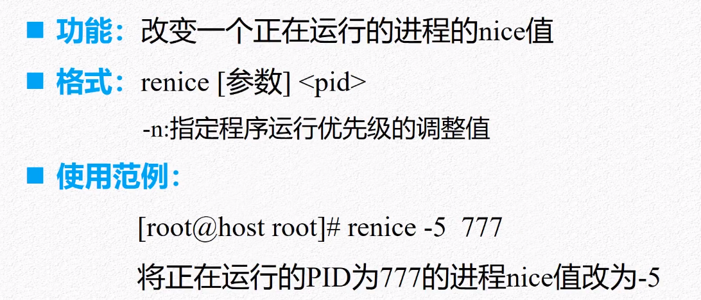
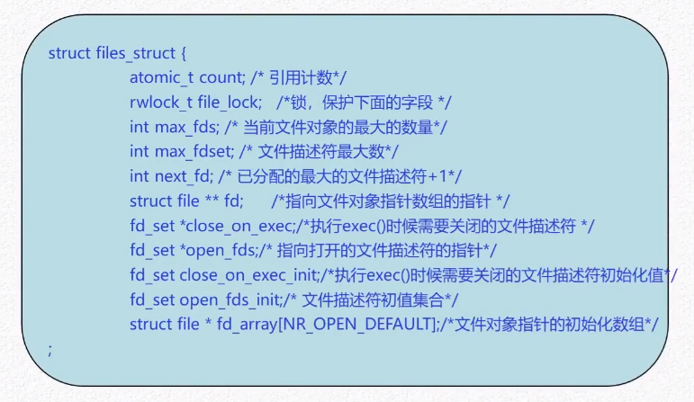
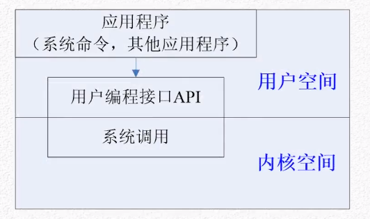

## linux

1973年，为了提升UNICS系统的性能与兼容性，采用当时刚问世的C语言对其进行重构，并将其命名为UNIX

UNIX标准：ANSI C、IEEE POSIX等；UNIX标准只是对应用程序接口进行统一（内部实现机制留给操作系统开发者自行实现）

+ ANCS C：C语言标准，旨在提供应用程序的可移植性，使其能适应于不同的操作系统，而不仅仅是UNIX操作系统
+ POSIX(Protable Operation System Interface)：定义了一整套的应用程序接口，包括系统调用、库函数、公共命令；希望在源码级别保证应用程序可移植性


#### kernel


##### 内存管理


##### 进程管理


##### 文件管理


##### 设备管理


#### 系统调用与库函数

​		系统调用供应用程序(用户空间)调用内核(硬件设备)的唯一接口，操作系统API通常以C库的方式提供，C库提供了POSIX绝大多数API，内核提供的每个系统调用在C库中都有具体相应的封装函数，但C库函数与系统调用之间并不是一一对应的，可能几个不同的函数会调用到同一个系统调用，另外，并非所有的库函数都会调用系统调用

​		linux首先启动内核程序（用于管理硬件【包括CPU、内存空间、磁盘接口、网络接口），为了方便用户调用内核，将内核功能、接口封装成系统调用（系统调用是操作系统的最小功能单元，一个操作系统以及基于操作系统的应用程序不可能实现超越系统调用的功能）；而库函数（Function）则是进一步将某些系统调用组合成某些常用的功能；Shell是一个命令解释器。

​		一般来说，应用程序使用用户空间的API而不是之间使用系统调用来编程，API给应用程序提供完全相同的接口，但在不同操作系统上的实现是可能不同的


##### 用户接口


##### 文件目录类命令

**ls** （list）显示目录文件

>-a  显示所有文件
>
>-l  显示详细信息
>
>-d  查看目录属性

**pwd** (print working directory) 显示当前所在工作目录

**cd** (change directory) 切换目录

**mkdir** (make directory) 创建新目录

**rmdir** (remove directory) 删除空目录

**cat** (concatenate and display files) 连接文件并打印到标准输出设备上

> -E  在每一行的末尾显示$
>
> -n  添加行号
>
> cat tex1 显示文件tex1的内容
>
> cat tex1 tex2 同时显示文件tex1和tex2的内容

**more**  分页显示文件内容

> space或f  显示下一页
>
> Enter  显示下一行
>
> q或Q   退出

**head**  显示文件前几行的内容

> head -n 显示前n行(默认10行)

**tail** 显示文件后几行的内容

> -n 显示后n行(默认10行)
>
> +n 从第n行显示到文件尾
>
> -F  跟踪显示不断增长的文件结尾内容（通常用于显示日志文件）

**cp** (cpoy) 将文件从一处复制到另一处

> cp [参数] <源文件路径> <目标文件路径>
>
> -p  连同文件的属性一起复制（常用于备份）
>
> -i 若目标文件已存在，则覆盖时先询问操作的进行
>
> -r 递归复制，用于目录复制
>
> -u 目标文件与源文件有差异时才会复制

**rm** 删除文件或目录

> -f  直接删除，忽略不存在的文件（不会出现警告消息）
>
> -i 在删除前询问用户是否操作
>
> -r 递归删除（！！！）

**find** 寻找文件或目录

> find 路径 [参数]
>
> -name filename 找出文件名为filename的文件
>
> -size [+/-] SIZE 找出比SIZE大或小的文件
>
> -type TYPE 查找文件类型为TYPE的文件（一般文件f、设备文件b/c、目录d、连接文件l、socket s、FIFO管道文件p）
>
> -perm mode 查找文件权限为mode的文件，mode用数字表示,如0755

**grep** (Globally search a Regular Expression and Print) 在文件中搜索匹配的字符并进行输出

> grep [参数] <要找的字符串> <要寻找字符串的源文件>
>
> -a  将binary文件已text文件的方式查找数据  
>
> -c  计算字符串次数
>
> -v  忽略大小写
>
> -i 反向选择，显示不包含查找字符串内容的那一行

**tar** 


##### 进程控制类命令


**ps** 显示系统瞬间的进程信息

>l  长格式输出
>
>u  按用户名和启动时间的顺序来显示进程
>
>j  用任务格式来显示进程
>
>f  用树形格式来显示进程
>
>a  显示所有用户的所有进程
>
>x  显示无控制终端的进程
>
>r  显示运行中的进程
>
>ps -aux | grep pp 查找pp用户的进程

**top** 动态监视系统任务的工具（相当于windows的任务管理器），输出结果是连续的


**kill** 


**killall** 


**renice** 



**nice** 


**&** 


##### 用户及权限管理类命令


**useradd** 新建用户


**usermod** 修改用户属性（超级用户可用）


**passwd** 


**userdel** 删除指定的用户账号（超级用户可用）


**su** 切换用户身份


**id**   **whoami**    **w** 


**groupadd** 新建组群


**groupmod** 修改指定用户组的属性（超级用户可用）


**groupdel** 删除指定的用户组（超级用户可用）


**chmod** 修改文件的访问权限


**chown** 修改文件所有者


**chgrp** 修改文件所有用户组


#### GCC

​		gcc是一个自由编译器，包含多种语言的编译器(C、C++、Ada、Object C、Java、Go)
GCC主要包括cpp(预处理器)、gcc(c编译器)、g++(c++编译器)、binutils等二进制工具(as汇编器、ld链接器)


#### 一切皆文件

​			通过统一的文件I/O系统调用API即可对系统中的任意文件进行操作而无需考虑其所在的具体文件系统格式，文件操作可以跨文件系统执行


​		在用户空间，可以直接使用应用程序来对文件进行打开、读写、关闭等操作;VFS屏蔽了内部文件系统的差异，使得用户可以透明使用文件系统。


##### VFS


​		超级块是对一个文件系统的描述；索引节点是对一个文件物理属性的描述；目录项是对一个文件逻辑属性的描述；一个进程所处的位置是由fs_struct来描述的，而一个进程（或用户）打开的文件是由files_struct来描述的，而整个系统所打开的文件是由file结构来描述


+ 超级块


+ 索引节点


+ 目录项


+ 文件对象





#### System Call

​		为了更好的保护内核空间，将程序的运行空间分为内核空间和用户空间（也就是常称的内核态和用户态），它们分别运行在不同的级别上，在逻辑上是相互隔离的。因此，用户进程在通常情况下不允许访问内核数据，也无法使用内核函数，它们只能在用户空间操作用户数据，调用用户空间的函数。在进行系统调用时，程序运行空间从用户空间进入内核空间，处理完成后再返回用户空间。系统调用时操作系统提供给用户程序调用的一组”特殊“接口，用户程序可以通过这组”特殊“接口来获得操作系统内核提供的服务（C语言标准库函数在linux平台上的实现绝大部分依靠的系统调用来完成）

​		系统调用并不是直接与程序员进行交互的，它仅仅是一个通过软中断机制向内核提交请求，以获得内核服务的接口；在实际使用中程序员调用的通常是用户编程接口——API；而系统命令相对API更高了一层，它实际上是一个可执行程序，它的内部调用了用户编程接口（API）来实现相应的功能


+ 原理：进程先用适当的值填充寄存器，然后调用一个特殊的指令，这个指令会跳转到事先定义的内核中的位置，这个位置是用户进程可读但不可写，硬件一旦知道跳转到这个位置，则说明该进程进入了内核态，有了相关的内核权限，就可以任意使用内核服务。进程可以跳转到内核位置叫做System call，这个过程会检查系统调用号，告诉内核进程需要请求的服务




+ 系统命令：通常是一个可执行文件（cp 调用open、read、write、close等4个API）


## Centos 7

追踪系统调用 **strace **

> strace  -ff  -o syscalllog  java TestSysCall

**jsp** 查看Java进程等详细信息

**man** 查看命令帮助：man  2 socket （2表示系统调用层面 ） （若没有该命令yum install -y man-pages）

**netstat -natp**  (若没有netstat命令，yum install net-tools)

```
netstat -a     #列出所有端口
netstat -pt   #在netstat输出中显示 PID 和进程名称
netstat -n   #使用数字代替那些名称主机、端口和用户名
```

**cd /proc/3102**  进入proc(内核进程管理)中pid为3102进程的目录：有fd(文件描述符)、task（开启的线程数）

**lsof**(list open files)是一个列出当前系统打开文件的工具。在linux环境下，任何事物都以文件的形式存在，通过文件不仅仅可以访问常规数据，还可以访问网络连接和硬件。所以如传输控制协议 (TCP) 和用户数据报协议 (UDP) 套接字等，系统在后台都为该应用程序分配了一个文件描述符，无论这个文件的本质如何，该文件描述符为应用程序与基础操作系统之间的交互提供了通用接口。因为应用程序打开文件的描述符列表提供了大量关于这个应用程序本身的信息，因此通过lsof工具能够查看这个列表对系统监测以及排错将是很有帮

**ps -ef | grep nginx**  查看Nginx进程信息

**tail -f log.123**  实时查看文件log.123的末尾内容

