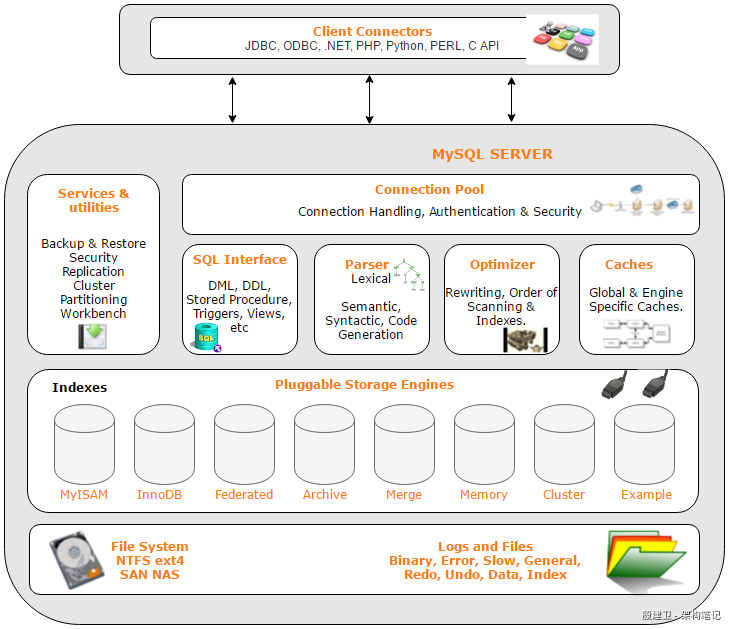

## Advanced-MySQL

​		MySql的架构可以在多种不同场景中发挥良好作用，其插件式的存储引擎架构将查询处理和其它的系统任务以及数据的存储提取相分离，使得可以根据业务需求和实际选择合适的存储引擎。

+ 连接层：客户端和连接服务，包含本地socket通信和大多数基于客户端/服务端工具实现的类似tcp/ip的通信；主要完成一些类似连接处理、授权认证及相关的安全方案。在该层引入了**线程池**的概念，为通过认证安全接入的客户端提供线程；同样在该层上可以实现基于SSL的安全连接。
+ 服务层：主要完成大多数核心服务：SQL接口并完成缓存的查询、SQL的分析和优化、以及部分内置函数的执行。在该层，Server会解析查询并创建相应的内部解析树，并对其它完成相应的优化（确定查询表的顺序、是否利用索引），最后生成相应的执行操作。对于select语句，Server会查询内部的缓存
+ 引擎层：存储引擎真正负责数据的存储于提取，服务层通过API与存储引擎进行通信。
+ 存储层：将数据存储于文件系统上并完成与存储引擎的交互

!


> show engines;     查看当前数据库提供的存储引擎
>
> show variables like '%storage_engine%';   查看当前数据库默认的存储引擎
>
> CREATE INDEX idx_student_name on student(name);  为studnet表的字段name建立索引

|          | MySAM              | InnoDB               |
| -------- | ------------------ | -------------------- |
| 主外键   | 不支持             | 支持                 |
| 事务     | 不支持             | 支持                 |
| 锁       | 表锁，不适合高并发 | 函索，适合高并发     |
| 表空间   | 小                 | 大                   |
| 功能偏向 | 性能               | 事务                 |
| 适用场景 | 查询及插入         | 频繁修改、安全性操作 |

> SELECT DISTINCT
> ​		<select_list>
> FROM
> ​		<left_table>  <join_type>  JOIN  <right_table>  ON  <join_condition>
> WHERE
> ​		<where_condition>
> GROUP BY
> ​		<group_by_list>
> HAVING
> ​		<having_condition>
> ORDER BY
> ​		<order_by_condition>
> LIMIT 
> ​		<limit_number>

+ SQL执行顺序

> FROM <left_table>
> ON <join_condition>
> <join_type>  JOIN  <right_type>
> WHERE <where_condition>
> GROUP BY <group_by_list>
> HAVING <having_condition>
> SELECT
> DISTINCT <select_list>
> ORDER BY <order_by_condition>
> LIMIT <limit_number>

+ JOIN

  > select * from  A  inner join  B  on A.key=B.key   //A∩B
  
  > select * from  A  left join   B  on  A.key=B.key   //A
  
  > select * from  A   right join  B  on  A.key=B.key   //B
  
  > select * from A left join B on  A.key=B.key where B.key is null   //A-B
  
  > select * from A right join B on  A.key=B.key where A.key is null   //B-A
  
  > select * from  A  left join   B  on  A.key=B.key 
  > union      //A∪B
  > select * from  A   right join  B  on  A.key=B.key  
  
  >select * from A left join B on  A.key=B.key where B.key is null 
  >union    //A∪B-A∩B
  >select * from A right join B on  A.key=B.key where A.key is null   

### 索引

​      索引(index)是帮助mysql高效获取数据的一种数据结构（排好序的快速查找数据结构），以某种方式指向数据。索引可以提高数据检索效率，降低数据库的IO成本，通过索引列队数据进行排序，降低数据排序的成本，降低CPU的消耗。虽然索引大大提高了查询速度，但却会降低更新表的速度，如对表进行INSERT、UPDATE和DELETE（因为在更新表是，MySQL不仅要保存数据，还要调整索引信息）。索引本身也挺大，往往以索引文件的形式存储在磁盘上。聚集索引、复合索引、前缀索引、唯一索引默认使用B+树

单值索引：一个索引值包含单列，一个表可以有多个单列索引

唯一索引：索引列的值必须唯一，但允许有空值

复合索引：一个索引包含多列

+ 创建索引

> CREATE  [UNIQUE]  INDEX  index_name ON  table_name(column_name)
>
> ALTER table_name ADD  [UNIQUE]  INDEX  [index_name]   ON(column_name)

+ 删除索引

> DROP INDEX [index_name] ON table_name

+ 查看索引

> SHOW INDEX FROM table_name

以下情况需要创建索引

1. 主键自动建立唯一索引
2. 频繁作为查询条件的字段应该创建索引
3. 查询中与其他表关联的字段，外键关系建立索引
4. 频繁更新的字段不适合创建
5. WHERE条件里用不到的字段不创建索引
6. 高并发下倾向创建组合索引

```
全值匹配我最爱，最左前缀要遵守
带头大哥不能死，中间兄弟不能死
索引列上少计算，范围之后全失效
LIKE百分写最右，覆盖索引不写*
不等空值还有or少用，会造成索引失效
```


**字符串类型数据的值在查询的时候一定要加单引号，否则可能会造成索引失效，导致行锁变为表锁**

### EXPLAIN


+ possible_keys：显示可能引用到这张表中的索引，一个或多个；查询涉及到的字段上若存在索引，则该索引将被列出，但不一定被查询实际使用
+ key
+ key_len
+ ref
+ rows
+ Extra

##### 小表驱动大表

+ 当A表查询数据集大于B表查询数据集时，使用in

**select * from A where id in(select id from B)**  等价于

```
for select id from B
	for select * from A where A.id = B.id
```

+ 当A表查询数据集小于B表查询数据集时，使用exists

**select * from A where exists (select 1 from B where B.id = A.id)** 等价于

```
for select * from A
	for select * from B where B.id = A.id
```

### 锁机制

+ 读锁(共享锁)：针对同一根数据，多个读操作可以同时进行而不会互相影响
+ 写锁(排它锁)：当前写操作没有完成前，它会阻断其他写锁和读锁

##### 表锁

​      偏向MyISAM存储引擎、开销小、加锁块、无死锁、锁粒度大、发生锁冲突的概率较高、并发性低。MyISAM的读写锁是写优先，不适合以写为主的场合，因为加写锁后，其他线程的写操作将进入阻塞状态

> SHOW OPEN TABLES   //查看表的锁状态
>
> LOCK TABLE table_name READ|WRITE  //该table_name上锁

+ 读锁：当session给A表加read锁时，它只能读A表的数据，并不能读写其他表的数据，也不能更新A表的数据；而其他session可以读取A表的数据，当想写A表数据会进入阻塞状态（等待A表的读锁被释放），但可以读写其他表的数据
+ 写锁：当session给A表加锁write锁时，它可以读写A表的数据，并不能读写其他表的数据；而其他session可以读取A表的数据，当想写A表数据时会进入阻塞状态(等待A表的写锁被释放)

> SHOW STATUS LIKE ‘table%’    //查看分析表锁状态信息

+ Table_locks_immediate：产生表级锁定的次数，表示可以立即获取锁的查询次数，每立即获取锁值加1
+ Table_locks_waited：出现表级锁定争用而发生等待的次数(不能立即获取锁的次数，每等待一次锁值加1)，此值高则说明存在着较严重的表级锁争用情况

##### 行锁

​      偏向InnoDB存储引擎、开销大、加锁慢、会出现死锁、锁粒度小、发生锁冲突的概率最低，并发性高

