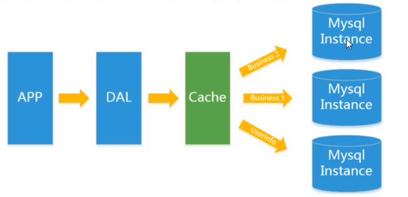
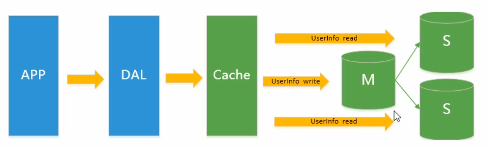
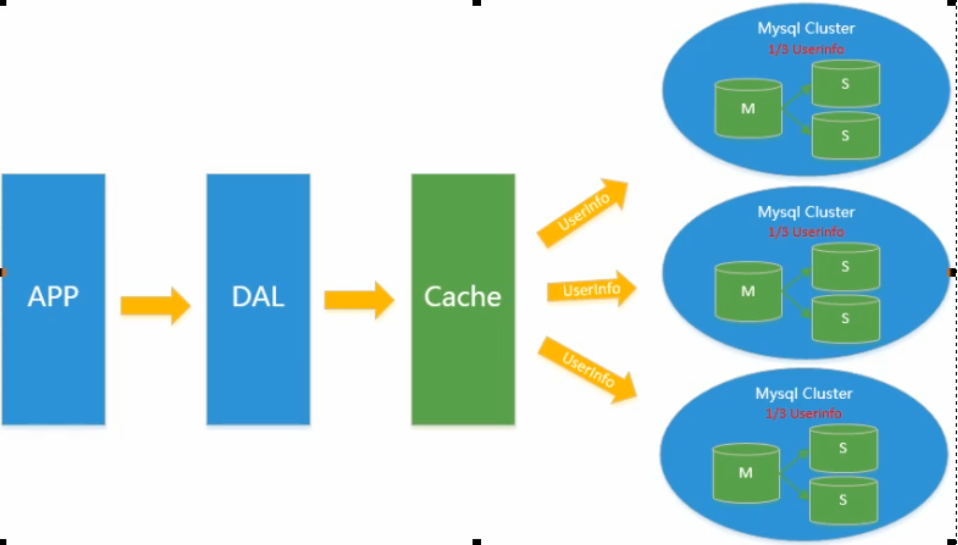
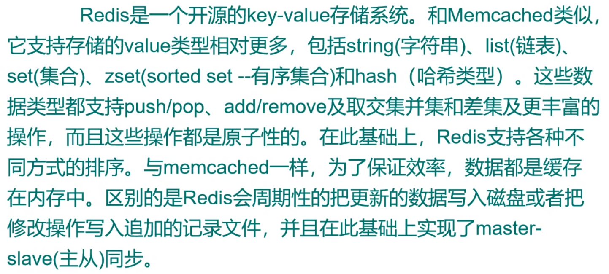
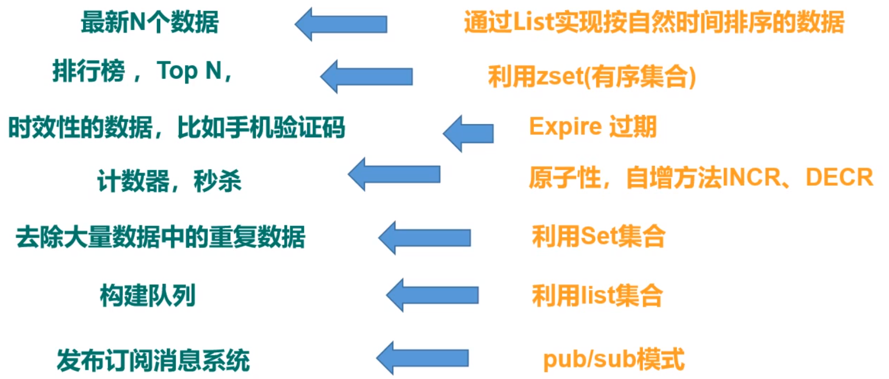

## redis

### NoSQL

#### Web架构演变

+ **单机数据库mysql**：在90年代，一个网站的访问量一般都不大，用单个数据库完全可以轻松应付(App→DAL→mysql)

+ **Memcached(缓存) + mysql + 垂直拆分**：随着访问量的上升，几乎大部分使用MySQL架构的网站在数据库上都开始出现了性能问题，web程序不再仅仅专注在功能上，同时也在追求性能。程序员们开始大量的使用缓存技术来缓解数据库的压力，优化数据库的结构和索引。开始比较流行的是通过文件缓存来缓解数据库压力，但是当访问量继续增大的时候，多台web机器通过文件缓存不能共享，大量的小文件缓存也带了了比较高的IO压力。Memcached作为一个独立的分布式的缓存服务器，为多个web服务器提供了一个共享的高性能缓存服务，在Memcached服务器上，又发展了根据hash算法来进行多台Memcached缓存服务的扩展，然后又出现了一致性hash来解决增加或减少缓存服务器导致重新hash带来的大量缓存失效的弊端

  

+ **mysql主从读写分离**：由于数据库的写入压力增加，Memcached只能缓解数据库的读取压力。读写集中在一个数据库上让数据库不堪重负，大部分网站开始使用主从复制技术来达到读写分离，以提高读写性能和读库的可扩展性。Mysql的master-slave模式成为这个时候的网站标配了，在Memcached的高速缓存，MySQL的主从复制，读写分离的基础之上，这时MySQL主库的写压力开始出现瓶颈，而数据量的持续猛增，由于MyISAM使用表锁，在高并发下会出现严重的锁问题，大量的高并发MySQL应用开始使用InnoDB引擎代替MyISAM。

+ **分表分库 + 水平拆分 + mysql集群**：同时，开始流行使用分表分库来缓解写压力和数据增长的扩展问题。这个时候，分表分库成了一个热门技术，是面试的热门问题也是业界讨论的热门技术问题。也就在这个时候，MySQL推出了还不太稳定的表分区，这也给技术实力一般的公司带来了希望。虽然MySQL推出了MySQL Cluster集群，但性能也不能很好满足互联网的要求，只是在高可靠性上提供了非常大的保证

#### NoSQL

​		NoSQL无需事先为要存储的数据建立字段，随时可以存储自定义的数据格式

+ RDBMS：高度组织化结构化数据、结构化查询语言(SQL)、数据和关系都存在单独的表中、数据操纵语言、数据定义语言、严格的一致性(ACID)、基础事务
+ NoSQL：没有生命性查询语言、没有预定义的模式、键-值存储/列存储/文档存储/图形数据库、最终一致性、非结构化和不可预知的数据、CAP定理、高性能/高可用性/可伸缩性

##### ACID

+ A (Atomicity) 原子性：也就是说事务里的所有操作要么全部做完，要么都不做，事务成功的条件是事务里的所有操作都成功，只要有一个操作失败，整个事务就失败，需要回滚。比如银行转账，从A账户转100元至B账户，分为两个步骤：1）从A账户取100元；2）存入100元至B账户。这两步要么一起完成，要么一起不完成，如果只完成第一步，第二步失败，钱会莫名其妙少了100元。
+ C (Consistency) 一致性：也就是说数据库要一直处于一致的状态，事务的运行不会改变数据库原本的一致性约束。
+ I (Isolation) 独立性：所谓的独立性是指并发的事务之间不会互相影响，如果一个事务要访问的数据正在被另外一个事务修改，只要另外一个事务未提交，它所访问的数据就不受未提交事务的影响。比如现有有个交易是从A账户转100元至B账户，在这个交易还未完成的情况下，如果此时B查询自己的账户，是看不到新增加的100元的
+ D (Durability) 持久性：持久性是指一旦事务提交后，它所做的修改将会永久的保存在数据库上，即使出现宕机也不会丢失。

##### CAP

​		(Consistency)强一致性、(Availability)可用性、(Partition tolerance)分区容错性

> CA：传统Oracle数据库
> AP：大多数网站架构的选择
> CP：Redis、Mongodb

​		CAP理论的核心是：一个分布式系统不可能同时很好的满足一致性，可用性和分区容错性这三个需求，最多只能同时较好的满足两个。由于当前的网络硬件肯定会出现延迟丢包等问题，所以分区容忍性是我们必须需要实现的。所以我们只能在一致性和可用性之间进行权衡，没有NoSQL系统能同时保证这三点。分布式架构的时候必须做出取舍。一致性和可用性之间取一个平衡。多余大多数web应用，其实并不需要强一致性。因此牺牲C换取P，这是目前分布式数据库产品的方向

​		根据 CAP 原理将 NoSQL 数据库分成了满足 CA 原则、满足 CP 原则和满足 AP 原则三大类：

CA - 单点集群，满足一致性，可用性的系统，通常在可扩展性上不太强大。
CP - 满足一致性，分区容忍必的系统，通常性能不是特别高。
AP - 满足可用性，分区容忍性的系统，通常可能对一致性要求低一些。

#### redis

 Redis 命令参考  http://redisdoc.com/   http://www.redis.cn/

​		Remote Dictionary Server(远程字典服务器)，使用C语言编写，遵守BSD协议，是一个高性能的(key/value)分布式内存数据库，基于内存运行并支持持久化的NoSQL数据库(**读110000次/s、写80000次/s**)

+ redis支持数据的持久化，可以将内存中的数据保持在磁盘中，重启的时候可以再次加载进行使用

+ redis不仅仅支持简单的key-value类型的数据，同时还提供list、set、zset、hash等数据结构的存储

+ redis支持数据的备份，即master-slave模式的数据备份

  ​		redis属于单进程模型，通过对epoll函数的进一步增强来实现的，redis的实际处理速度完全依靠主进程的执行效率（epoll是linux下多路复用IO接口select/poll的增强版本，是linux内核为处理大批量文件描述符而作了改进的。它能显著提高程序在大量并发连接中只有少量活跃的情况下的系统CPU利用率）
  
  

​		redis是单线程+多路IO复用，多路复用是指用一个线程来检查多个文件描述符（socket）的就绪状态，比如调用select和poll函数，传入多个文件描述符，如果有一个文件描述符就绪，则返回，否则阻塞直到超时。得到就绪状态后进行真正的操作可以在同一个线程里执行，也可以启动线程执行（比如使用线程池）

##### 五大数据类型

+ **string** ：redis最基本的类型，一个key对应一个value，一个value最多可以是512M；string类型是二进制安全的，指的的是string可以包含任何数据(比如jpg图片或者序列化的对象)
+ **hash**：一个键值对集合，是一个string类型的field和value的映射表，特别适合用于存储对象（hash类似java中的Map<String,Object>）
+ **list**：字符串列表，元素按照插入顺序排序（底层实现是一个双向链表）
+ **set**：string类型的无序集合，不允许重复的元素（通过hashtable实现，添加、删除、查找的复杂度都是O(1)）
+ **zset**：string类型的有序集合，不允许重复的元素，但每一个元素都会关联一个double类型的分数(sorce可重复)，通过该分数可以为集合中的成员进行从小到大的排序（通过hashtable实现）

###### 基本命令

获取密码：config get requirepass（默认为空）

获取当前路径：config get dir

设置密码：config set requirepass "12345"（设置密码后在看客户端每次使用redis命令需输入auth 12345）

启动服务端：**./redis-server   /redis.conf**

启动客户端：**./redis-cli -p 6379**

测试redis性能：**redis-benchmark**

切换数据库：**select** db_index

查看当前数据库key的数量：**DBSIZE**

清空当前库：**FLUSHALL**

清空所有库：**FLUSHALL**

自动校正rdb文件：**./redis-check-rdb**  --fix  dump.rdb

自动校正aof文件：**./redis-check-aof**   --fix  appendonly.aof

+ key

查看所有key：**keys ***

判断单个、某些key是否存在： **EXISTS [key_name...]**

移动某个key到某个数据库：**MOVE**  key_name  db_index

给key设置过期时间：**EXPIRE** key_name  seconds

查看某个key的过期时间：**TTL** key_name （返回-1表示永不过期、-2表示已过期）

查看key的类型：**TYPE** key_name

+ string（单kye单value）

为string设值(如果key已存在，则覆盖)：**set** key_name value

条件设值(key不存在才设值)：**setnx** key_name value

多个设值：**mset** key_1 value_1   key_2 value_2    key_3 value_3

多个获值：**mget**  key_1  key_2  key_3

多个设值(当有一个key存在时，此操作都失败)：**msetnx**  key_1 value_1   key_2 value_2    key_3 value_3

设值的同时设值过期时间：**SETEX** key_name  time_seconds  value

获取某个key的值：**get** key_name

删除某个key、某些key：**DEL  [key_name...]**

字符追加拼接：**append** key_name str

获取某个value的长度：**STRLEN**  key_name

数字值+1：**INCR**  key_name

数字值+N：**INCRBY** key_name  N

数字值-1：**DECR**   key_name 

数字值-N：**DECRBY** key_name  N

截取字符：**GETRANGE** key_name start end

字符插值：**SETRANGE** key_name offset value

+ list（单key多value）

为list赋值(从左往右)：**LPUSH** list_name value_1 value_2 value_3

为list赋值(从右往左)：**RPUSH** list_name value_1 value_2 value_3

截取list：**LRANGE** list_name start stop（查看list所有元素lrange key_name 1 -1）

删除最左边元素：**LPOP** list_name

删除最右边元素：**RPOP** list_name

按索引获取元素(从左往右)：**LINDEX**  list_name  index

获取list大小：**LLEN** list_name

删除N个值为value的元素：**LREM** list_name  N value

截取指定范围list并赋值给list：**LTRIM** list_name start stop

将list1最右边元素弹出放入list2的最左边：**RPOPLPUSH** list_1 list_2

覆盖设值：**lset** list_name index new_value

插值(在某个值为value的元素前面/后面插入新元素)：**LINSERT** list_name before/after value_1 new_value

+ set(单值多value)

为set赋值(重复元素添加只存在一个)：**sadd** set_name value_1 value_2 value_3

读取set所有元素：**SMEMBERS** set_name

读取set元素个数：**SCARD**  set_name

删除某个值为value的元素：**SREM** set_name value

随机读取N个元素：**SRANDMEMBER**  set_name  N

随机删除N个元素：**SPOP** set_name N

将set1中值为value的元素移动到set2中：**SMOVE** set1 set2 value

差集(set1有，set2、set3没有)：**SDIFF** set1 [set2、set3...]

交集： **SINTER** set1 [set2、set3 ...]

并集：**SUNION** set1 [set2、set3 ...]

+ hash(key-[key-value])

设值：**HSET** key field value

条件设值(不存在才赋值)：**HSETNX** key field value

获取值：**HGET** key field

批量设值：**HMSET** key field1 value2  field2  value2

批量获值：**HMGET** key field1 field2  field3 

获取所有值：**HGETALL** key

删除某个字段：**HDEL**  key field1 [field2、field3 ...]

获取字段个数：**HLEN** key

判断某个key里面是否包含field：**HEXISTS** key field

获取所有field：**HKEYS** key

获取所有值：**HVALS** key

某个数值字段+N(n为整数)：**HINCRBY** key field N

某个数值字段+N(n可以为浮点数)：**HINCRBY** key field N

+ zset(在set的基础上为每个元素添加sorce)

设值：**zadd** zset_name  sorce1 value1 sorce2 value2

获取所有值：**ZRANGE** zset_name 0 -1

带分数获取所有值：**ZRANGE** zset_name 0 -1 WITHSCORES

计算zset中的元素个数：**ZCARD** zset_name

计算分数区间元素个数：**ZCOUNT**  zset_name min_scorce max_scorce

获取某个元素的分数：**ZSCORE** zset_name value

获取值为value的元素的sorce排位（从小到大，以0开始）：**zrank**  zset_name value

逆序获取值为value的元素的sorce排位（从大到小，以0开始）：**zrevrank**  zset_name value

##### redis.conf

> 1k => 1000 bytes
> 1kb => 1024 bytes
> 1m => 1000000 bytes
> 1mb => 1024*1024 bytes
> 1g => 1000000000 bytes
> 1gb => 1024*1024*1024 bytes

+ daemonize yes：设置redis以守护进程方式启动

+ pidfile /var/run/redis_6379.pid：进程管道文件路径

+ tcp-backlog：设置tcp的backlog，backlog其实是一个连接队列，backlog队列总和=未完成三次握手队列 + 已经完成三次握手队列。在高并发环境下你需要一个高backlog值来避免慢客户端连接问题。注意Linux内核会将这个值减小到/proc/sys/net/core/somaxconn的值，所以需要确认增大somaxconn和tcp_max_syn_backlog两个值来达到想要的效果

+ tcp-keepalive：单位为秒，如果设置为0，则不会进行Keepalive检测，建议设置成300

+ loglevel notice：设置日志级别

+ logfile "6379.log"：设置日志文件

+ requirepass ""：设置密码(默认为空)

+ maxclients 10000：最大client连接数

+ maxmemory <bytes>：设置触发缓存过期策略的最大缓存大小（默认策略是永不过期）

+ dbfilename dump.rdb：RDB备份文件名

+ rdbcompression yes：启动LZF算法对rdb快照文件进行压缩，但会消耗额外的CPU

+ rdbchecksum yes：在存储快照后，可以让redis使用CRC64算法来进行数据校验，但是这样做会增加约10%的性能消耗

+ appendonly no：默认不开启AOF持久化（当rdb与aof同时存在时会优先选择aof）

+  appendfsync always：同步持久化，每次发生数据变更会被立即记录到磁盘，性能较差但数据完整性较好
  appendfsync everysec：异步操作，每秒记录，如果一秒内宕机则会有数据丢失(默认方式)

  appendfsync no：

###### 常用配置

redis.conf 配置项说明如下：

1. Redis默认不是以守护进程的方式运行，可以通过该配置项修改，使用yes启用守护进程

   > daemonize no

2. 当Redis以守护进程方式运行时，Redis默认会把pid写入/var/run/redis.pid文件，可以通过pidfile指定

   >  pidfile /var/run/redis.pid

3. 指定Redis监听端口，默认端口为6379，作者在自己的一篇博文中解释了为什么选用6379作为默认端口，因为6379在手机按键上MERZ对应的号码，而MERZ取自意大利歌女Alessia Merz的名字

   > port 6379

4. 绑定的主机地址

   >  bind 127.0.0.1

5.当客户端闲置多长时间后关闭连接,如果指定为0,表示关闭该功能

> timeout 300

6. 指定日志记录级别，Redis总共支持四个级别：debug、verbose、notice、warning，默认为verbose

   > loglevel verbose

7. 日志记录方式，默认为标准输出，如果配置Redis为守护进程方式运行，而这里又配置为日志记录方式为标准输出，则日志将会发送给/dev/null

   > logfile stdout

8. 设置数据库的数量，默认数据库为0，可以使用SELECT <dbid>命令在连接上指定数据库id

   > databases 16

9. 指定在多长时间内，有多少次更新操作，就将数据同步到数据文件，可以多个条件配合

  save <seconds> <changes>

  Redis默认配置文件中提供了三个条件：

  save 900 1

  save 300 10

  save 60 10000

  分别表示900秒（15分钟）内有1个更改，300秒（5分钟）内有10个更改以及60秒内有10000个更改。

 

10. 指定存储至本地数据库时是否压缩数据，默认为yes，Redis采用LZF压缩，如果为了节省CPU时间，可以关闭该选项，但会导致数据库文件变的巨大

  rdbcompression yes

11. 指定本地数据库文件名，默认值为dump.rdb

  dbfilename dump.rdb

12. 指定本地数据库存放目录

  dir ./

13. 设置当本机为slav服务时，设置master服务的IP地址及端口，在Redis启动时，它会自动从master进行数据同步

  slaveof <masterip> <masterport>

14. 当master服务设置了密码保护时，slav服务连接master的密码

  masterauth <master-password>

15. 设置Redis连接密码，如果配置了连接密码，客户端在连接Redis时需要通过AUTH <password>命令提供密码，默认关闭

  requirepass foobared

16. 设置同一时间最大客户端连接数，默认无限制，Redis可以同时打开的客户端连接数为Redis进程可以打开的最大文件描述符数，如果设置 maxclients 0，表示不作限制。当客户端连接数到达限制时，Redis会关闭新的连接并向客户端返回max number of clients reached错误信息

  maxclients 128

17. 指定Redis最大内存限制，Redis在启动时会把数据加载到内存中，达到最大内存后，Redis会先尝试清除已到期或即将到期的Key，当此方法处理 后，仍然到达最大内存设置，将无法再进行写入操作，但仍然可以进行读取操作。Redis新的vm机制，会把Key存放内存，Value会存放在swap区

  maxmemory <bytes>

18. 指定是否在每次更新操作后进行日志记录，Redis在默认情况下是异步的把数据写入磁盘，如果不开启，可能会在断电时导致一段时间内的数据丢失。因为 redis本身同步数据文件是按上面save条件来同步的，所以有的数据会在一段时间内只存在于内存中。默认为no

  appendonly no

19. 指定更新日志文件名，默认为appendonly.aof

   appendfilename appendonly.aof

20. 指定更新日志条件，共有3个可选值： 

  no：表示等操作系统进行数据缓存同步到磁盘（快） 

  always：表示每次更新操作后手动调用fsync()将数据写到磁盘（慢，安全） 

  everysec：表示每秒同步一次（折衷，默认值）

  appendfsync everysec

 

21. 指定是否启用虚拟内存机制，默认值为no，简单的介绍一下，VM机制将数据分页存放，由Redis将访问量较少的页即冷数据swap到磁盘上，访问多的页面由磁盘自动换出到内存中（在后面的文章我会仔细分析Redis的VM机制）

   vm-enabled no

22. 虚拟内存文件路径，默认值为/tmp/redis.swap，不可多个Redis实例共享

   vm-swap-file /tmp/redis.swap

23. 将所有大于vm-max-memory的数据存入虚拟内存,无论vm-max-memory设置多小,所有索引数据都是内存存储的(Redis的索引数据 就是keys),也就是说,当vm-max-memory设置为0的时候,其实是所有value都存在于磁盘。默认值为0

   vm-max-memory 0

24. Redis swap文件分成了很多的page，一个对象可以保存在多个page上面，但一个page上不能被多个对象共享，vm-page-size是要根据存储的 数据大小来设定的，作者建议如果存储很多小对象，page大小最好设置为32或者64bytes；如果存储很大大对象，则可以使用更大的page，如果不 确定，就使用默认值

   vm-page-size 32

25. 设置swap文件中的page数量，由于页表（一种表示页面空闲或使用的bitmap）是在放在内存中的，，在磁盘上每8个pages将消耗1byte的内存。

   vm-pages 134217728

26. 设置访问swap文件的线程数,最好不要超过机器的核数,如果设置为0,那么所有对swap文件的操作都是串行的，可能会造成比较长时间的延迟。默认值为4

   vm-max-threads 4

27. 设置在向客户端应答时，是否把较小的包合并为一个包发送，默认为开启

  glueoutputbuf yes

28. 指定在超过一定的数量或者最大的元素超过某一临界值时，采用一种特殊的哈希算法

  hash-max-zipmap-entries 64

  hash-max-zipmap-value 512

29. 指定是否激活重置哈希，默认为开启（后面在介绍Redis的哈希算法时具体介绍）

  activerehashing yes

30. 指定包含其它的配置文件，可以在同一主机上多个Redis实例之间使用同一份配置文件，而同时各个实例又拥有自己的特定配置文件

  include /path/to/local.conf

#### RDB

​		在规定的时间间隔内将内存中的数据集快照写入磁盘，即Snapshot快照，，恢复时将快照文件直接读到内存里。redis会单独创建(fork)一个子线程来进行持久化，会先将数据写入到一个临时文件中(dump.rdb)，待持久化过程都结束了，再用这个临时文件替换上次持久化好的文件。整个过程中，主进程是不进行任何IO操作的，这就确保了极高的性能。RDB适合大规模的数据恢复，合适对数据完整性和一致性要求不高的数据。RDB的缺点是最后一次持久化后的数据可能丢失。

快照触发条件，默认为：1分钟内改了1万次、5分钟内改了10次、15分钟内改了1次、使用save/bsave命令、执行flushall、SHUTDOWN等命令也会产生dump.rdb文件

+ save：只管保存，其他全部阻塞
+ bsave：redis会在后台异步进行快照操作，快照同时还可以响应客户端请求。可以通过lastsave命令获取最后一次成功执行快照的时间

#### AOF

​		以日志的形式记录每个写操作(增、删、改)，将这些执行过的所有指令追加写入文件appendonly.aof，redis启动之初会读取该文件重新构建数据，即将appendonly中的指令全部重新执行一次进行数据恢复。AOF采用文件追加方式会使得文件越来越大，因此需要对文件进行重写优化，当AOF文件的大小超过设定的阈值时，redis会启动AOF文件的内容压缩，只保留可以恢复原数据的最小指令集

+ 重写原理：AOF文件持续增长而过大时，会fork出一条新进程来讲文件重写(先写入临时文件最后在rename)，遍历新进程的内存中数据，每条记录有一条set语句。重写aof文件操作时，并没有读取旧的aof文件，而是将整个内存中的数据内容用命令的方式重写了一个新的aof文件（默认当AOF文件大小大于64M且是上一次rewrite大小的两倍时就会触发重写机制）

#### 事务

​		redis中的事务只是单独的隔离操作，同一个事务中的所有命令都会被序列化、按顺序执行，事务在执行过程中不会被其他客户端发送的命令请求所打断(即其他客户端同样可以对数据进行修改)；在队列中的命令在没有提交之前都不会实际被执行，这导致了没有隔离级别；另外，不保证原子性，同一个事务中，即使有一条命令执行失败，其他命令仍然会被执行，没有回滚

开启事务：**MUTLI**（开启事务后的执行的一系列命令会被存入队列直到执行exec命令才全部被执行）

> MUTLI 
> set key1 abc
> set key2 cdf
> EXEC

执行事务：**EXEC**（在操作命令入队过程中若有命令出现编译报错，则此次事务中全部命令全部作废、失败，若只是某个操作无法完成，但编译通过，则其他命令可以执行成功）

放弃事务：**DISCARD**

> MUTLI 
> set key1 abc
> set key2 cdf
> DISCARD

监控key：**WATCH**  key（当key在执行事务过程被其他线程修改时，则此次事务失败）

>WATCH  key1
>MUTLI 
>set key1 abc
>set key2 cdf
>EXEC

取消监控：**UNWATCH**  key

> WATCH  key1
> set key1 abc
> UNWATCH  key1
> MUTLI 
> set key1 fghfg
> set key2 cdf
> EXEC

+ 悲观锁：悲观锁(Pessimistic Lock), 顾名思义，就是很悲观，每次去拿数据的时候都认为别人会修改，所以每次在拿数据的时候都会上锁，这样别人想拿这个数据就会block直到它拿到锁。传统的关系型数据库里边就用到了很多这种锁机制，比如行锁，表锁等，读锁，写锁等，都是在做操作之前先上锁
+ 乐观锁：乐观锁(Optimistic Lock), 顾名思义，就是很乐观，每次去拿数据的时候都认为别人不会修改，所以不会上锁，但是在更新的时候会判断一下在此期间别人有没有去更新这个数据，可以使用版本号等机制。乐观锁适用于多读的应用类型，这样可以提高吞吐量（提交版本必须大于记录当前版本才能执行更新）

#### 发布订阅

​			发布订阅是进程间的一种消息通信模式，发送者(pub)发送消息，订阅者(sub)接收消息

先订阅后发布后才能收到消息，

+ 可以一次性订阅多个**SUBSCRIBE** c1 c2 c3
+ 消息发布**PUBLISH** c2 hello-redis
+ 订阅多个(使用通配符）**PSUBSCRIBE** new\*
+ 发送消息  **PUBLISH** new1 redis2015

#### 主从复制

​		主机数据更新后根据配置和策略，自动同步到备机（master已写为主，slave以读为主）;由于所有写操作都是在master上操作，然后同步更新到slave中，所以会存在复制延时

+ 从库配置：SLAVEOF  主库IP 主库端口

+ 查看当前redis主从关系：INFO REPLICATION

+ 一主二仆：当mster宕机后重启仍可用，但从库宕机后重启需重新连接主库，除非把配置写入redis.conf中

+ 薪火相传：master→slave1→slave2；上一个slave可以是下一slave的master，slave同样可以接受其他slave的连接和同步请求，那么该slave可以作为链条中的下一个master，可以减轻master的写压力

+ SLAVEOF no one：使得当前数据库停止与其他数据库的同步，恢复默认的master身份

+ 主从复制原理（第一次全量复制，后续增量复制）

  

+ 哨兵：在后台监控主机是否故障，当master宕机后自动从slave选一个作为新的master，当原master重新恢复时会原master会变为slave；一组sentinel能同时监控多个master

  配置文件：sentinel.conf

  > sentinel montitor 被监控的master名称(随便写)  主机IP:port   1

  启动哨兵：./redis-sentinel  ./sentinel.conf

### zset实现文章访问量排行榜

zadd  article_set  100 java  999 python 88888 c++ 7777 c  6666 php

从大到小排序：zrevrange article_set 0 -1

 获取某个范围：zrevrangebyscore article_set  1000000  555

参考博客 https://codekiller.top/2020/03/30/redis2/