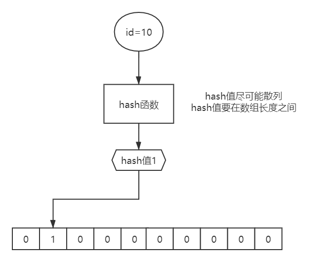
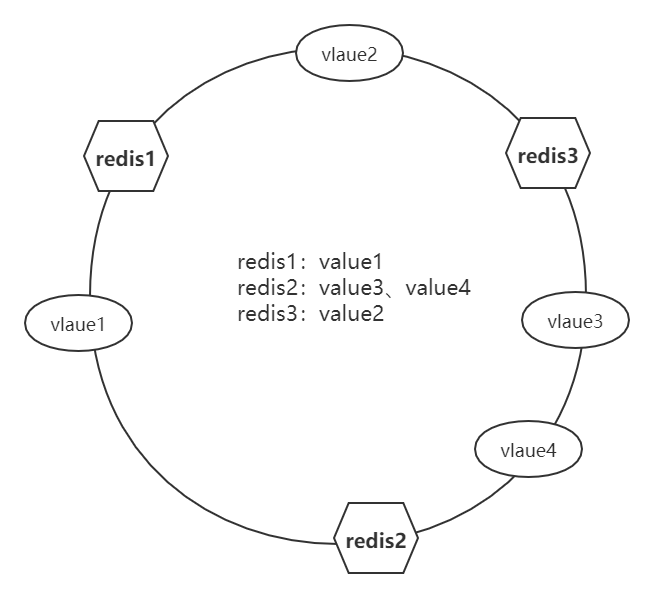
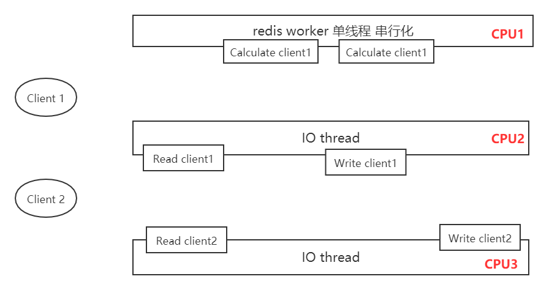
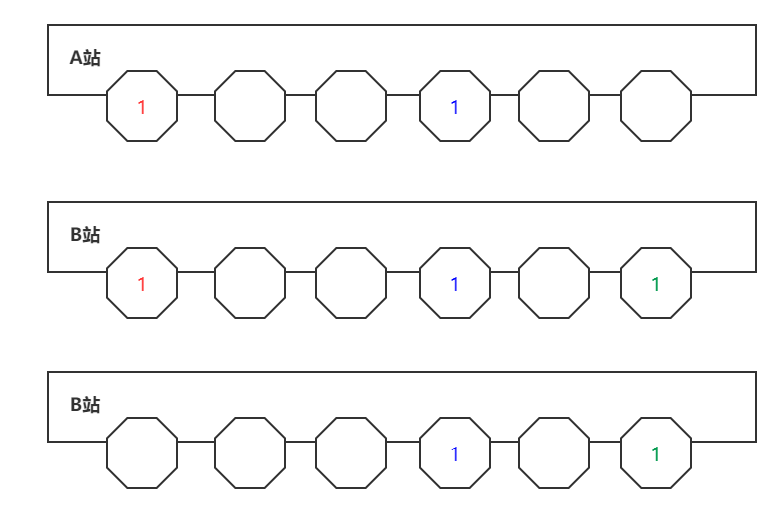

#### 缓存穿透

​			如果查询数据时，在缓存中找不到，从而去数据库中查询，这种现象就是缓存穿透。即客户端向服务端发起一个数据库不存在的数据请求，显然在缓存中肯定不存在该数据，然后该请求就直奔数据库（缓存穿透是不可避免的，低频的缓存穿透是可以接受的，但是如果大量这样的请求并发，数据库可能会承受不了如此高的并发量从而导致崩溃）

解决方案：当第一次在缓存中查找不到数据时，然后去数据库中查找，把查找的结果缓存的redis中(这样的话可以解决相同非法请求——请求的数据数据库中并不存在，但无法解决每次不同非法请求，反而缓存太多不存在的非法请求而导致触发redis的淘汰策略丢弃原本有价值的热点数据)；最终的解决方案是在redis缓存与数据库之间加一个轻量级的过滤器(尽可能占用少的内存)，用来保存未来可能查询的字段值

布隆过滤对所有的可能查询的参数以hash形式存储,在控制器层先进行校验,不符合则丢弃,从而避免了对底层存储系统的查询压力。bloomfilter就类似于一个hash set，用于快速判某个元素是否存在于集合中，其典型的应用场景就是快速判断一个key是否存在于某容器，不存在就直接返回。举例:将真实正确Id在添加完成之后便加入到过滤器当中，每次再进行查询时，先确认要查询的Id是否在过滤器中，如果不在，则说明Id为非法Id。缓存空对象当从数据库查询不到值，就把参数和控制缓存起来，设置一个简短的过期时间(因为缓存是需要内存的，如果有过多空值key，占用内存多),在该时间段如果有携带此参数再次请求，就可以直接返回。可能导致该段时间缓存层和数据库数据不一致，对于需要保持一致性的业务有影响。

+ 布隆算法：通过二进制数组对数据进行标识，通过哈希函数(该hash函数需满足：计算出的hash值尽可能散列、hash值要在数组的长度之间)对数据进行哈希计算得到一个hash值(hash值对应着二进制数组的下标)，然后根据hash值对二进制数组相应的下标设值为1，标识该数据在数据库中存在（使用二进制数组标识的好处是节约内存，约一百亿bit只占1.16G内存，但可能会发生hash碰撞，而导致不同数据可能计算出同样一个hash值，则导致会一些非法数据请求依旧可以穿过布隆过滤器去访问数据库，但是可以接受的，所以布隆算法是一种通过错误率来换取空间的算法）

  

+ 降低布隆算法的错误率：增大数组长度、使用多个hash函数进行计算(对同一个数据使用多个hash函数进行计算得不同出的hash值并将数组对应下标设为1，则当下次请求数据到来时，通过多个hash函数得出不同hash值，只有这些hash值对应的下标同时为1才可判断该请求数据在数据库是存在的，这样可以降低误判率)

#### 缓存击穿

​		缓存中的某条热门数据过期失效了，导致大量请求直接冲向数据库（一般的中小型并发量的缓存击穿是不足以弄崩溃数据库的）

+ 解决方案1：出现缓存击穿严重问题说明请求并发量十分高了，则不只只需要在数据库一端添加缓存，在服务端也要进行负载均衡、集群分流；这时可以使用分布式锁（能够解决多个节点上多个进程之间的排队问题）；让这些请求去抢锁，抢到锁才可以直接访问数据库（这样只有部分请求直接访问数据库）然后异步把那些数据重新缓存到redis上，后续其他请求重新去访问redis，而不是数据库

+ 解决方案2：可以不使用分布式锁，请求直接访问数据库，但每次访问数据库都将数据重新缓存到redis中，数据库的访问量会随着热点数据的缓存增加而逐渐降低，当所有热点数据都缓存完成时，那么此时数据库的访问量就降低了，请求都去redis缓冲中了

加锁条件：共享资源、共享资源互斥、多任务竞争资源

#### 缓存雪崩

​		大量缓存数据同时过期失效或者redis突然宕机了，导致一瞬间大量请求冲向数据库

+ 将缓存的数据设置不同的有效期
+ redis集群：将数据分片存储在不同的服务器上或者采用主从复制方式

切片集群：每个服务器存储部分数据。一致性Hash算法可以使得各个reids服务器上的数据均匀分布

+ 一致性Hash算法：对数据、redis服务器进行hash计算并映射到hash环上，将数据放在顺时针上第一个服务器上；当新增服务器时，将属于该服务器上的数据从后一个服务器上复制过来

**缓存雪崩、缓存击穿算是缓存穿透的特殊表现形式**

#### redis

+ 特点：内存、key-value、单线程(worker)、IO模型(epoll)、多类型value(每个类型具有本地方法)

  

+ I/O模型：redis是单线程的，在读/写的时候是串行的（即读→计算→写），一个redis值会运行在一个CPU上，后来redis引入IO thread多线程模型，在其他CPU上开启多个IO thread负责数据读写，redis只负责计算（worker还是单线程的）

I/O thread参考 https://blog.51cto.com/14751386/2484683

+ memcache只能存字符串，而且没有什么操作函数，计算是在client中进行的；而redis可以存放多种数据类型的value且具有操作函数，计算是在redis服务端进行的（例如存一个数组，在memache中读取某个元素时需将整个数组字符串返回到client，然后在client对字符串数组进行反序列化、类型转换等计算；而redis中可以直接存放list，并通过list自带的操作函数直接返回相应元素给client）

+ redis天生的单线程、串行化在某些业务场景下(秒杀：虽然可以通过多服务器并行处理高并发访问请求，但最终到达数据的请求还是串行处理请求的，为了保证数据的一致性)相对于传统数据库的使用额外事务来实现数据访问串行化的效率高得多，这使得redis具有非常的高并发处理能力

##### 应用场景

帮助命令  help + Tab

查看某个key的数据类型   type  key1

查看某个key底层数据结构实现  object encoding  key

+ **string**：二进制安全(一切数据转换为byte数组存入redis)；使用strlen key获取到的字符长度的单位是字节

  + 字符串：存放seesion、uuid、VFS in memory(文件)

  + 数值计算：限流器、点击率统计

  + bitmap：二进制操作(and 、or、not)；当表示范围在0~127时代表是ascii；bitmap属于二进制数组，其消耗内存极小

    > setbit  key  index  1/0 （setbit  key1   3  1 → key1 : 00010000）
    >
    > setbit key2  1 1       //01000000
    >
    > setbit key2  7  1      //01000001
    >
    > get key2    // A

    > bitcout  key3  start end（统计key3从start到end区间中1的个数）

    > bitop  and  key3 key1 key2 (对key1、key2进行按位与运算把结果存入key3)

    + 用户登陆天数统计：setbit  user_name  2  1 (每位代表一天，365位二进制数组即可表示一年；哪天登陆设哪位为1，最后使用bitcout统计1的个数)
    + 活跃用户统计：每一位代表一个用户，每天一个key，哪天哪位用户登陆就对应的下标设值为1，最后将多天的value进行or运算即可算出这些天登陆过的客户
    + 12306：一趟火车会经过多个站，每个站火车上的座位情况对应一个二进制数组，则不同站之间可以通过and运算计算出某个些站区间哪些座位是空闲的，是有票的（比如小明买了从A到B的票、小军买了一张A到C的票、小强卖了一张B到C的票）

    

    + 权限管理：777（111-111-111→rwx-rwx-rwx）

+ **list**：数据有序放入（双向链表，key可以直接访问list的头和尾）
  
  + 同向进出：栈
  + 同向进出：队列
  + 下标取值：数组
  + LTRIM key start stop（弹出start~stop之外的元素）：可以应用于保留热数据
  
+ **set**：底层是value为null的hashmap；只存key

  + 无序、去重
  + 随机事件：SRANDMEMBER  key1 n（随机返回n个元素）
  + 交并差

+ **zset**：当元素太多或元素内容太大时底层存储由ziplist转为skiplist

  + 排行榜
  + 有序事件
  + 评论（点赞数排序）+动态分页
  + skiplist：多层链表(最高层为64层)组成网格，使得遍历查询可以跳跃某些节点（牺牲存储空间换取存取效率）

##### 持久化

+ RDB：以快照形式将所有redis内存中的数据定时保存到文件中；其特点是恢复速度快，但可能造成最后一次的数据丢失
+ AOF：以日志的形式记录reids内存数据更新指令(增、删、改)；其特点是数据完整、但恢复速度相对慢一些，而且日志文件随着数据的增加日趋庞大（可以通过rewrite日志文件减小文件大小）

